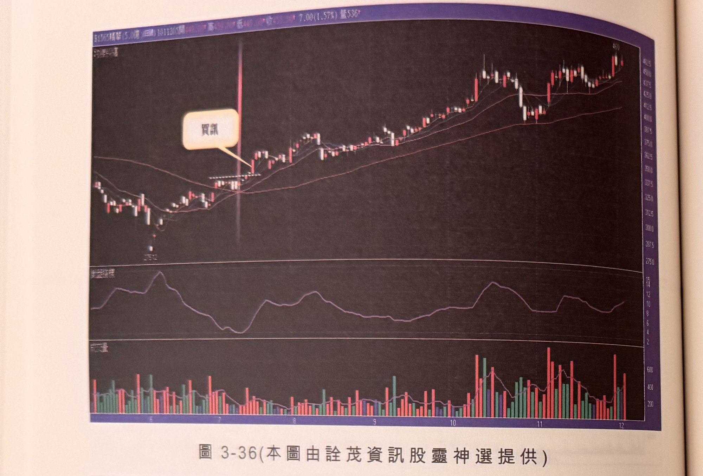
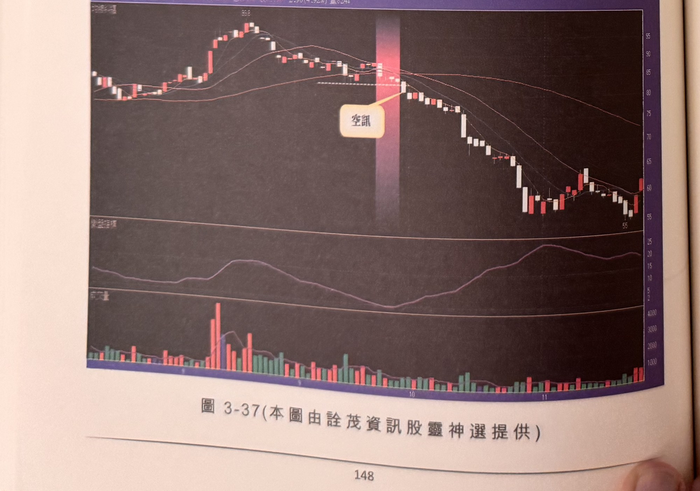

## p.148

**圖 3-36** (本圖由詮茂資訊股靈神選提供)

> 圖說（figure notes）：精華(1565) K 線圖（黑底配色），報價列標示「B1565精華(5.0億) 日線 1011305開…7.00(1.57%)量536」。K 線圖疊加均線，價格自左側低點附近緩步回升，於均線糾纏處（紅色縱帶）文字方塊「買訊」標示，其後價格持續走高。下方為變盤指標子圖與成交量柱狀圖（紅漲綠跌配色）。

**圖 3-37** (本圖由詮茂資訊股靈神選提供)

> 圖說（figure notes）：個股 K 線圖（黑底配色），報價列標示「B?建東(10.7億) 日線 1011126開59.8?高59.8?低59.80收61.90 2.90(4.92%)量824」。K 線圖疊加均線，高點59.8附近，於均線糾纏處（紅色縱帶）文字方塊「空訊」標示，其後價格持續下跌至低點55附近。下方為變盤指標子圖與成交量柱狀圖（紅漲綠跌配色）。

## p.149

[插畫頁（已核對照片）：本頁只有一幅油畫，說明文字「王沛文油畫作品----醉夢溪畔」（河岸邊一人撐傘行走），無正文。油畫周圍淡淡的字是背面透印，不是本頁內容。]
