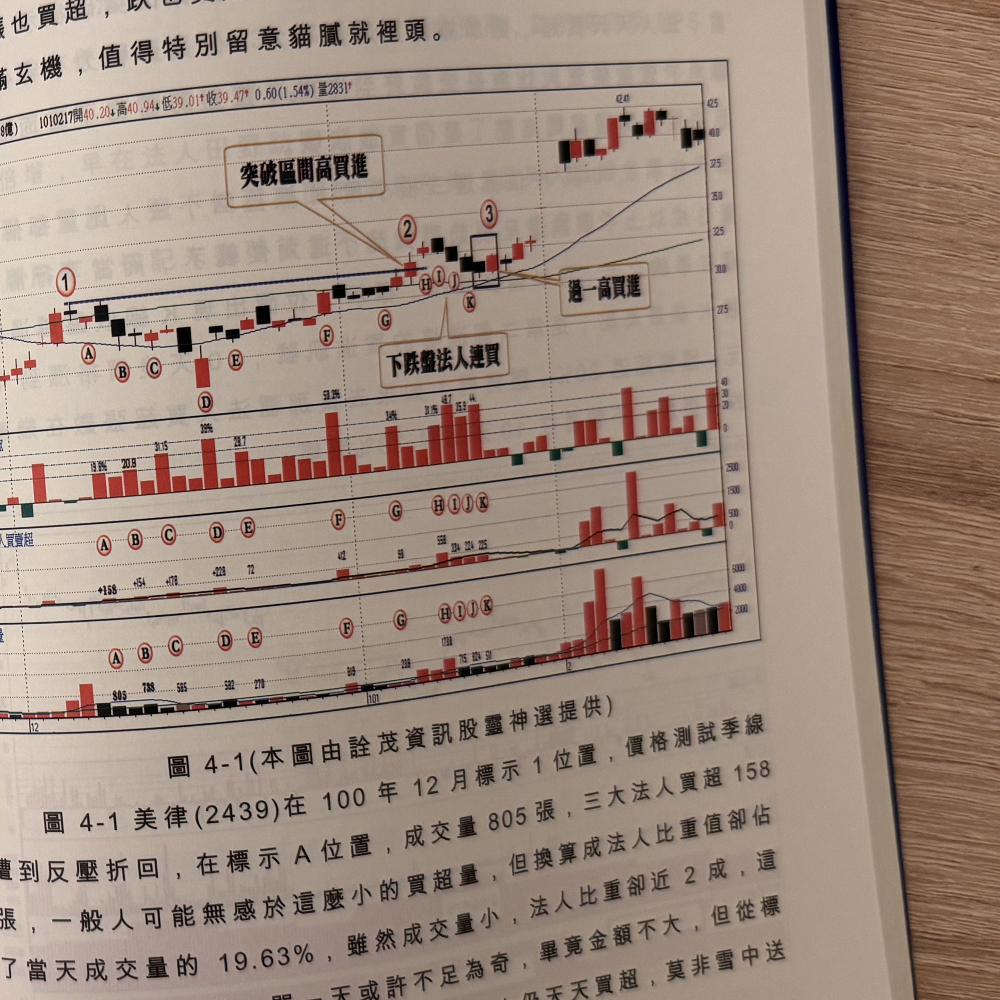

## p.152

怕賣不掉，尤其毫不起眼的個股，價格橫向窄幅游走，法人卻默默地買進，漲也買跌也買，這其中必有尚未報導的利多訊息，本章節要介紹的法人比重即著眼在這種思維。

把個股當日三大法人買賣超的淨額，除以個股的當日成交量，得到的數值再乘 100，就得到法人買賣超比重的百分比，這個比重值主要在觀察法人買賣超對個股的控盤能力的深淺，同時也可以觀察到法人對個股的認養及看好度是否持續在進行，單一天的買超並不足以代表法人對該股的看好度或認養的深淺，如果法人天天買超且比重常常超過 20% 以上，那法人為什麼有興趣天天買，就值得研究。

要觀察法人對標的股的買進決心，最佳時機就在股價拉回，或者橫盤時，最好選擇區間窄幅盤整，法人是不是天天都買超，如果確是如此，並不急於跟進，買超的天數要連續超過 10 天以上，即使中間曾出現賣超或無買超的狀況，最好只發生 1 天，或賣超張數甚小；法人買超不代表行情必然向上，得看他是否積極向上作價還是消極承接而已，這才是影響股價能不能透過法人的鎖住籌碼的動作，而有所表現；太多例子顯示法人天天買超的個股，到最後還是棄守倒殺；因此，當區間盤整時，法人日日買超達 10 天以上，法人比重也一直維持在 20% 以上，或其間有數日超過 40% 以上，符合這三種要件，當突破區間時，立刻跟隨買進，對於短線操作的投機者，是個相當可行的選股方式。

## p.153

### 橫向區間法人大買的玄機

當價格陷入橫向區間整理，法人卻不斷在區間內盡情承接籌碼，漲也買超，跌也買超，價格並沒有法人進場而表現突出，這其中充滿玄機，值得特別留意貓膩就裡頭。

**圖 4-1** (本圖由詮茂資訊股靈神選提供)

> 圖說（figure notes）：美律(2439) K 線圖，左上角報價列標示「B2439美律(15.8億) 1010217開40.20↓高40.94↓低39.01↑收39.47↑0.60(1.54%)量2831↑」。K 線圖疊加均線，標示紅色圓圈字母「A」「B」「C」「D」「E」「F」「G」「H」「I」「J」「K」對應各交易日；標示數字「①」「②」「③」，文字方塊「突破區間高買進」指向②附近突破點，「過一高買進」指向③右側再創高處，「下跌盤法人連買」指向D點下跌段。下方三個子圖依序為「法人比重」（各字母對應百分比數值，如19.9%、20.8%、31.15%、39%、28.7%等）、「三大法人買賣超」（+158、+154、+178、+228、72、412、93、558、334、224、225等張數）、「成交量」（805、738、585、582、270、319、288、715、824、58、1738等張數）。K 線右側持續上漲，高點42.41。

圖 4-1 美律(2439)在 100 年 12 月標示 1 位置，價格測試季線遭到反壓折回，在標示 A 位置，成交量 805 張，三大法人買超 158 張，一般人可能無感於這麼小的買超量，但換算成法人比重值卻佔了當天成交量的 19.63%，雖然成交量小，法人比重卻近 2 成，這是法人有心在買的，單一天或許不足為奇，畢竟金額不大，但從標示 A 到標示 D 位置，處於下跌走勢，法人仍天天買超，莫非雪中送炭，不可能的，無利可圖，法人不會去護盤。
