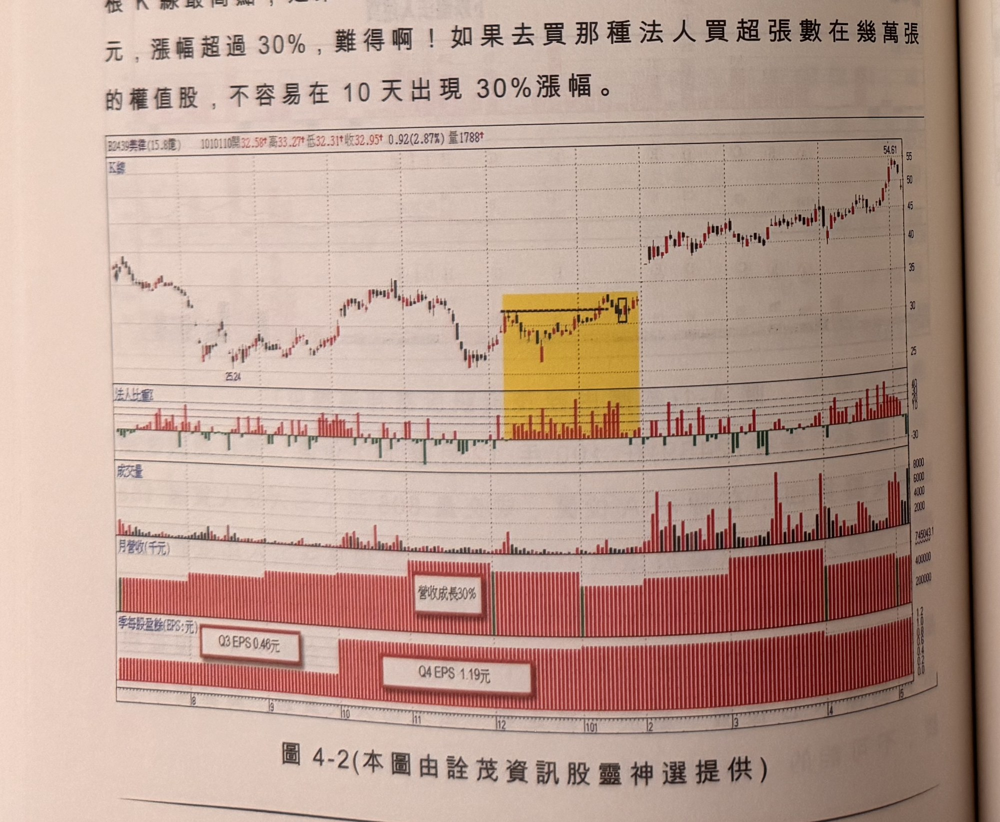

## p.154

標示 B 位置成交量 738 張，法人買超 154 張，法人比重達 20% 以上；標示 D 位置跳低開盤，成交量萎縮到 582 張，三大法人買超 228 張，法人比重拉升到 39%；標示 E 位置成交量只有 270 張，法人買超 72 張，法人比重 26%；在標示 2 位置做出突破標示 1 高點前，法人天天買超，雖然總體買超量不大，但是影響力不容小覷，標示 F 位置的法人比重甚至拉升到 50%，控盤影響力不言而喻；標示 2 位置突破區間高點，是個買進訊號。

標示 I、J 及 K 位置連三根小黑 K 線拉回，法人比重都佔成交量 3 成以上，回跌還呈現起勁買超，這太仗義了，而當下行情也站穩在季線之上，可以偏多操作，標示 3 位置出現 K 線收盤越過前一根 K 線最高點，是第二個進場的買進訊號，10 天後價格漲到 42.5 元，漲幅超過 30%，難得啊！如果去買那種法人買超張數在幾萬張的權值股，不容易在 10 天出現 30% 漲幅。

**圖 4-2** (本圖由詮茂資訊股靈神選提供)

> 圖說（figure notes）：美律(2439) K 線圖，左上角報價列標示「B2439美律(15.8億) 1010110開32.58↑高33.27↑低32.31↑收32.95↑0.92(2.87%)量1788↑」。K 線圖疊加均線，低點25.24後上升，黃色色塊標示一段法人持續買超的橫向整理區，區內以黑色框線標示突破點；其後價格快速上漲，末端高點54.61。下方依序為「法人比重」子圖（黃色區間內比重明顯偏高）、「成交量」柱狀圖、「月營收(千元)」柱狀圖（文字方塊「營收成長30%」標示一段月營收放大區）、「季每股盈餘(EPS:元)」柱狀圖（文字方塊「Q3 EPS 0.46元」「Q4 EPS 1.19元」分別標示對應季度）。

為什麼法人會在 12 月開始天天買超美律呢？100 年 8 月開始月營收逐月成長，尤其 11 月營收成長 30%(如圖 4-2)，造成報載臆測美律第四季營收將爆增至 25 億，較之第三季營收 13 億，成長近倍，雖公司澄清市場揣測，法人仍天天買超近月，當 101 年 1 月公布第四季合併營收達 24.38 億，符合市場預期，當然第四季 EPS 自然將較之第三季倍增，難怪連出二根漲停，或許這些營收變化及盈餘的倍增，早在法人田野訪察之時，已有了解，因此當出現這種法人默默地買超，雖不知基本面的消息發佈，但列入追蹤名單，伺機搭上順風車，切記未突破前，不必偷跑上車，免遭意外。

## p.155

[本頁為背面透印造成的淡淡鏡像字，非本頁實際內容；扣除頁碼「155」及章名列「第四章 透過法人比重選股」外，本頁無正文可辨識轉錄。]
