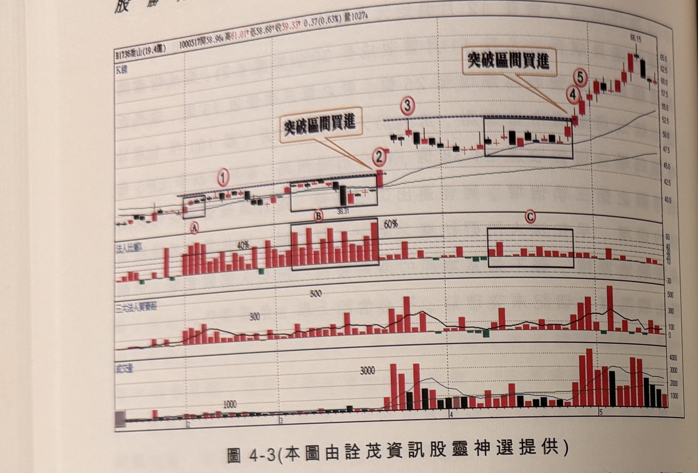
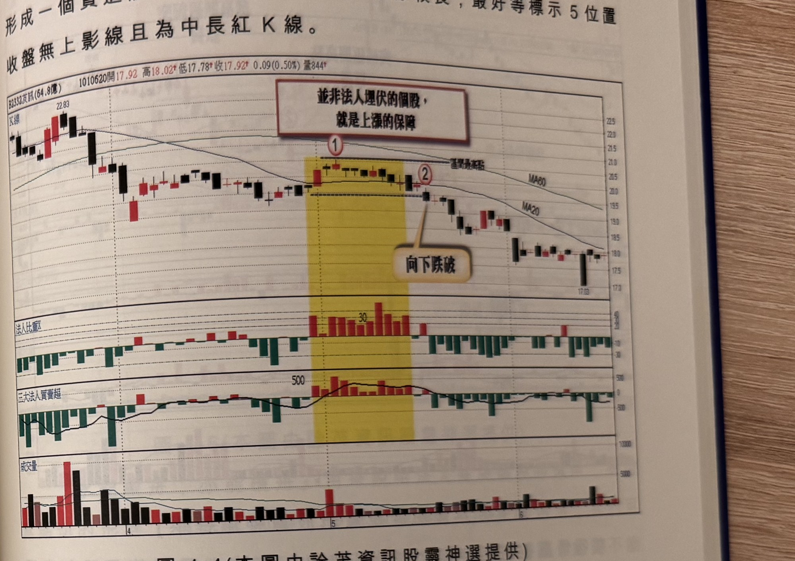

## p.156

**圖 4-3** (本圖由詮茂資訊股靈神選提供)

> 圖說（figure notes）：喬山(1736) K 線圖，左上角報價列標示「B1736喬山(19.4億) 1000517開58.96↑高61.01↑低58.68↑收59.33↑0.37(0.63%)量1027↑」。K 線圖疊加均線，標示紅色圓圈數字「①」「②」「③」「④」「⑤」，文字方塊「突破區間買進」出現兩次，分別指向②（黑框區間）及④（黑框區間，38.31）突破處；下方以黑框分別標示 A、B、C 三段法人比重偏高的區間（A區約40%、B區約60%、C區同樣偏高）。下方依序為法人比重、三大法人買賣超（300、500參考線）、成交量（1000、3000參考線）子圖。K 線右側持續上漲，高點66.15。

圖 4-3 為喬山(1736)在 100 年 2 月股市開紅盤即連續近 2 個月買超，在標示 A 區，成交量都低於 1000 張，三大法人買超張數都在 300 張以下，但換算法人比重，連續 4 天超過 40% 以上，這是值得列入追蹤後續發展，到了 3 月的 B 區每日買超張數仍不出 300 張，但因為成交量愈小，法人比重有 5 個交易日高達 60%，即使日本 311 大地震，造成輻射災變，產業重要零組件出現斷料危機，造成 3 月 15 日指數暴跌 285 點，盤中一度下跌近 450 點，當日喬山雖出現一根長黑下跌，但法人處變不驚，法人比重仍然在 60%，如果在 3 月初股價貼近標示 1 位置所代表的區間最高點，又發現 2 月份法人比重很高，未待突破即逕行買進，那麼遇到長黑破底，便須停損出場，說明買進訊號未現前，勿以為先卡位先贏，其實賺不到便宜的，必須等到標示 2 位置的 K 線收盤突破區間最高點，才是確定法人上攻的表態，始可進場跟買；C 區同樣出現另一次的橫向

## p.157

盤整，法人埋伏其中，當標示 4 位置 K 線突破標示 3 區間最高點，形成一個買進訊號，但因訊號 K 線上影線較長，最好等標示 5 位置收盤無上影線且為中長紅 K 線。

**圖 4-4** (本圖由詮茂資訊股靈神選提供)

> 圖說（figure notes）：友訊(2332) K 線圖，左上角報價列標示「B2332友訊(64.8億) 1010620開17.92 高18.02↑低17.78↑收17.92↑0.09(0.50%)量844↑」。K 線圖疊加均線，高點22.83，文字方塊「並非法人埋伏的個股，就是上漲的保障」置頂；標示紅色圓圈數字「①」「②」（黃色縱帶標示區間最高點與法人比重偏高區），文字方塊「向下跌破」以箭頭指向②右側跌破處。K 線右側持續下跌，低點17.03。下方依序為法人比重（黃色區間內約30%）、三大法人買賣超（500參考線）、成交量子圖。

在追蹤法人買超過程，絕對不可認定挖到寶，股價變化多端，法人買超不過是一種參考指標，或許在基本面的研究上，法人著墨較多，但不代表他買多的股票鐵定會漲，要把法人買超當成是獵犬，旨在幫助獵人找到標的物，至於要不要買進，端視價格是否出現有攻擊姿態，才決定跟隨與否。圖 4-4 友訊(2332)在 101 年 5 月初法人連續買超 11 天，價格回檔，只見法人不斷承接，卻不見維持在 30% 以上，具有控盤的影響力，但屬消極性的低接，當標示 2 位置跌攻擊買盤，只守不攻，無法突破標示 1 區間高點，這說明當型態已然破區間低點時，法人開始停損砍出，沿路下殺，這說明當型態轉空，即使法人不斷買超，也難敵趨勢的力量，操作者一定要切記轉空。
