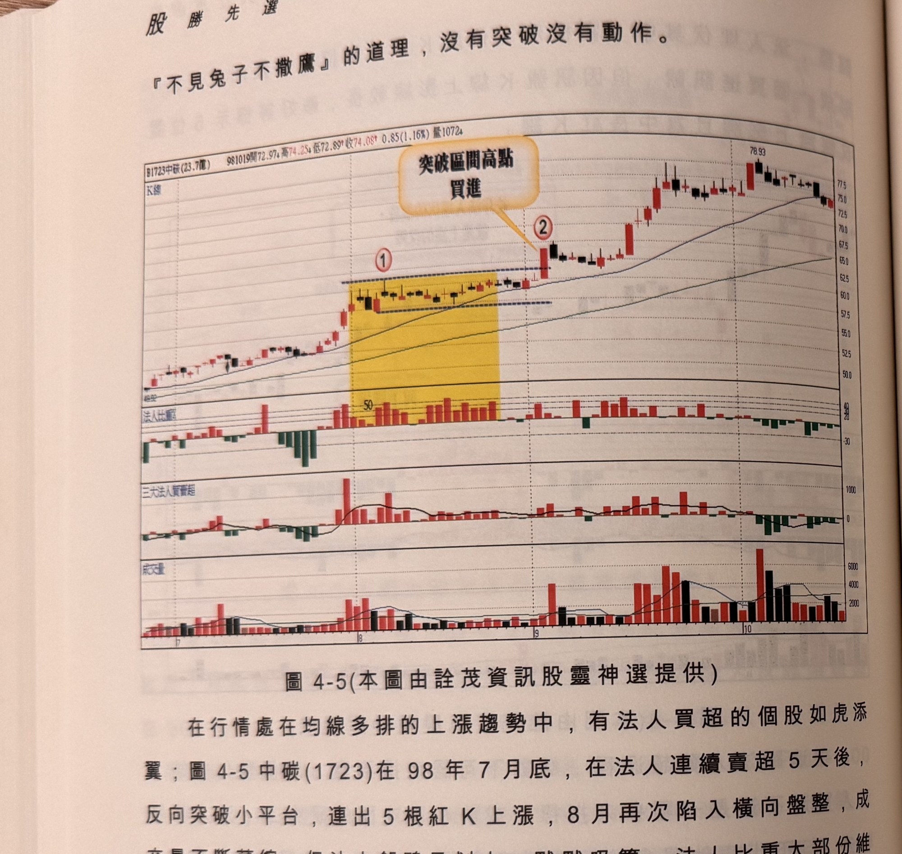
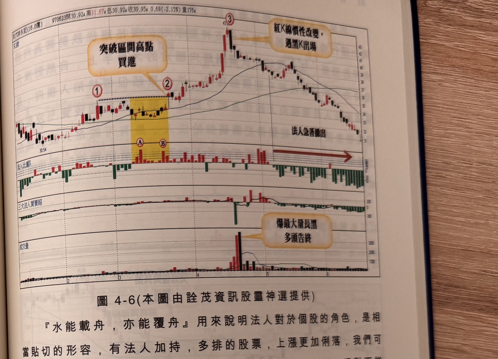

## p.158

『不見兔子不撒鷹』的道理，沒有突破沒有動作。

**圖 4-5** (本圖由詮茂資訊股靈神選提供)

> 圖說（figure notes）：中碳(1723) K 線圖，左上角報價列標示「B1723中碳(23.7億) 981019開72.97↑高74.25↑低72.89↑收74.08↑0.85(1.16%)量1072↑」。K 線圖疊加均線，黃色縱帶標示區間整理段（標示①），文字方塊「突破區間高點買進」以箭頭指向標示②突破處。K 線右側持續上漲，高點78.93。下方依序為法人比重（黃色區間內約50%）、三大法人買賣超（1000參考線）、成交量（2000/4000/6000參考線）子圖。

在行情處在均線多排的上漲趨勢中，有法人買超的個股如虎添翼；圖 4-5 中碳(1723)在 98 年 7 月底，在法人連續賣超 5 天後，反向突破小平台，連出 5 根紅 K 上漲，8 月再次陷入橫向盤整，成交量不斷萎縮，但法人卻鴨子划水，默默吸籌，法人比重大部份維持在 30% 以上，買超天數遠遠超過 10 天以上，區間上下界距離約 10%，三大條件皆符合，當標示 2 位置 K 線收盤帶量突破標示 1 位置區間高點，可以跟隨買進，並把停損投在標示 2 長紅 K 線最低點，中碳從此成為法人認養股，價格不斷攀高，法人買超一直沒間斷，除權前到達 188 元。

## p.159

**圖 4-6** (本圖由詮茂資訊股靈神選提供)

> 圖說（figure notes）：永記(1726) K 線圖，左上角報價列標示「B1726永記(16.0億) 970623開30.92↑高31.67↑低30.92↑收30.95↓0.68(-2.15%)量176↓」。K 線圖疊加均線，黃色縱帶標示區間整理段（標示①、A、B），文字方塊「突破區間高點買進」指向標示②突破處；標示③高點（43附近）處文字方塊「紅K線慣性改變，過黑K出場」；右側文字方塊「法人急著撤出」配紅色箭頭指向後續持續下跌段。K 線右側持續下跌，低點約31。下方依序為法人比重（A、B區偏高，其後轉綠翻負）、三大法人買賣超、成交量（文字方塊「爆最大量長黑 多頭告終」指向一根巨量黑K）子圖。

『水能載舟，亦能覆舟』用來說明法人對於個股的角色，是相當貼切的形容，有法人加持，多排的股票，上漲更加俐落，我們可以利用法人買超來做為選股參考，但離場要自己來判斷，絕對不能
