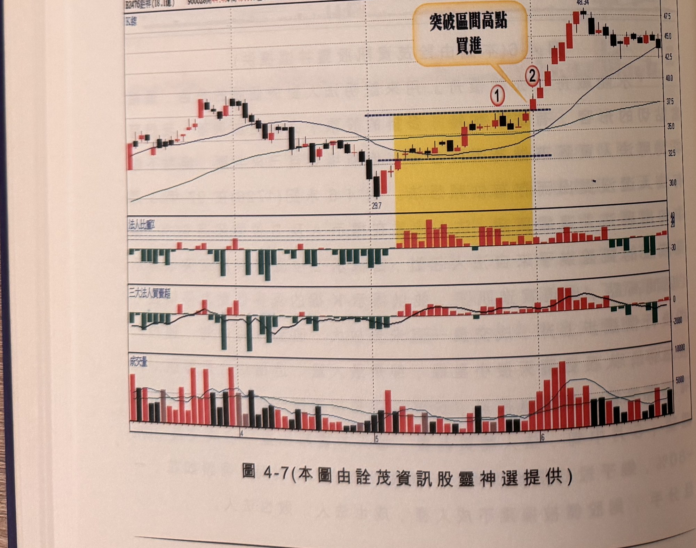
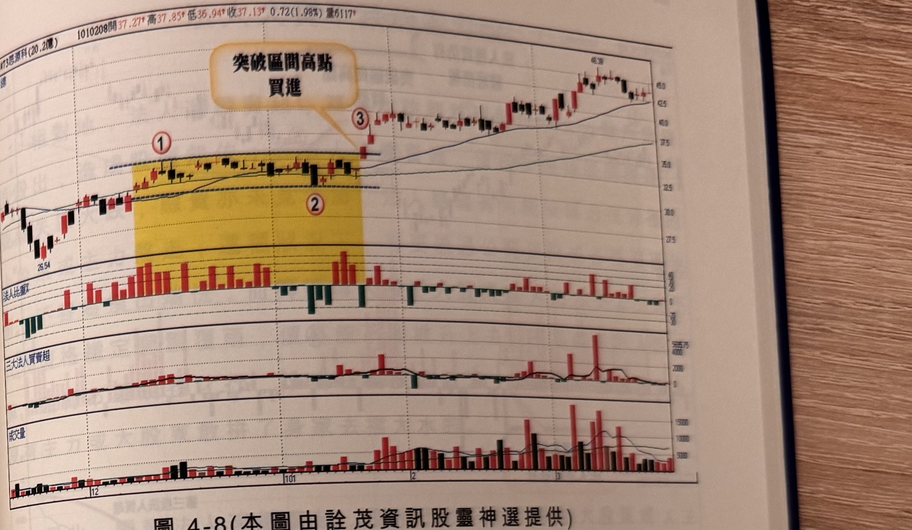
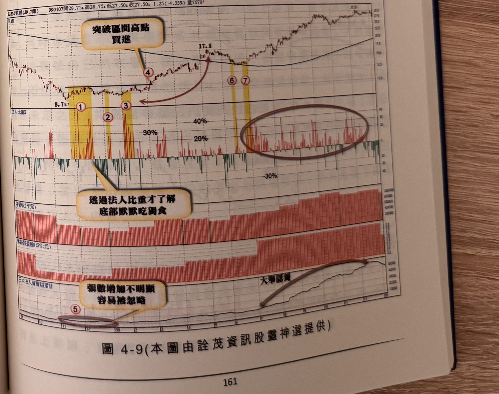

## p.160

如果法人買超能創造潛在的上漲行情，那麼法人賣超也可以出現上漲行情？端視籌碼落向何方神聖手中。價格剛從跌勢轉為均線多排的漲勢，法人買超代表籌碼歸向穩定的大戶手上，自然對推升是助力；如果價格推升到頭部區域，法人買超但價格陷入橫向，是誰擋著法人最積極向上的作為呢？散戶大部份是後知後覺，沒有頭部風險意識，不可能懂得把籌碼拋給法人，最有可能是大股東或主力籌碼拋給法人承接，這部份是找不到直接的資訊證據，那後市自然不妙。

以下各圖請讀者自行參閱。

**圖 4-7** (本圖由詮茂資訊股靈神選提供)

> 圖說（figure notes）：巨祥(2476) K 線圖，左上角報價列標示「B2476巨祥(18.1億) 950628開44.46↑高45.11↓低42.29↑收43.46 0.94(-2.12%)量3702」。K 線圖疊加均線，低點29.7後黃色縱帶標示均線糾纏區間（標示①、②），文字方塊「突破區間高點買進」以箭頭指向②突破處。K 線右側持續上漲，高點48.34。下方依序為法人比重（黃色區間內偏高）、三大法人買賣超、成交量子圖。

## p.161

**圖 4-8** (本圖由詮茂資訊股靈神選提供)

> 圖說（figure notes）：思源科 K 線圖，報價列標示「1010208開37.27↑高37.85↑低36.94↑收37.13↑0.72(1.98%)量6117↑」。K 線圖疊加均線，低點26.54，黃色縱帶標示均線糾纏區間（標示①、②），文字方塊「突破區間高點買進」以箭頭指向③突破處。K 線右側持續上漲。下方依序為法人比重（黃色區間內偏高）、三大法人買賣超、成交量子圖。

**圖 4-9** (本圖由詮茂資訊股靈神選提供)

> 圖說（figure notes）：敬鵬(2355) K 線圖，左上角報價列標示「B2355敬鵬(39.7億) 990107開28.75↓高28.75↓低27.50↓收27.50↓1.25(-4.35%)量7678↑」。K 線圖疊加均線，低點8.7附近，標示紅色圓圈數字「①」「②」「③」（黃色縱帶標示三段低檔法人比重偏高處）、「④」（突破處，文字方塊「突破區間高點買進」），紅色箭頭指向高點17.5；其後「⑥」「⑦」（黃色縱帶）。下方「法人比重A」子圖標示「40%」「30%」「20%」「-30%」參考線，橘色圈標示右側一段持續密集偏高區。「月營收(千元)」「季每股盈餘(EPS:元)」「三大法人買賣超累計」子圖，文字方塊「透過法人比重才了解底部默默吃獨食」「張數增加不明顯容易被忽略」及「大事認養」分別標示對應區段。K 線右側持續上漲，末端約30。

『水能載舟，亦能覆舟』用來說明法人對於個股的角色，是相當貼切的形容，有法人加持，多排的股票，上漲更加俐落，我們可以利用法人買超來做為選股參考，但離場要自己來判斷，絕對不能有法人還沒賣出而存有依賴想法。圖 4-6 永記(1726)在 97 年 3 月中旬出現法人連續買超，法人比重在標示 A 及 B 位置超過 60%，顯見該股的買盤幾乎來自法人包辦；當標示 2 位置 K 線跳空突破標示 1 區間高點，出現買進訊號，並以標示 K 線的真實低點為停損點，其後行情緩步上升，成交量一直未見放大，直到 4 月中旬，連拉二根漲停，大長紅隔天接小星線，卻是最大量，這種組合是警訊，再隔天居然殺一根爆量長黑，跌破長紅 K 線實體一半之下，便須出場觀望；5 月中旬，法人轉買為賣，每天的賣超比重，佔成交量 30%~80%，幾乎殺紅眼般砍貨，一檔個股被法人疼愛時，呵護如花，一旦分手，則股價被摧殘不成人樣，成也法人，敗也法人。
