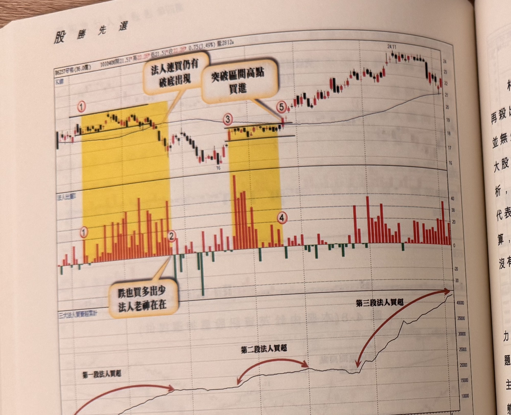
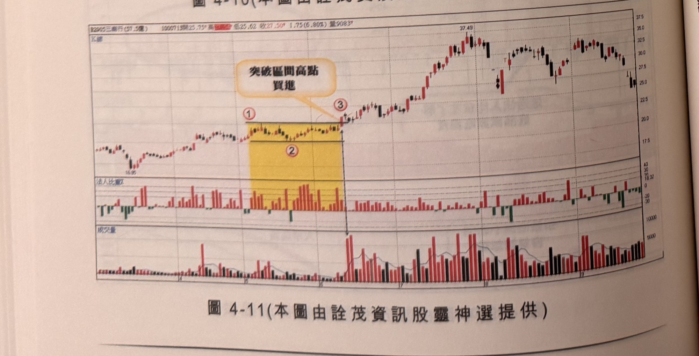

## p.162

**圖 4-10** (本圖由詮茂資訊股靈神選提供)

> 圖說（figure notes）：矽格(6257) K 線圖，左上角報價列標示「B6257矽格(36.0億) 1010406開21.51↑高22.20↓低21.51↑收22.20↑0.75(3.49%)量2812↓」。K 線圖疊加均線，兩段黃色縱帶分別標示「①法人連買仍有破底出現」（低點16附近）與「②突破區間高點買進」（標示③突破處）。K 線右側持續上漲，高點24.11。下方「法人比重」子圖，文字方塊「跌也買多出少 法人老神在在」指向一段轉負後回正區；「三大法人買賣超累計」子圖以紅色箭頭依序標示「第一段法人買超」「第二段法人買超」「第三段法人買超」三段階梯式上升。

**圖 4-11** (本圖由詮茂資訊股靈神選提供)

> 圖說（figure notes）：三商行(2905) K 線圖，左上角報價列標示「B2905三商行(57.5億) 1000713開25.75↑高?低25.62↓收27.50↑1.75(6.80%)量9083↑」。K 線圖疊加均線，低點16.95，黃色縱帶標示「①」「②」區間，文字方塊「突破區間高點買進」以箭頭指向③突破處。K 線右側持續上漲，高點37.49後回落整理。下方為法人比重與成交量子圖。

## p.163

# 法人大賣不跌的主力股

相對地，法人連續賣超，籌碼本該轉移到散戶手上，散戶賠錢再殺出，造成股價無依；若法人連續賣超，價格卻維持區間震盪，並無失靠大跌，融資亦未見增加，法人籌碼有可能被隱形在背後的大股東或主力盤走；這種狀況下，若要透過公開資訊或各種籌碼分析，不容易摸出端倪，而籌碼轉入隱形大股東或 X 主力手上，也不代表價格鐵定翻雲覆雨，價格能不能推升上去，不是錢多的人說得算，還得市場說行才行，市場在極度恐慌下，要霸盤不讓價格跌，沒有主力或大股東敢拚了身家去擋大水的。

因此，觀察法人連續賣超，價格不跌只說明某些大股東或 X 主力有企圖接走法人籌碼，但有沒有決心向上翻漲，這不只是資金問題，同時也須意志力貫徹，當 K 線收盤若突破區間高點，才能彰顯主力攻擊號角已然吹響，視為買進訊號，若觀察籌碼換手的吸籌動態，不能有立刻跳進跟買的想法，在未突破區間前，能不能攻上去還在未定之天。有心炒股價的市場主力或公司派大股東主導，在吸籌階段，能夠從法人手上逼出籌碼，自然比向散戶逼出來得省事，又能獲得較多的額子。這種現象非常經典，我們形容這種行情叫巴掌行情，當法人出脫完畢，該股價立刻突破推漲，無異是賞了籌碼出脫的法人一巴掌。

法人連續賣超的觀察天數，宜超過 10 個交易日以上，區間裡宜漲跌交錯，區間高低收盤價震盪幅度 10% 以內為宜，最佳是只有 5% 以內來回游走，而突破區間的突破 K 線宜為中長紅 K 線，不宜有長上影線，漲幅在 3%，最佳是達到漲停板收盤。

（註：本頁書眉標示頁碼「162」「163」，但下方圖 4-10 說明文字未完整拍攝，該段文字實際延續於下一張照片重複頁面中。）
