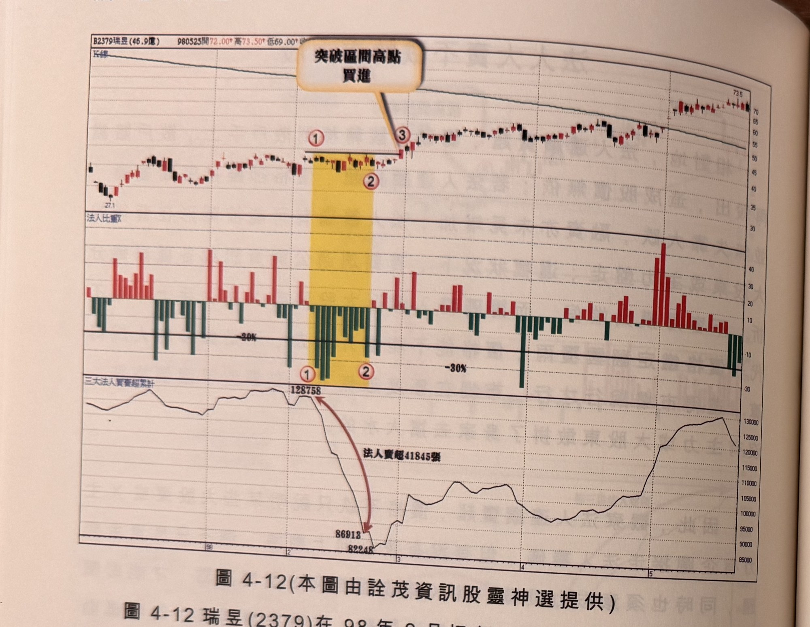
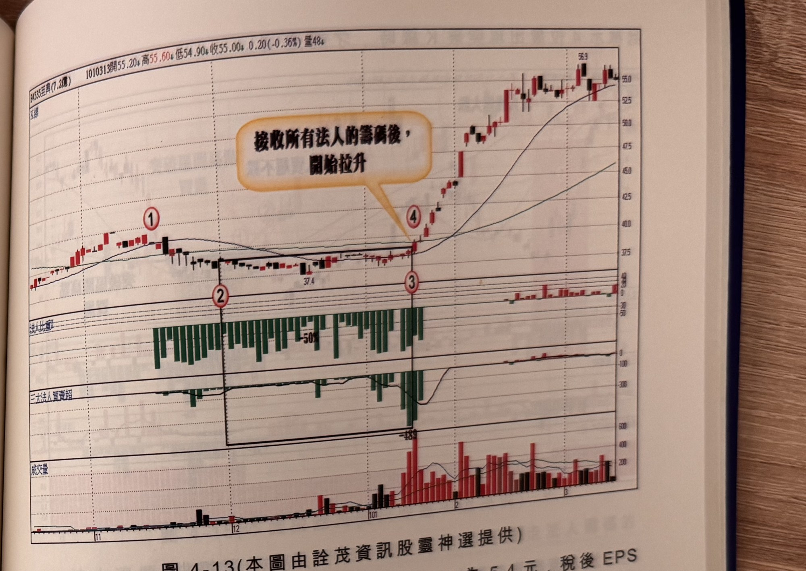

## p.164

**圖 4-12** (本圖由詮茂資訊股靈神選提供)

> 圖說（figure notes）：瑞昱(2379) K 線圖，左上角報價列標示「B2379瑞昱(46.9億) 980525開72.00↑高73.50↑低69.00↑…」。K 線圖疊加均線，低點27.1，標示紅色圓圈數字「①」「②」（黃色縱帶標示區間，下方另有小型①②標示於法人比重子圖對應處），文字方塊「突破區間高點買進」以箭頭指向③突破處。K 線右側持續上漲，末端73.5附近。下方「法人比重」子圖（標示「-20%」「-30%」參考線）與「三大法人買賣超累計」子圖，數值標示「128758」（起點）、紅色箭頭指向「法人賣超41845張」下降至「86913」「82248」，其後回升至13萬附近。

圖 4-12 瑞昱(2379)在 98 年 2 月初在 30 元附近塊，在標示 1 至標示 2 之間，出現三大法人連續賣超 11 天，賣超比重佔當日成交量超過 20% 者 6 個交易日，區間最高收盤價 38 元，最低收盤價 34.45 元，差距在 10% 以內，法人在區間總賣超張數為 41845 張，正是法人連續賣超，價格橫向整理，顯然有一隻隱形手在撐住盤面，可能是大股東所為，也可能是市場大戶傑作，這只是在區間籌碼互換過程，壁上觀即可，不宜躁進加入任何一方，等到 2 月底在標示 3 位置以漲停板帶量攻擊盤出現時，才可確認攻擊發動，跟隨買進。攻擊日不見得出現在法人連續賣超的隔日或當日，有時也延遲一陣子，但突破區間就是做盤最佳的發動攻擊日。

## p.165

**圖 4-13** (本圖由詮茂資訊股靈神選提供)

> 圖說（figure notes）：至興(4535) K 線圖，左上角報價列標示「B4535至興(7.2億) 1010313開55.20↓高55.60↓低54.90↓收55.00↓0.20(-0.36%)量48↓」。K 線圖疊加均線，標示紅色圓圈數字「①」「②」（低點37.4附近，黑框標示長方形整理區）、「③」「④」（文字方塊「接收所有法人的籌碼後，開始拉升」指向④突破處）。K 線右側持續上漲，高點56.9。下方「法人比重」子圖（黑框內持續為綠色賣超，觸及「-50%」「-189」低點）與成交量子圖（突破後放量轉紅）。

圖 4-13 至興(4535)在 100 年度稅前 EPS 為 5.4 元，稅後 EPS 為 4.5 元，100 年 10 月 31 日公布前三季稅後 EPS 為 3.15 元，價格卻在 11 月中旬(標示 1 位置)開始下跌，由於成交量過小，法人賣超比重往往都佔當日成交量 50% 以上，一開始法人賣超時，價格也跟著滑跌到 38 元附近，在 12 月開始(標示 2 位置)，跟著滑跌到 38 元附近；盤整區間內最高收盤價為 39 元，最低收盤價為 37.45 元，震盪幅度更小於 5%，如果不是用法人比重來觀察，每日法人賣超張數小，絕對不容易引人注意這個股票。在兩個月內，法人幾乎天天賣超，誰不想讓至興下跌呢？大股東或市場主力皆有可能，畢竟它具有獲利數字佳的硬底子，總會有識貨者玩你丟撿，但觀察到這種奇怪現象時，不必等可認定後市必漲，一分證據一分真相，沒有突破沒有買進，必須等
