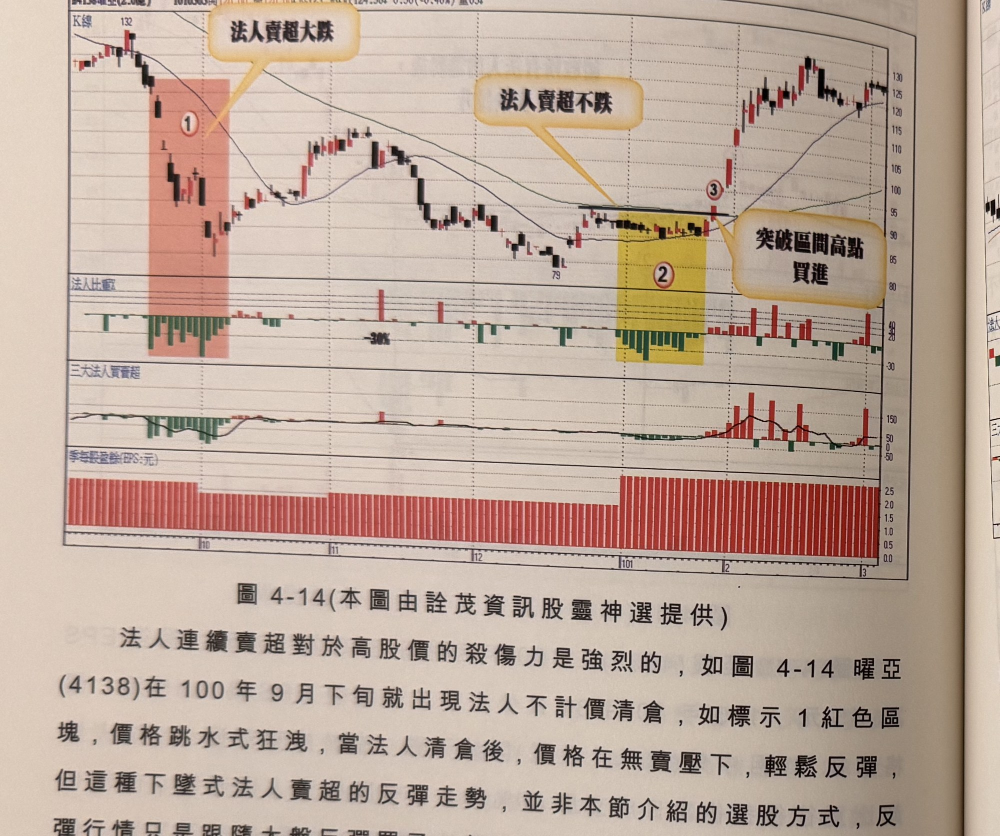
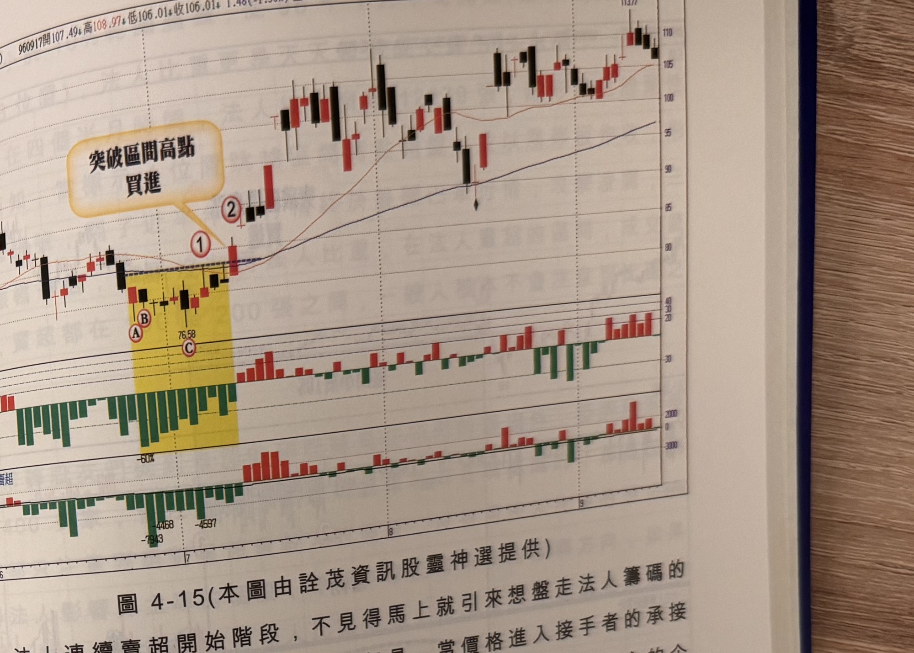

## p.166

到標示 4 位置出現突破 K 線時，才能進場。

**圖 4-14** (本圖由詮茂資訊股靈神選提供)

> 圖說（figure notes）：曜亞(4138) K 線圖，左上角報價列標示「B4138曜亞(2.6億) 1010303開126.00↑高126.00↓低123.50↓收124.50↓0.50(-0.40%)量65↓」。K 線圖高點132，紅色縱帶標示①（文字方塊「法人賣超大跌」），低點79附近；文字方塊「法人賣超不跌」以箭頭指向後段黃色縱帶②；標示③（文字方塊「突破區間高點買進」）。K 線右側持續上漲。下方依序為法人比重（-30%參考線）、三大法人買賣超、季每股盈餘(EPS:元)柱狀圖（黃色縱帶對應期間EPS偏低）子圖。

法人連續賣超對於高股價的殺傷力是強烈的，如圖 4-14 曜亞(4138)在 100 年 9 月下旬就出現法人不計價清倉，如標示 1 紅色區塊，價格跳水式狂洩，當法人清倉後，價格在無賣壓下，輕鬆反彈，但這種下墜式法人賣超的反彈走勢，並非本節介紹的選股方式，反彈行情只是跟隨大盤反彈罷了，在 101 年 1 月標示 2 黃色區塊，同樣出現法人連續賣超，但價格似乎不再爹娘不疼，只呈現橫向窄幅盤整，這種異常的狀況，就值得觀察動向，價格正好夾處在季線與月線之間游走，如做突破季線前的關前整理，當標示 4 位置出現突破 K 線，正式突破區間高點，也突破季線近一個月的壓制，形成買進訊號，行情也快速拉升，軋空手的法人搶買。

## p.167

**圖 4-15** (本圖由詮茂資訊股靈神選提供)

> 圖說（figure notes）：億光(2393) K 線圖，報價列標示「960917開107.49↓高108.97↑低106.01↓收106.01↓1.48(-1.38%)量3545↓」。K 線圖疊加均線，黃色縱帶標示均線糾纏區間（標示A、B、C，低點76.58），標示①②，文字方塊「突破區間高點買進」以箭頭指向突破處。K 線右側持續上漲，高點113.77。下方法人比重子圖標示「-60%」及數值「-4468」「-4597」「-7943」，其後轉紅回升；三大法人買賣超子圖亦由負轉正。

法人連續賣超開始階段，不見得馬上就引來想盤走法人籌碼的隱形買主，造成價格往下跌一段；但是，當價格進入接手者的承接價格區間，價格開始呈現橫向游走，此時方能偵測出隱形買主的企圖，如圖 4-15 億光(2393)在 96 年 6 月初法人開始連續賣超，賣超比重在當日成交量 30% 以上佔八成的時間，一開始價格滑跌，較難看出隱形買主的承接意志，但在標示 A、B 及 C 位置出現賣超張數達 16000 張以上，尤其標示 A 法人比重達 60%，居然能絕地反攻，價格收盤始終硬挺在標示 A 位置 K 線最低點之上，隨後的 9 個交易日，任由法人倒貨，價格收盤始終硬挺在標示 A 位置 K 線最低點之上，換言之從標示 A 開始的價格區間，就是隱形買主展現決心承接的區域，當標示 2 位置 K 線收盤突破區間高點(標示 1)代表橫向 10 天的承接防守模式，已變為攻擊向上的積極操作，在標示 2 位置，即可跟隨買進，並設好 7% 停損的風險管控。
