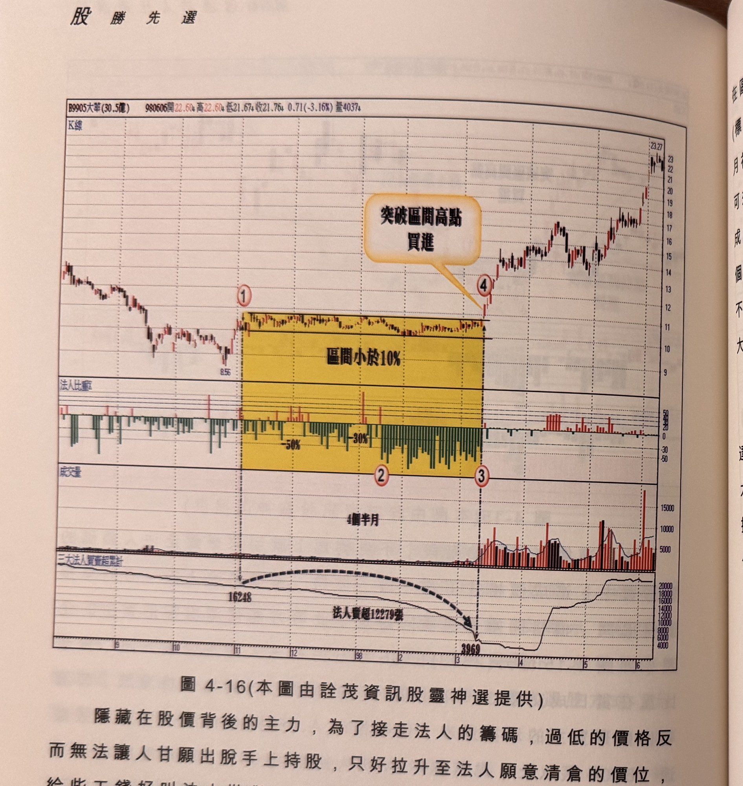

## p.168

**圖 4-16** (本圖由詮茂資訊股靈神選提供)

> 圖說（figure notes）：大華(9905) K 線圖，左上角報價列標示「B9905大華(30.5億) 980606開22.60↑高22.60↓低21.67↓收21.76↓0.71(-3.16%)量4037↓」。K 線圖低點8.56，黃色縱帶標示「區間小於10%」（標示①②③），文字方塊「突破區間高點買進」以箭頭指向④突破處。K 線右側持續上漲，高點23.27。下方法人比重子圖（黃色區間內觸及「-50%」「-30%」）；三大法人買賣超累計子圖，數值標示「16248」，虛線弧形指向「法人賣超12279張」下降至「3969」，其後回升至20000附近。

隱藏在股價背後的主力，為了接走法人的籌碼，過低的價格反而無法讓人甘願出脫手上持股，只好拉升至法人願意清倉的價位，給些工錢好叫法人拋貨，當然這種協定或默契不是外人所能知悉的，為了承接法人的籌碼，有時是耗費時間的，如圖 4-16 大華(9905)在 97 年 8 月開始，法人不斷賣超，價位從 13 元一路賣到 8.56 元，顯見法人主導這檔股票的升跌，但從 11 月底出現從底部翻升，拉到 10.71 元(標示 1 位置)，法人依舊賣個不停，事情開始起根本變化，隱形買主開始現出身影，法人怎麼賣也無法造成股價大跌，只

## p.169

在區間小於 10% 範圍震盪，從 98 年 1 月中旬開始(標示 2)到 3 月初(標示 3 位置)，法人比重更是天天超過成交量 50% 水準，一直到 3 月初，在四個半月時間，法人總計賣超 12279 張，隱形買主的耐性可想而知，當標示 4 位置跳越區間高點開盤，並以漲停板作收，形成買進訊號，悶了近半年的行情終於展開巴掌行情，攻擊凌厲，三日月漲幅一倍，如果沒有用法人比重，在法人賣超的區間，成交量賣超都在 100 至 200 張之間，一般人根本不會注意到比重之不小，賣超都在 100 至 200 張之間，一般人根本不會注意到比重之大。

常聽股友們提到會漲的個股總是在他們的眼皮外，掛牌股票多達 1400 多家，會注意到的都是媒體報導或名嘴推薦的，那是因為大眾都只注意到絕對買超量較大的個股，沒有用法人比重的想法去搜尋法人影響力主導的個股，希望本章能帶來新的觀察方向，如果你所使用的看盤軟體沒有法人比重指標，務請向軟體提供者反應增設。
