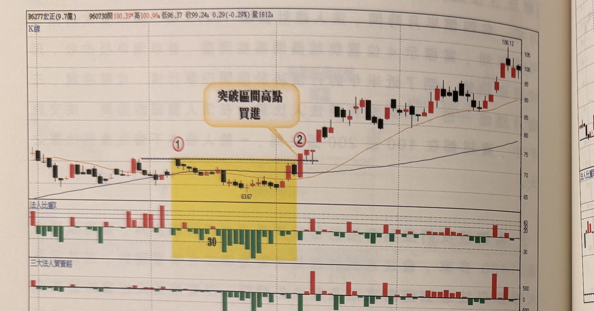
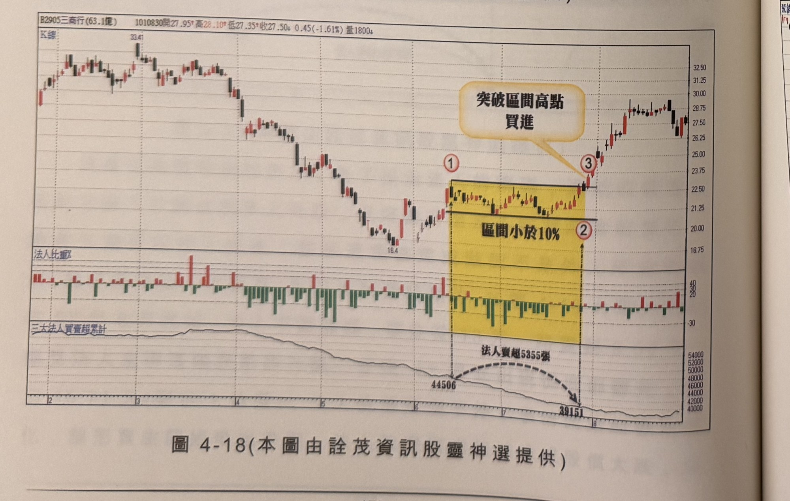
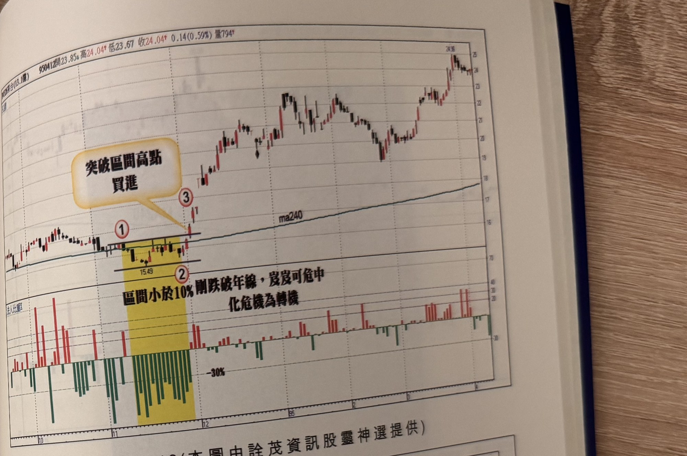
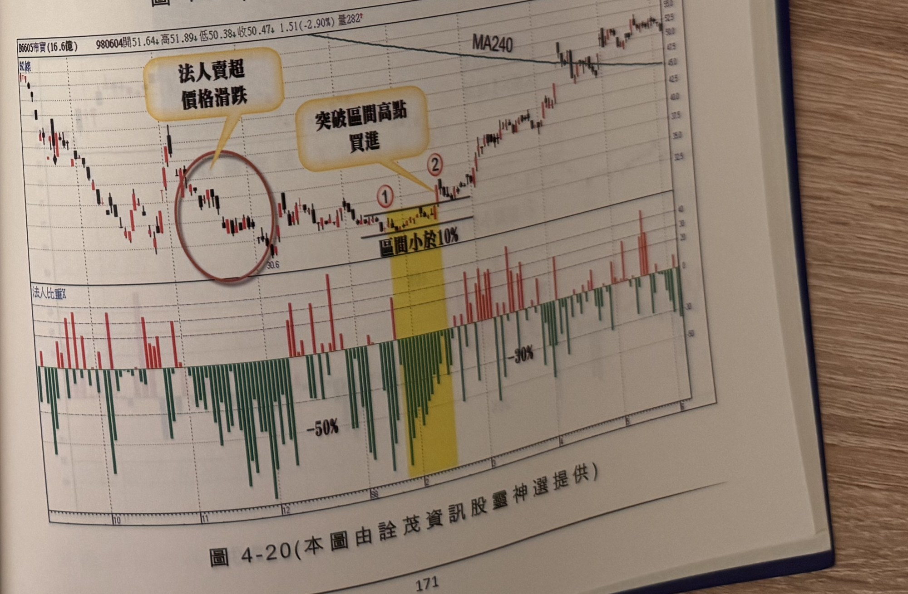

## p.170

以下附圖請讀者自行參閱練習。

**圖 4-17** (本圖由詮茂資訊股靈神選提供)

> 圖說（figure notes）：宏正(6277) K 線圖，左上角報價列標示「B6277宏正(9.7億) 960730開100.39↑高100.96↓低96.37↑收99.24↓0.29(-0.29%)量1812↓」。K 線圖黃色縱帶標示均線糾纏區間（標示①，低點63.67），文字方塊「突破區間高點買進」以箭頭指向②突破處。K 線右側持續上漲，高點106.12。下方法人比重子圖（黃色區間內觸及「30」偏低）與三大法人買賣超子圖。

**圖 4-18** (本圖由詮茂資訊股靈神選提供)

> 圖說（figure notes）：三商行(2905) K 線圖，左上角報價列標示「B2905三商行(63.1億) 1010830開27.95↑高28.10↑低27.35↓收27.50↓0.45(-1.61%)量1800↓」。K 線圖高點33.41，低點18.4後回升，黃色縱帶標示「區間小於10%」（標示①②），文字方塊「突破區間高點買進」以箭頭指向③突破處。K 線右側持續上漲。下方法人比重子圖與三大法人買賣超累計子圖，數值標示「44506」，弧形虛線指向「法人賣超5355張」下降至「39151」，其後回升。

## p.171

**圖 4-19** (本圖由詮茂資訊股靈神選提供)

> 圖說（figure notes）：個股 K 線圖，左上角報價列標示「95041?台(13.1億) …開23.85↓高24.04↑低23.67↑收24.04↑0.14(0.59%)量794↑」。K 線圖低點15.49，黃色縱帶標示「區間小於10%」（標示①②），文字方塊「突破區間高點買進」（標示③）與「剛跌破年線，岌岌可危中 化危機為轉機」分別標示於突破處與MA240年線下方。K 線右側持續上漲，高點24.36。下方法人比重子圖（黃色區間內觸及「-30%」）。

**圖 4-20** (本圖由詮茂資訊股靈神選提供)

> 圖說（figure notes）：帝寶(8605) K 線圖，左上角報價列標示「B8605帝寶(16.6億) 980604開51.64↓高51.89↓低50.38↓收50.47↓1.51(-2.90%)量282↑」。K 線圖低點30.6，紅色圓圈標示「法人賣超價格滑跌」區段，黃色縱帶標示「區間小於10%」（標示①），文字方塊「突破區間高點買進」以箭頭指向②突破處，其上MA240年線走平後緩步上揚。K 線右側持續上漲，高點約53附近後回落整理。下方法人比重子圖（觸及「-50%」「-30%」）。
