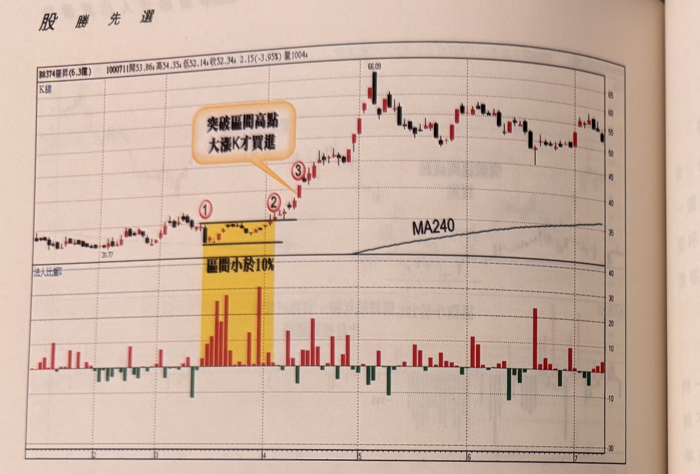
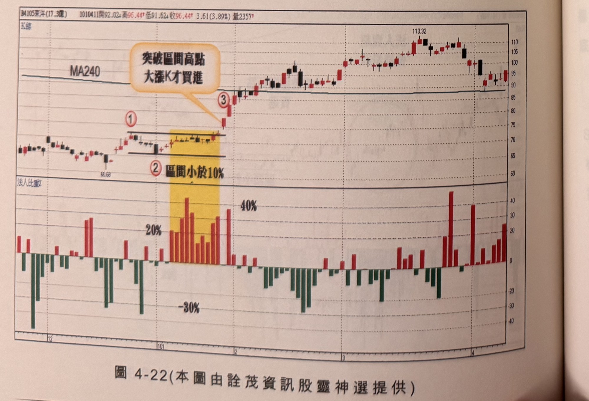

## p.172

**圖 4-21** (本圖由詮茂資訊股靈神選提供)

> 圖說（figure notes）：曜越(8374) K 線圖，左上角報價列標示「B8374曜越(6.3億) 1000711開53.86↓高54.35↓低52.14↓收52.34↓2.15(-3.95%)量1004↓」。K 線圖低點31.77，黃色縱帶標示「區間小於10%」（標示①②），文字方塊「突破區間高點大漲K才買進」以箭頭指向③突破處，上方MA240年線走平後緩升。K 線右側持續上漲，高點66.09，其後回落整理於52～60區間。下方法人比重子圖（黃色區間內明顯偏高）。

**圖 4-22** (本圖由詮茂資訊股靈神選提供)

> 圖說（figure notes）：東洋(4105) K 線圖，左上角報價列標示「B4105東洋(17.3億) 1010411開92.02↑高96.44↑低91.62↓收96.44↑3.61(3.89%)量2357↑」。K 線圖低點60.68，上方MA240年線走平，黃色縱帶標示「區間小於10%」（標示①②），文字方塊「突破區間高點大漲K才買進」以箭頭指向③突破處。K 線右側持續上漲，高點113.32，其後回落整理於90～100區間。下方法人比重子圖（黃色區間內觸及「20%」「40%」「-30%」）。

## p.173

# 第五章 快速D頂底訊號

[本頁上方為插圖「破窗玫瑰(王沛文油畫作品，16歲)」——蜘蛛網纏繞的樹幹暗處有一隻黑烏鴉，下方角落一朵沾著水珠的紅玫瑰。插圖右側及下方另排印章名列與章首文字，但因插圖佔據版面大部分且照片角度關係，文字擠壓於窄欄且部分反光模糊，無法逐字確認轉錄；其內容與下一張照片（IMG_8915／p.175）清晰可讀的章首段落相同或相接，完整文字請見 IMG_8915.md 的 p.175 部分。]
