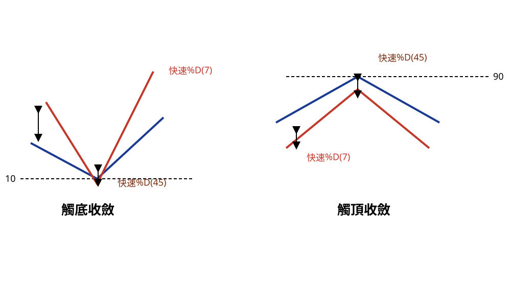

## p.176

是價格峰谷即將產生的重要徵兆。

### 峰谷觸及收斂訊號

**圖 5-1** (本圖由詮茂資訊股靈神選提供；示意圖，已重繪為 SVG，原圖見 股勝先選-fig-5-1.orig.jpg)

> 圖說（figure notes）：本圖為手繪示意圖（非真實 K 線截圖），分兩組。左「觸底收斂」：藍線「快速%D(45)」與紅線「快速%D(7)」皆呈 V 形下探後回升，藍線谷底觸及水平虛線「10」，兩線谷底處以雙箭頭標示距離已收斂靠攏。右「觸頂收斂」：藍線與紅線皆呈倒 V 形（先升後跌），藍線峰頂觸及水平虛線「90」，兩線峰頂處以雙箭頭標示距離收斂。

為了說明起見，快速 D(7) 及快速 D(45) 簡稱短 D 及長 D，讀者在製作指標時，把一般常見的 KD 指標的 K 值取參數 7 及參數 45 放置在同一視窗中即可，如果無法製作，後面我們將介紹另一種 KD(45) 指標結合 RSI(5) 研判的方式，亦能做到相同效果。圖 5-1 是短 D 與長 D 的收斂分為觸底收斂及觸頂收斂兩種，這是尋找峰谷位置的基本結構。

在觸底收斂過程，長 D 必須先觸及 20 以下，但以 10 以下為佳，

## p.177

代表長 D 落入超賣區，速率會變慢變緩，這是所有在 0~100 間波動的指標特色，也是避免不掉的鈍化行為，正因為長 D 進入超賣區的速率改緩，造成短 D 可以逼近長 D，彼此的距離由大縮小收斂，如圖左半邊所示，短 D 必須位在 30 以下，最佳在 20 以下，愈貼近長 D，谷點的可靠度愈高，當貼近後，短 D 與長 D 同時打勾上揚是第一種買進訊號，配合中長紅 K 線的出現，則訊號品質愈好；另一種短 D 打勾，長 D 未打勾，則必須等到長 D 打勾始確認買訊出現，訊號品質同樣要求為中長紅 K 線為佳，如果訊號本身為小漲 K 線，則控制停損的設置更要切實執行。

而在觸頂收斂過程如圖 5-1 上右半邊，長 D 必須先觸及 80 以上，90 以上則最好，代表指標進入超買區，速率將趨緩，短 D 逐漸逼近也進入 70 以上，最好短 D 進入 80 以上超買區域，原先短 D 與長 D 之間的距離愈來愈小，如果短 D 及長 D 皆上達 90 以上，同向下彎，就形成賣出訊號，距離高點在 2 根以內的訊號品質為佳，如果短 D 先下彎，但長 D 未彎，則等待長 D 下彎，始能成立賣出訊號。

在觸底收斂過程，短 D 必須由長 D 的內側逼近，即短 D 必須保持在長 D 的右側向下逼近，由外側逼近的程序後文說明，在收斂過程不可有兩者距離放大發散，如有必須放棄訊號；觸頂收斂過程也是一樣，短 D 必須由長 D 的內側逼近，即短 D 必須維持在長 D 的右側向上逼近，在收斂過程也不可有短 D 與長 D 之間距離放大發散情形發生，如有必須放棄訊號。
