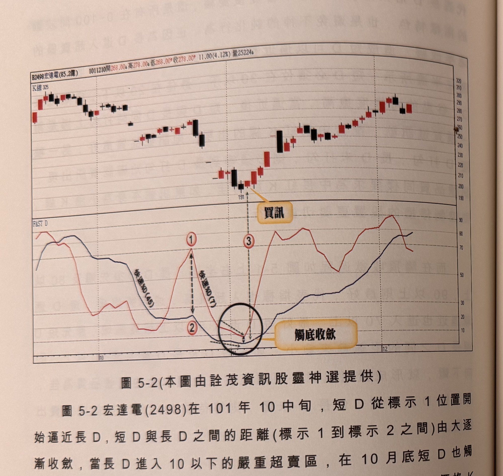
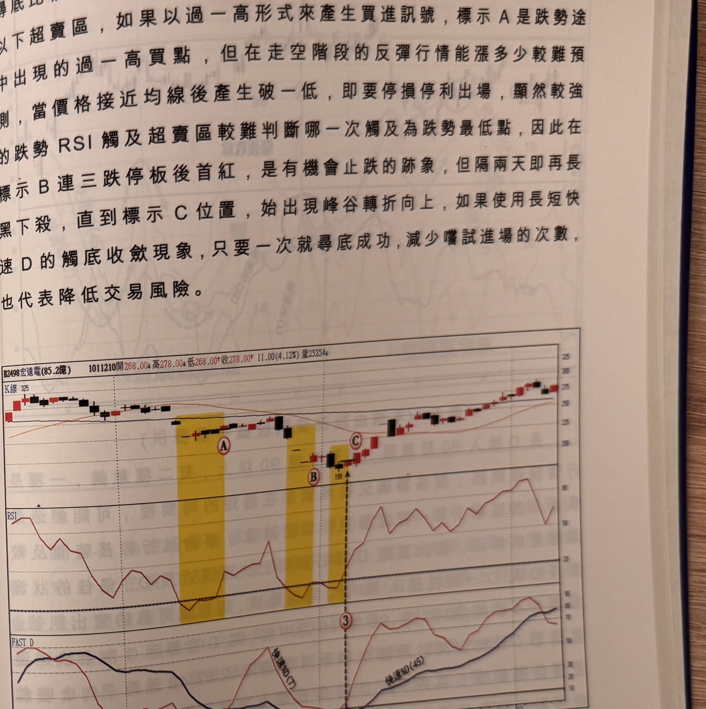

## p.178

**圖 5-2** (本圖由詮茂資訊股靈神選提供)

> 圖說（figure notes）：宏達電(2498) K 線圖，左上角報價列標示「B2498宏達電(85.2億) 1011210開268.00↓高278.00↓低268.00↑收278.00↑11.00(4.12%)量25224↓」。K 線圖下方「FAST D」子圖，藍線為快速%D(45)，紅線為快速%D(7)。標示紅色圓圈數字「①」（短D快速上衝高點，雙箭頭標示與長D距離）、「②」（短D回落），黑色圓圈標示「觸底收斂」處（短D與長D重疊糾結），標示「③」，虛線箭頭指向 K 線圖上文字方塊「買訊」（對應K線價位191附近的止跌長紅K）。K 線右側持續上漲，收在278附近。

圖 5-2 宏達電(2498)在 101 年 10 中旬，短 D 從標示 1 位置開始逼近長 D，短 D 與長 D 之間的距離(標示 1 到標示 2 之間)由大逐漸收斂，當長 D 進入 10 以下的嚴重超賣區，在 10 月底短 D 也觸及 10 以下，當標示 3 位置長短 D 同時打勾轉折向上，當日價格 K 線亦收中紅 K 線，沒有過長的上影線，形成買進訊號，這是觸底收斂的典型範例。

注意短 D 必須位在長 D 的右側，並從上方向下逼近長 D，距離逐漸縮小到同時轉向打勾或長 D 打勾，形成買進訊號，並設停損 7% 或以谷點為停損位置，其後行情往上漲，即可運用第一章提到的出場方式，進行移動停利。

圖 5-3 亦為宏達電(2498)日線圖，將 RSI(5) 及快速 D 值來做為

## p.179

尋底比較，在下跌走勢過程中，黃色區域代表 RSI 指標值進入 20 以下超賣區，如果以過一高形式來產生買進訊號，標示 A 是跌勢途中出現的過一高買點，但在走空階段的反彈行情能漲多少較難預測，當價格接近均線後產生破一低，即要停損停利出場，顯然較強的跌勢 RSI 觸及超賣區較難判斷哪一次觸及為跌勢最低點，因此在標示 B 連三跌停板後首紅，是有機會止跌的跡象，但隔兩天即再長黑下殺，直到標示 C 位置，始出現峰谷轉折向上，如果使用長短快速 D 的觸底收斂現象，只要一次就尋底成功，減少嘗試進場的次數，也代表降低交易風險。

**圖 5-3** (本圖由詮茂資訊股靈神選提供)

> 圖說（figure notes）：宏達電(2498) 同一段行情的日線圖，上方 K 線圖疊加均線，三段黃色縱帶分別標示紅色圓圈「A」（過一高買點）、「B」（連三跌停板後首紅）、「C」（峰谷轉折向上處，虛線連至下方標示「3」）。中段「RSI」子圖，紅線於三段黃色縱帶對應處觸及約20以下超賣區。下方「FAST D」子圖，藍線快速%D(45)、紅線快速%D(7)，兩線於標示「3」處同時觸底打勾向上，其後同步上揚，標示「快速%D(7)」「快速%D(45)」文字標籤。
