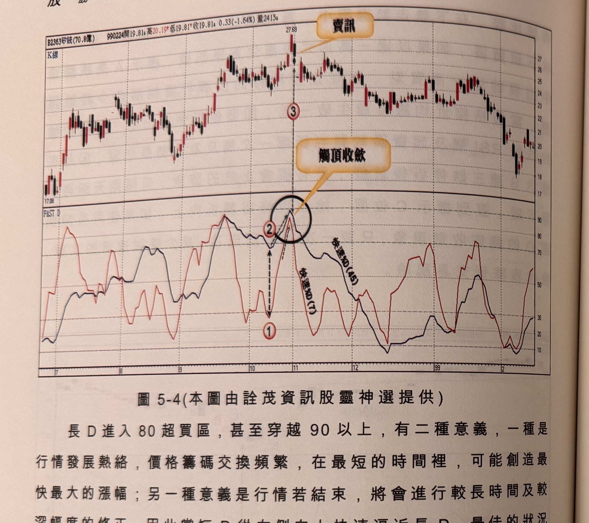
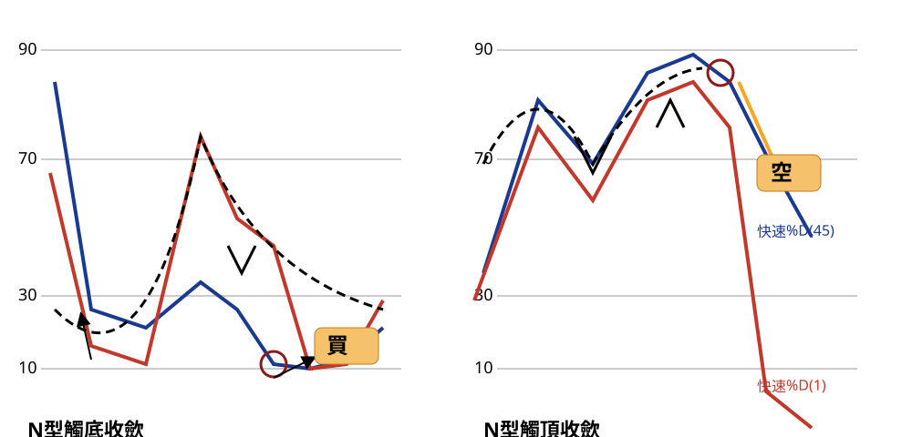

## p.180

**圖 5-4** (本圖由詮茂資訊股靈神選提供)

> 圖說（figure notes）：矽統(2363) K 線圖，左上角報價列標示「B2363矽統(70.8億) 990224開19.81↓高20.19↑低19.81↑收19.81↓0.33(-1.64%)量2415↓」。K 線圖低點17.08，高點27.69處文字方塊「賣訊」以箭頭指向標示「③」。下方「FAST D」子圖，藍線快速%D(45)、紅線快速%D(7)，標示紅色圓圈數字「①」（雙箭頭距離）「②」，黑色圓圈標示「觸頂收斂」處（短D與長D於高點附近糾結，對應K線賣訊處）。K 線右側大幅下跌，收在20附近。

長 D 進入 80 超買區，甚至穿越 90 以上，有二種意義，一種是行情發展熱絡，價格籌碼交換頻繁，在最短的時間裡，可能創造最快最大的漲幅；另一種意義是行情若結束，將會進行較長時間及較深幅度的修正，因此當短 D 從右側向上快速逼近長 D，最佳的狀況是長 D 短 D 一致性進入 90 後，同向彎頭，則形成可靠的賣出訊號。如圖 5-4 矽統(2363)在 98 年 10 月中旬，短 D 從標示 1 向上快速逼近長 D，彼此之間的距離由標示 1 及標示 2 的 40 差距，向上收斂至黑色圈區的 5 以內，長 D 短 D 在標示 3 一致性的彎頭，就形成波段頂點反轉的機率大增，代表後市將進入較長時間的整理，修正幅度也較大，操作者可以將觸頂收斂當作出場訊號，也可視為放空訊號，但因此峰點放空，也表示行情正處在均線多排，逆向操作要設好停損 7% 準備，以防指標呈現複雜的鈍化出現。

## p.181

### 峰谷N型收斂訊號

**圖 5-5** (示意圖，已重繪為 SVG，原圖見 股勝先選-fig-5-5.orig.jpg)

> 圖說（figure notes）：手繪示意圖（非真實 K 線截圖），分兩組，縱軸標示 90、70、30、10 參考線。左「N型觸底收歛」：藍線快速%D(45)與紅線快速%D(1)先下探至低點，藍線出現一個較淺的N型反彈波（黑色虛線標示其路徑，箭頭向下再向上），紅線觸及10附近低點（紅色圓圈標示），隨後文字方塊「買」以橘色線段指向該處。右「N型觸頂收歛」：藍線與紅線先上衝至70~90區間，出現N型的雙峰走勢（黑色虛線與箭頭標示先降後升的第二峰），藍線於高點觸及90附近（紅色圓圈標示），文字方塊「空」以橘色線段指向該處，隨後紅線快速下滑至30以下。

圖 5-5 為波段峰谷偵測的第二種形式為 N 型收斂，在觸底過程，短 D 位在長 D 左側，雙雙朝下滑行，短 D 先穿越長 D 形成黃金交叉，但並非買訊，短 D 進入長 D 內側(右方)並朝上穿越 40 以上，此時短 D 與長 D 之間開口達到最大後，短 D 開始向下快速逼近長 D，長 D 已經探至超賣區接近 90，此時，若發生短 D 與長 D 同時打勾向上，為買進訊號，如果短 D 先打勾向上，長 D 卻仍朝下同時打勾向上，為買進訊號；通常長 D 觸及 90 以上移動，則須等待長 D 打勾始確認買進訊號；通常長 D 觸及 90 以上移動，則須等待長 D 打勾始確認買進訊號，兩者之間距離收斂越小越好。

倒 N 型觸頂收斂的觀察過程，短 D 也是位在長 D 左側，向上穿越長 D 後向下跌破長 D 形成死亡交叉，但不視為賣出訊號，平行移動後，短 D 再度向下跌破長 D 形成死亡交叉，才視為賣出訊號。[本段末句書眉印刷字跡略糊，最後一次死亡交叉是否構成賣出訊號需核對原書確認]
