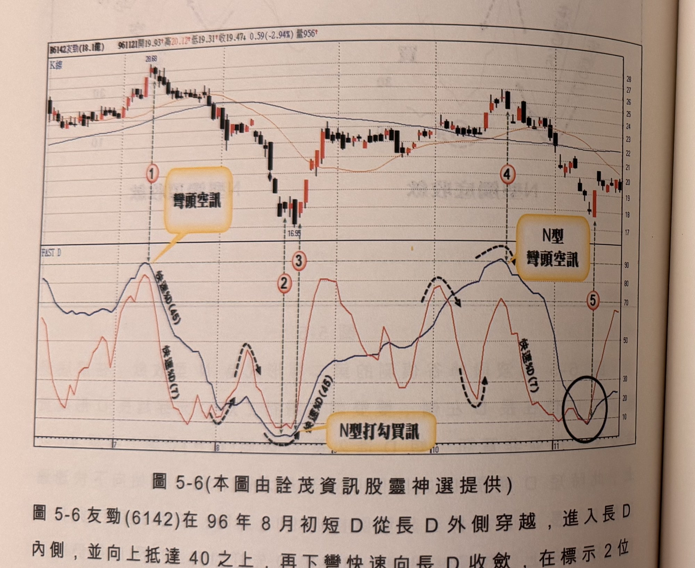
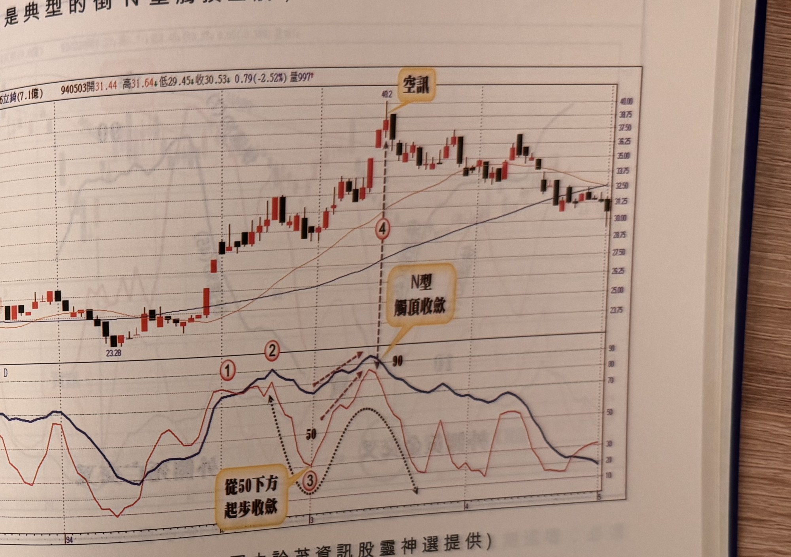

## p.182

當短 D 進入長 D 內側(右方)後，短 D 維持向下跌至 60 以下，短 D 重新轉折向上並逼近長 D，兩者之間的距離由大變小，當長 D 進入超買區接近 90 後，短 D 長 D 同時出現下彎，就形成賣出訊號，若短 D 下彎，長 D 仍向上，則必須等待長 D 完成下彎動作時，才確認賣出訊號。

**圖 5-6** (本圖由詮茂資訊股靈神選提供)

> 圖說（figure notes）：友勁(6142) K 線圖，左上角報價列標示「B6142友勁(18.1億) 961121開19.93↑高20.12↑低19.31↑收19.47↓0.59(-2.94%)量956↑」。K 線圖高點28.68（標示①，文字方塊「彎頭空訊」），低點16.95（標示②③），高點處標示④（文字方塊「N型彎頭空訊」，黑色虛線箭頭標示雙峰下彎），末端標示⑤（黑色圓圈標示底部糾結處）。下方「FAST D」子圖，藍線快速%D(45)、紅線快速%D(7)，標示②③附近黑色虛線標示「N型打勾買訊」處。K 線右側震盪於18～22區間。

圖 5-6 友勁(6142)在 96 年 8 月初短 D 從長 D 外側穿越，進入長 D 內側，並向上抵達 40 之上，再下彎快速向長 D 收斂，在標示 2 位置短 D 及長 D 同時從嚴重超賣 10 以下，打勾向上形成買進訊號，然訊號 K 線為小黑 K 線不符品質要求，隔天收實體小之紡錘線亦非中長紅 K 線仍須忽略之，標示 3 位置是另一次長 D 短 D 打勾出現，為漲停 K 線，確認為 N 型觸底買進訊號。在 10 月初短 D 從長 D 外側向下死叉長 D，但長 D 仍繼續上行，短 D 則下探 30 以下，約在

## p.183

中旬短 D 轉向朝上快速向長 D 逼近，當短 D 攻過 70，長 D 短 D 在標示 4 位置一致性向下彎頭，訊號 K 線為長黑 K 線，形成賣出訊號，這是典型的倒 N 型觸頂空訊，

**圖 5-7** (本圖由詮茂資訊股靈神選提供)

> 圖說（figure notes）：立錡(6286) K 線圖，報價列標示「940503開31.44↑高31.64↓低29.45↓收30.53↓0.79(-2.52%)量997↑」。K 線圖低點23.28，高點40.2處文字方塊「空訊」以箭頭指向標示④。下方「FAST D」子圖，標示①②（虛線箭頭標示自50下方起步向上收斂）、③（文字方塊「從50下方起步收歛」），標示④對應K線空訊處，文字方塊「N型觸頂收歛」。K 線右側回落整理於31～33區間。

在倒 N 型觸頂收歛的觀察過程，短 D 從外側跌破長 D 後，不久即來到標示 2，與長 D 收歛，不能視為倒 N 型觸頂空訊，因為短 D 並沒有跌破長 D 後，繼續下跌到 60 以下，因此真正逼近的啟動點在標示 3 位置，向上逐漸逼近長 D，標示 4 位置，長 D 進入嚴重超買區 90 界限下彎，短 D 亦同步下彎，才是標準倒 N 型觸頂收歛點，但空訊的 K 線品質應為黑 K 線，因此在隔天黑 K 線，才是進場操作的訊號位置。
