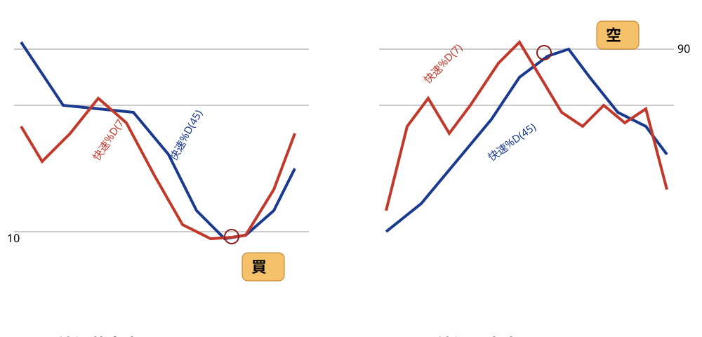
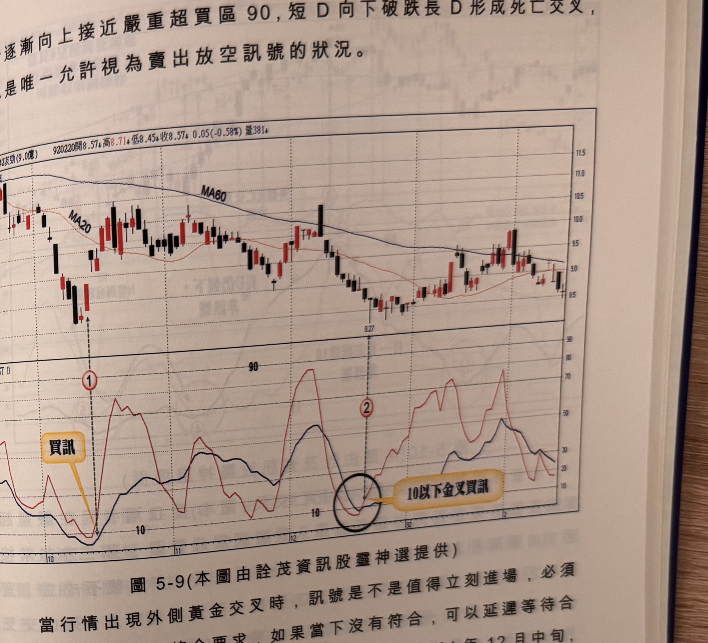

## p.184

### 外側交叉峰谷訊號

**圖 5-8** (示意圖，已重繪為 SVG，原圖見 股勝先選-fig-5-8.orig.jpg)

> 圖說（figure notes）：手繪示意圖（非真實 K 線截圖），分兩組。左「外側黃金交叉」：藍線快速%D(45)與紅線快速%D(7)皆下滑至水平參考線「10」附近糾結交叉，文字方塊「買」以線段指向交叉點。右「外側死亡交叉」：兩線皆上衝至水平參考線「90」附近後交叉反轉向下，文字方塊「空」以線段指向交叉點。

一般具有長短天期的雙線指標都把交叉當作重要的轉折訊號，如 RSI 採取不同參數值去觀察黃金交叉或死亡交叉，KD 指標更是以 KD 交叉的行為做為判斷最基礎原則，均線或乖離率均是如此研判，但在使用短 D 與長 D 交叉時，特別強調必須在嚴重超買超賣區域使用，而且限制短 D 與長 D 必須同時非常接近 90 或 10(必須有一方超過)，如圖 5-8 右邊為外側黃金交叉，短 D 在長 D 外側向下，兩者先後抵達嚴重超賣區 10，短 D 向上與長 D 形成黃金交叉，這是唯一允許視為買進訊號的狀況。

圖上左邊為外側死亡交叉的示意圖，短 D 亦是在長 D 外側，兩

## p.185

者逐漸向上接近嚴重超買區 90，短 D 向下破跌長 D 形成死亡交叉，也是唯一允許視為賣出放空訊號的狀況。

**圖 5-9** (本圖由詮茂資訊股靈神選提供)

> 圖說（figure notes）：友勁(6142) K 線圖，報價列標示「920220開8.57↑高8.71↓低8.45↓收8.57↓0.05(-0.58%)量381↓」，圖中疊加 MA20、MA60。K 線圖低點附近文字方塊「買訊」以箭頭指向標示①（K線急跌後止穩處）。下方「FAST D」子圖，標示②對應處黑色圓圈標示「10以下金叉買訊」（短D與長D於低檔10附近交叉向上）。K 線右側於8.27附近盤整。

當行情出現外側黃金交叉時，訊號是不是值得立刻進場，必須考慮 K 線品質是否符合要求，如果當下沒有符合，可以延遲等待合適的 K 線出現再進場操作，如圖 5-9 友勁(6142)在 91 年 12 月中旬，長 D 亦達嚴重超賣區，出現短 D 從長 D 外側下探至 10 以下，如標示 2 位置短 D 向上與長 D 形成外側黃金交叉，買訊宜以紅 K 線為訊號，當根 K 線為帶下影線極長之地火線，以中長紅 K 線為好，因此，操作者可以延遲至出現合適紅 K 線再行操作，92 年 1 月第二個交易日，出現向上跳空紅 K 線，可以做為真正進場買點位置。
