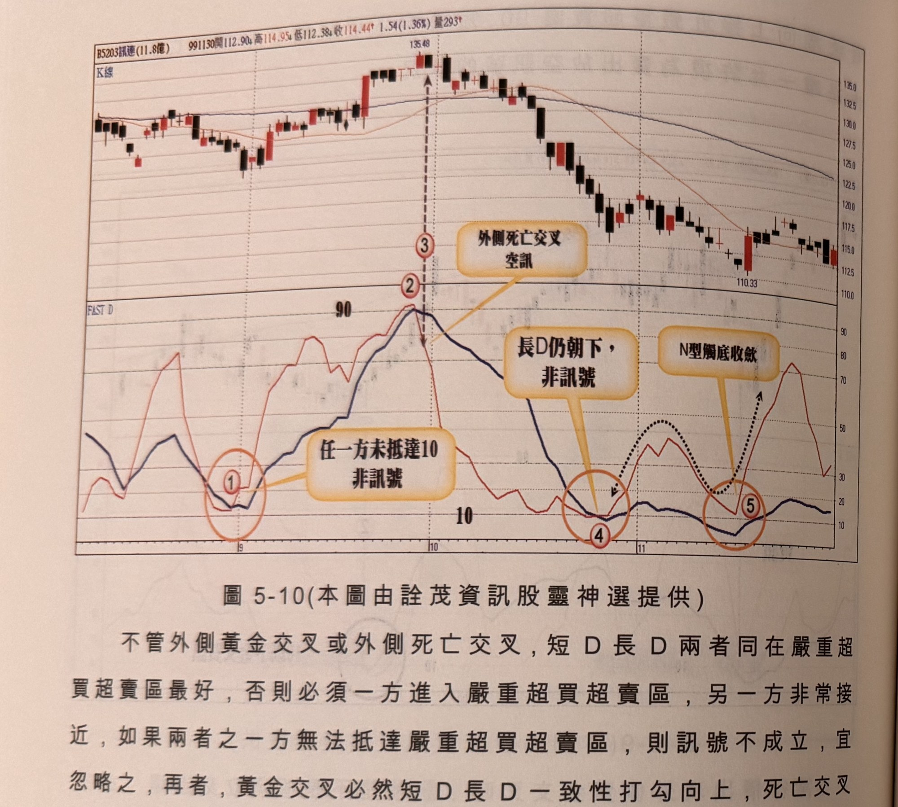
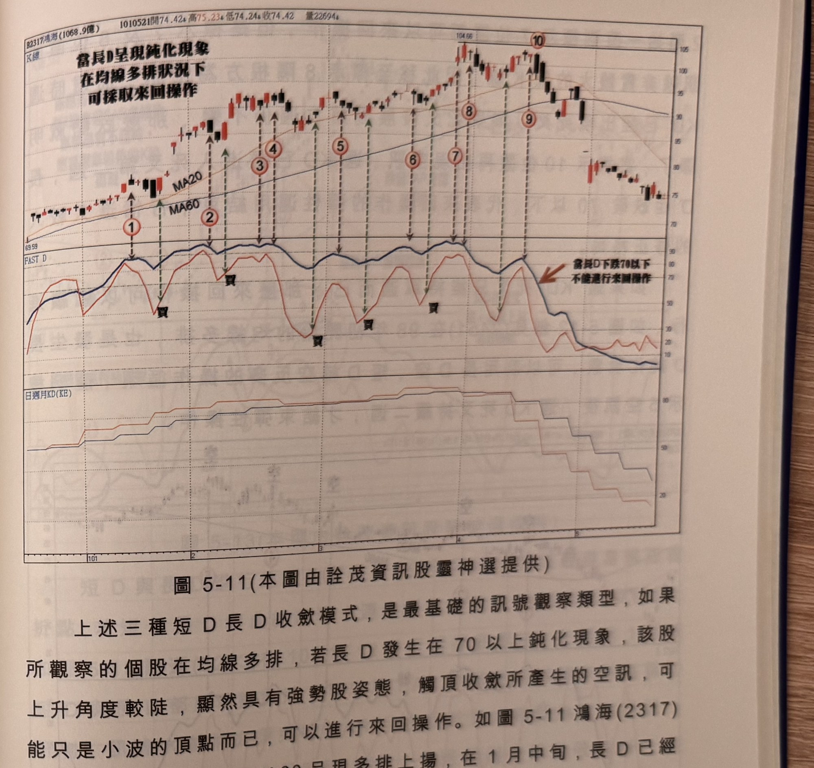

## p.186

**圖 5-10** (本圖由詮茂資訊股靈神選提供)

> 圖說（figure notes）：訊連(5203) K 線圖，左上角報價列標示「B5203訊連(11.8億) 991130開112.90↑高114.95↓低112.38↑收114.44↑1.54(1.36%)量293↑」。K 線圖高點135.48（標示③），文字方塊「外側死亡交叉 空訊」以箭頭指向③。下方「FAST D」子圖，標示①（紅色圓圈，文字方塊「任一方未抵達10 非訊號」）、②③（高點90附近死叉），標示④（紅色圓圈，文字方塊「長D仍朝下，非訊號」），標示⑤（紅色圓圈，文字方塊「N型觸底收歛」，黑色虛線與箭頭標示雙峰型態）。K 線右側持續下跌，收在110.33附近。

不管外側黃金交叉或外側死亡交叉，短 D 長 D 兩者同在嚴重超買超賣區最好，否則必須一方進入嚴重超買超賣區，另一方非常接近，如果兩者之一方無法抵達嚴重超買超賣區，則訊號不成立，宜忽略之，再者，黃金交叉必然短 D 長 D 一致性打勾向上，死亡交叉也必須短 D 長 D 一致性彎頭向下。如圖 5-10 訊連(5203)在 99 年 8 月底標示 1 位置出現短 D 從外側與長 D 黃金交叉，但兩者沒有一方進入嚴重超賣區 10 以下，就不能認定為買進訊號，而 9 月底在標示 2 位置兩者都進入嚴重超買區 90 以上，在標示 3 位置出現的外側死亡交叉，也一致性彎頭向下，訊號為黑 K 線符合各條件，是為賣出放空訊號，標示 4 位置呈現外側黃金交叉，但長 D 仍朝下，不符合一致性打勾向上，亦非訊號，11 月中旬呈現的 N 型買進訊，符合條件。

## p.187

**圖 5-11** (本圖由詮茂資訊股靈神選提供)

> 圖說（figure notes）：鴻海(2317) K 線圖，左上角報價列標示「B2317鴻海(1068.9億) 1010521開74.42↑高75.23↑低74.24↑收74.42 量22694↑」。K 線圖疊加 MA20、MA60，文字方塊「當長D呈現鈍化現象 在均線多排狀況下 可採取來回操作」置頂，標示紅色圓圈數字①~⑩沿上升趨勢依序標示（虛線垂直對應下方FAST D子圖）。下方「FAST D」子圖，多處標示「買」字（黑色印章樣式）對應短D低點打勾處，右側文字方塊「當長D下跌70以下 不能進行來回操作」以箭頭指向長D跌破70後的區域。最下方「日週月KD(KE)」子圖，藍線與紅線同步階梯狀上升後於末段轉為下降階梯。K 線右側於高點104.66（標示⑧⑨⑩）後回落整理，收在74.42附近。

上述三種短 D 長 D 收斂模式，是最基礎的訊號觀察類型，如果所觀察的個股在均線多排，若長 D 發生在 70 以上鈍化現象，該股上升角度較陡，顯然具有強勢股姿態，觸頂收斂所產生的空訊，可能只是小波的頂點而已，可以進行來回操作。如圖 5-11 鴻海(2317)能只是小波的頂點而已，可以進行來回操作。如圖 5-11 鴻海(2317)在 101 年初 MA20 與 MA60 呈現多排上揚，在 1 月中旬，長 D 已經揚升到嚴重超買區，形成倒 N 型觸頂空訊，如標示 1 位置前一天的長紅 K 線才剛突破兩個月高點，立刻出現空訊，如果進行放空動作，當幾天後，短 D 下探 50 隨即重新突穿 50，長 D 也上勾，K 線是一根中長紅，可以回補並反多買進，代表突破兩個月高點的動作是代表趨勢向上的買氣不會在突破立刻告終，也暗示長 D 可能發展成鈍化走勢，則觸頂收斂空訊，可以當作買進部位的短線出場點，再利用短 D 下跌後上勾時再買，或利用前幾章所介紹的方式買進，標示
