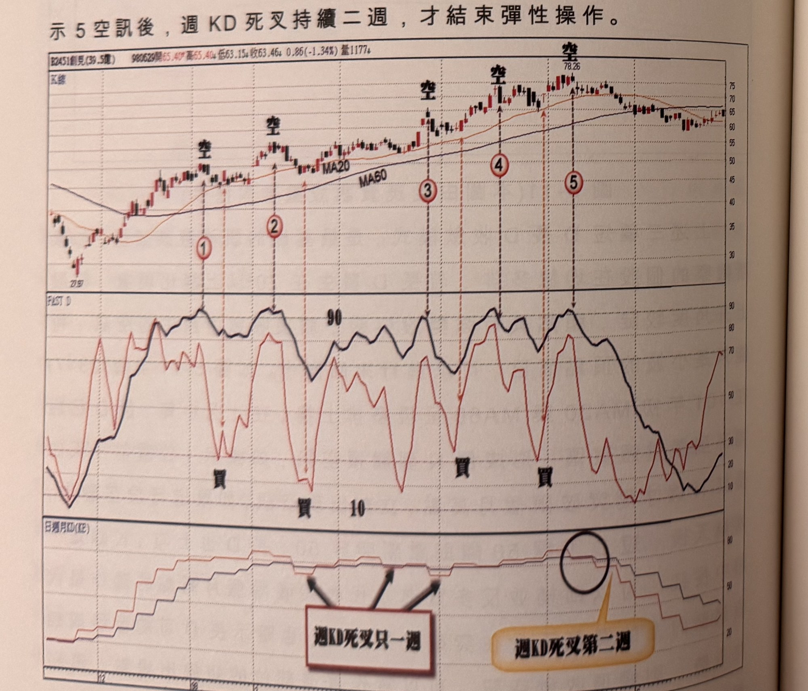
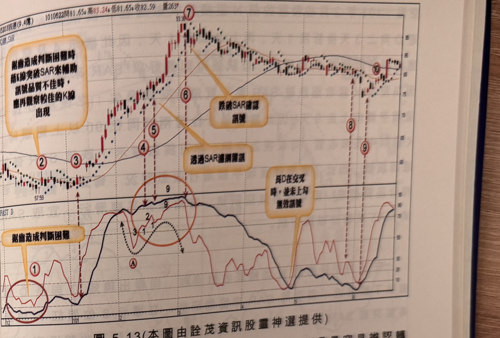

## p.188

2 開始一直到標示 7 位置都可以來回操作，但是標示 7 及 8 位置的訊號非實體大的黑 K 線，因此移至標示 8 隔根方為空訊，而這時週 KD 已經出現死叉，如果死叉發展到第二週仍不變，那麼跌勢就明顯了，當標示 10 位置再出現空訊，週 KD 已經進入死叉第二週，長 D 也跌破 70 以下，代表來回操作的彈性運用結束，行情進入較大的修正格局。

如果週 KD 死叉只維持單週而已，那麼來回操作可以繼續進行，如圖 5-12 創見(2451)在 98 年初開始的均線多排，也是發生長 D 鈍化現象，可以利用長 D 空，短 D 補空反多的操作循環，直到標示 5 空訊後，週 KD 死叉持續二週，才結束彈性操作。

**圖 5-12** (本圖由詮茂資訊股靈神選提供)

> 圖說（figure notes）：創見(2451) K 線圖，左上角報價列標示「B2451創見(39.5億) 980529開65.40↑高65.40↑低63.15↓收63.46↓0.86(-1.34%)量1177↓」。K 線圖疊加 MA20、MA60，五處標示「空」字對應標示①②③④⑤（虛線垂直向下指向FAST D子圖高點）。下方「FAST D」子圖，多處標示「買」字對應短D低點打勾處。最下方「日週月KD(K2)」子圖，黑色圓圈標示一處「週KD死叉第二週」，另以箭頭標示三處「週KD死叉只一週」。K 線右側於高點78.26後回落整理，收在60~65區間。

## p.189

短 D 與長 D 進行逼近收斂過程，保持平滑狀態是最容易辨認轉折點，若短 D 長 D 的曲線出現一連串鋸齒狀波動，將造成研判困難；如圖 5-13 訊連(5203)在 100 年 12 月行情探底尾端，在標示 1 區域短 D 與長 D 都呈現鋸齒狀，可以用 SAR 停損停利指標來做為輔助研判，訊號 K 線將必須突破 SAR 且收盤越過才確認為買進訊號，如標示 2 位置之 K 線收盤突破 SAR，在這個例子雖突破 SAR，但上影線比實體長，必須再延遲等待中長紅 K 線出現才確認；其後標示 3 位置出現另一次觸底收斂，K 線收盤亦突破 SAR，確認買進訊號。

**圖 5-13** (本圖由詮茂資訊股靈神選提供)

> 圖說（figure notes）：訊連(5203) K 線圖，左上角報價列標示「1010622開81.65↑高83.24↓低81.65↑收82.59 量263↑」。K 線圖疊加均線與 SAR 點狀線，高點93.38（標示⑦，文字方塊「跌破SAR確認訊號」以箭頭指向），標示②③④⑤⑥（文字方塊「鋸齒造成判斷困難時 稍再觀察較佳的K線出現」及「透過SAR濾網雜訊」），標示⑧⑨（文字方塊「長D在交叉時，並未上勾 無效訊號」），標示⑩。下方「FAST D」子圖，紅色圓圈標示①（文字方塊「鋸齒造成判斷困難」）及橙色圓圈標示⑨附近鋸齒區（黑色虛線標示A點型態）。K 線右側於高點回落整理，末端收在90附近。

短 D 與長 D 逼近收斂過程，平順滑動宜有 4 天以上為宜，換言之，若出現續高 2、3 天即出現下彎，下彎一天後，又恢復續高，這種狀況出現時，最好引用 SAR 或者 MA5 來輔助尋找可靠的轉折
