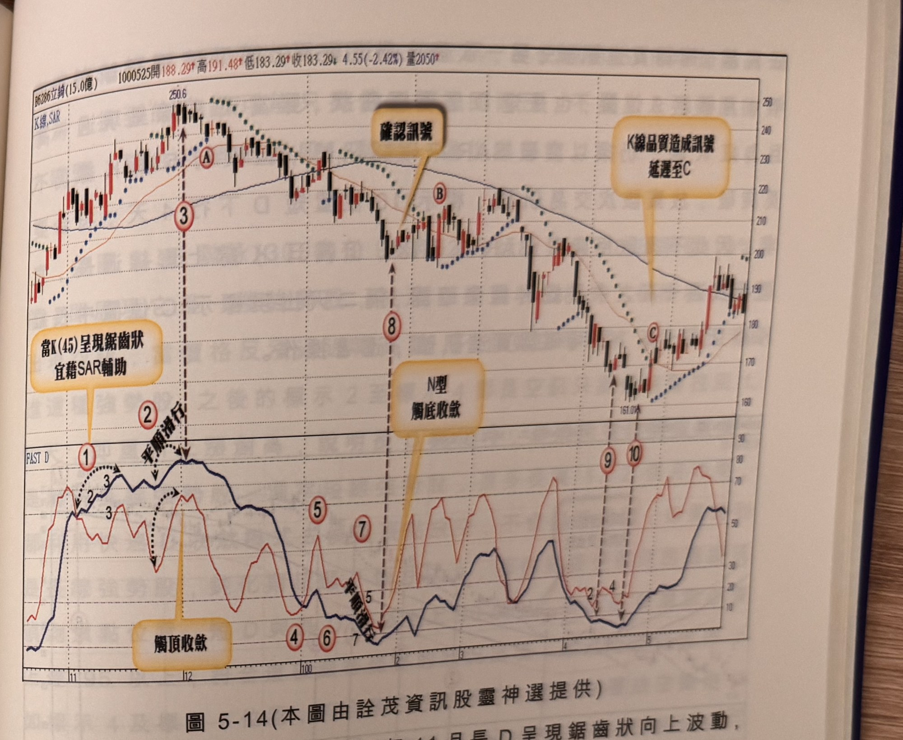

## p.190

空點，101 年 2 月初發展的倒 N 型觸頂收斂過程，從標示 A 位置，短 D 向上 3 天後折回 1 天，再上 2 天回 1 天，因此標示 4 及標示 5 雖然都是與長 D 同時彎頭，但訊號確認最好以 SAR 來輔助判斷，因為沒有 K 線收盤跌破 SAR 點，就沒有空訊發生；之後短 D 長 D 呈現平順向上走 9 天，因此當標示 6 位置兩線同在 90 以上彎頭時，K 線以中長黑收盤，可以視為空訊，亦可採取標示 7 跌破 SAR 做為確認訊號，因此，當兩線呈現平順滑行收斂狀況，彎頭當根 K 線若符合品質要求，即可做為放空訊號，若兩線非平順滑行，宜取 SAR 或 MA5 來輔助確認空訊。

在 5 月初發展的 N 型觸底收斂過程，同樣出現短 D 與長 D 鋸齒狀下跌逼近，須引用 SAR 來協助研判，在標示 8 位置紅 K 線最高點突破 SAR 點，但收盤沒有通過，因此須再等隔天收盤過高之紅 K 線，行情卻急速下跌，短 D 與長 D 向下順行 4 天，符合要求，因此標示 9 出現兩線同時打勾向上，形成買點，只可惜訊號 K 線為小漲紅 K 線，宜再延遲等待中長紅 K 線出現。

引用 SAR 指標來輔助判斷，其參數為一般市場所使用參數，並無特殊參數，請讀者自行參考。

在實際運用上，快速 D 呈現鋸齒狀波動的情形不少，當短 D 長 D 能以平順滑行的方式收斂，訊號的確認較簡易，若帶有鋸齒狀的波動，啟動 SAR 或 MA5 來輔助確認，可以清除雜訊；而在選股上，與其選擇判斷困難的鋸齒狀，不如選擇平順滑行收斂的個股，避開不必要的再確認步驟。

## p.191

**圖 5-14** (本圖由詮茂資訊股靈神選提供)

> 圖說（figure notes）：立錡(6286) K 線圖，左上角報價列標示「B6286立錡(15.0億) 1000525開188.29↑高191.48↑低183.29↑收183.29↓4.55(-2.42%)量2050↑」。K 線圖疊加均線與 SAR 點狀線，高點250.6（標示③，文字方塊「當K(45)呈現鋸齒狀 宜藉SAR輔助」），標示⑧（文字方塊「確認訊號」指向低點反彈處），標示B（「N型觸底收歛」），標示⑨⑩附近（文字方塊「K線品質造成訊號延遲至C」，對應低點161.01處標示C）。下方「FAST D」子圖，標示①②③（黑色虛線「平順滑行」，文字方塊「觸頂收歛」），標示④⑤⑥⑦（低檔鋸齒區），標示⑨⑩對應低檔區。K 線右側於130附近整理後回升。

如圖 5-14 立錡(6286)在 99 年 11 月長 D 呈現鋸齒狀向上波動，上 2 退 1，再進 3 退 1，顯然無法超過 4 天平順滑行要求，因此若有訊號，將須進一步觀察空訊的 K 線收盤是否跌破 SAR 點，而延遲確認時間，不是無限期的尋找，宜在 5 根 K 線內得到具體空訊出現，限期一過，忽略本次訊號為宜，標示 2 區短 D 長 D 保持平順滑行收斂，因此在標示 3 位置，自然不須在標示 A 位置跌破 SAR 確認空訊，而不必啟用 SAR 輔助；100 年 1 月標示 4 到標示 8 之間形成 N 型觸底收斂買進結構，一開始短長 D 呈現鋸齒狀波動，但自標示 7 開始，兩線恢復平順滑行，在標示 8 位置短 D 長 D 一致性上勾，形成買點，然訊號 K 線為黑 K 線，必須等待中長紅 K 線確認，隔天即出現過一高之
