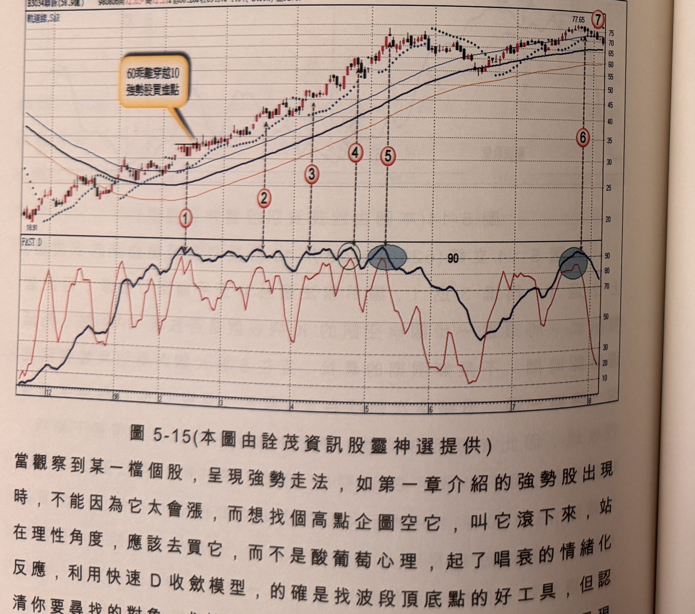

## p.192

紅 K 線，確認買進訊號；另一次發生啟用 SAR 輔助確認訊號在 100 年 4 月標示 9 位置，也是短 D 呈現鋸齒狀，雖當天 K 線呈現過一高且為紅 K 線，仍須以突破 SAR 來確認訊號，但限制 5 根 K 線仍不見突破，放棄該次交易訊號，標示 10 位置短 D 下行 4 天，符合要求，因此不須啟用突破 SAR 來確認，但當日 K 線上影線過長，宜再尋找過一高之中長紅 K 線來確認，隔二天出現標示 C 位置中長紅 K 線且過一高，即可確認買進訊號，進場操作。

**圖 5-15** (本圖由詮茂資訊股靈神選提供)

> 圖說（figure notes）：聯詠(3034) K 線圖，左上角報價列標示「B3034聯詠(58.9億) 980806開72.05↑高72.21↑低68.28↓收69.37↓1.84(-2.58%)量9271↓」。K 線圖疊加短中長均線與SAR點狀線，文字方塊「60乖離穿越10 強勢股買進點」以箭頭指向低點18.91附近；標示紅色圓圈數字①~⑦（虛線垂直向下連至下方FAST D子圖），標示④⑤處以灰藍色橢圓標示FAST D高檔鈍化區，⑥附近同樣以灰藍色圓圈標示。K 線右側高點77.65（標示⑦）後回落整理。下方「FAST D」子圖，長D持續貼近90附近鈍化。

當觀察到某一檔個股，呈現強勢走法，如第一章介紹的強勢股出現時，不能因為它太會漲，而想找個高點企圖空它，叫它滾下來，站在理性角度，應該去買它，而不是酸葡萄心理，起了唱衰的情緒化反應，利用快速 D 收斂模型，的確是找波段頂底點的好工具，但認清你要尋找的對象，尤其是想放空強勢股，如果發生長 D 一直呈現

## p.193

高檔鈍化行為，即使出現模型中的空訊，即使運用 SAR 增加濾網去偵測，找到的空訊可能只提供短暫拉回而已，不如加入強勢股的買方陣營，記住空到老虎股，將是一場災難來臨。

如圖 5-15 聯詠(3034)在 98 年 2 月行情穿過 60 日乖離 10% 界限，即展現它是一檔強勢股，快速 D 觸頂收斂模式，在標示 1 位置出現空訊，當價格反漲過近期高點，不僅要空單回補，更要反手買進這種強勢股，之後的標示 2 至標示 4 都是空訊只提供短暫拉回 1、2 天，即重新上漲創高，說明長 D 鈍化時，必須先判斷該個股是不是屬於長線強勢股，通常短線強勢股，頂多表演 1、2 個月時間，那利用快速 D 收斂模式去偵測頂點放空，不會鎩羽而歸，如果遇到是長線強勢股，鈍化期超過 2 個月以上，那你需要更嚴苛的濾網來偵測頂點位置，短 D 與長 D 務必全上 90 以上，甚至長 D 規定必須上達 95 以上，符合這樣嚴格條件的狀況出現，才進場逆向操作，如標示 4 及標示 5 位置，符合最嚴格的條件，可以試著放空操作，而停損點 7% 必須嚴格控管，或採取過區間高停損策略，即使如此，標示 4 位置的空訊，行情只續跌二天，即重新上漲，難免被停損，標示 5 是個放空能夠獲利的訊號位置，行情下跌也只在 MA60 季線附近即止住跌勢，對強勢股放空，說到底是事倍功半，在放空策略上，宜避開強勢股。

7 月底出現倒 N 型觸頂收斂空訊，行情在此並沒有發展突破 60 日乖離 10 後，N 型上漲的強勢做為，因此不用採取最嚴格的濾網，在標示 6 位置，短 D 呈現鋸齒狀波動，因此須用 SAR 來輔助確認，標示 7 位置 K 線收盤跌破 SAR 支撐點，亦為中長黑 K 線，空訊，標示 7 位置品質符合要求，確認空訊。
