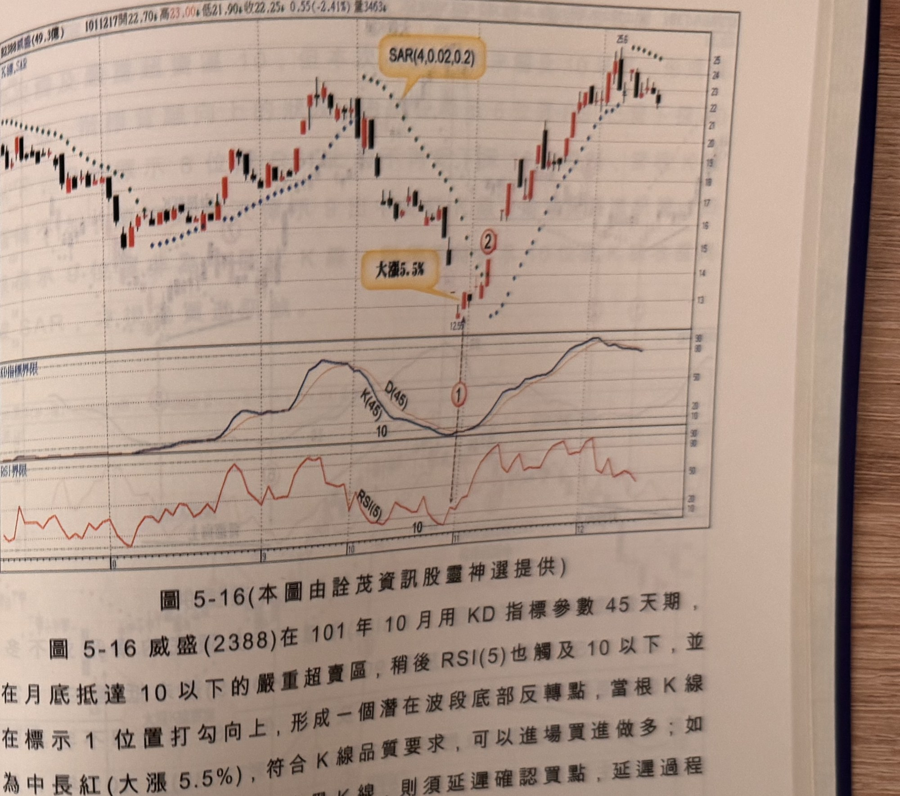

## p.194

### 替代方式 KD(45)配合 RSI(5)尋找波段高低點

如果讀者所使用的軟件，無法提供編寫指標或多指標堆疊同一視窗功能，可以用 KD 指標與 RSI 指標來替代快速 D 值收斂策略，KD 指標參數取 45 天參數，RSI 指標取 5 天期參數，運用方式，以 KD(45) 觸及嚴重超買超賣區後，同時配合 RSI 抵達嚴重超買超賣區轉折尋找波段的高低點，再視訊號 K 線品質，選擇再搭配 SAR 確認訊號，進行買進或賣出操作。

由於 KD 及 RSI 指標無法重疊在同一視窗觀察，因此較難看出 RSI 是否在 KD(45) 指標的內側同向逼近，或形成 N 型觸及收斂結構，因此，波段高點的尋找，要求 KD(45) 觸及嚴重超買區 90 期間，再觀察 RSI(5) 在 90 附近出現彎頭向下，那極可能是頂點反轉位置；而波段低點的尋找，要求 KD(45) 觸及嚴重超賣區 10 以下，期間再配合 RSI(5) 在 10 附近出現打勾向上，則波段低點反轉極可能發生在此，如果訊號 K 線為大漲收盤者，可能視為反轉開始而進行買進，若為其它狀況，宜啟動 SAR 停損停利點，收盤突破 SAR 或跌破 SAR，雖會犧牲最高最低進場的可能性，但卻提高進場的可靠度。

波段高低點的出現，有時會發生指標背離現象，若 KD(45) 觸及 90 期間，RSI(5) 卻無法抵達 90，再觀察先前價格與指標是否呈現背離向下狀況，如果確有背離情形發生，要求背離的起點位置，RSI(5) 曾觸及 90，而對應點則宜超過 80，則 RSI(5) 彎頭亦視為高點反轉點，底部若發生 RSI 背離向上，則 RSI(5) 先前行情必須曾觸及 10 以下，則對應點位置 20 以下的打勾向上，亦視為低點反轉點，再搭配 SAR 過濾，訊號位置將更具可靠度。

## p.195

**圖 5-16** (本圖由詮茂資訊股靈神選提供)

> 圖說（figure notes）：威盛(2388) K 線圖，左上角報價列標示「1011217開22.70↑高23.00↑低21.90↓收22.25↓0.55(-2.41%)量3463↓」。K 線圖疊加SAR點狀線，文字方塊「SAR(4,0.02,0.2)」及「大漲5.5%」標示低點12.55附近（標示①）拉出中長紅K線，其後標示②延續上漲，末端高點25.6附近後回落整理。下方「KD指標界限」子圖，K(45)、D(45)雙線於標示①處觸及「10」後打勾向上。最下方「RSI界限」子圖，RSI(5)於同一時間點觸及「10」後打勾向上。

圖 5-16 威盛(2388)在 101 年 10 月用 KD 指標參數 45 天期，在月底抵達 10 以下的嚴重超賣區，稍後 RSI(5) 也觸及 10 以下，並在標示 1 位置打勾向上，形成一個潛在波段底部反轉點，當根 K 線為中長紅(大漲 5.5%)，符合 K 線品質要求，可以進場買進做多；如果訊號 K 線帶長上影線或為黑 K 線，則須延遲確認買點，延遲過程
