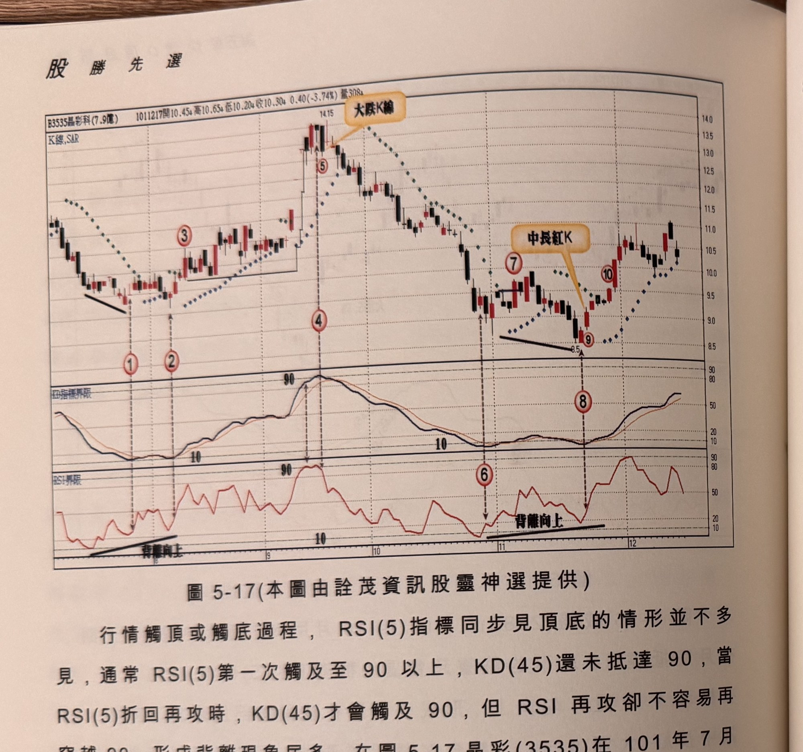
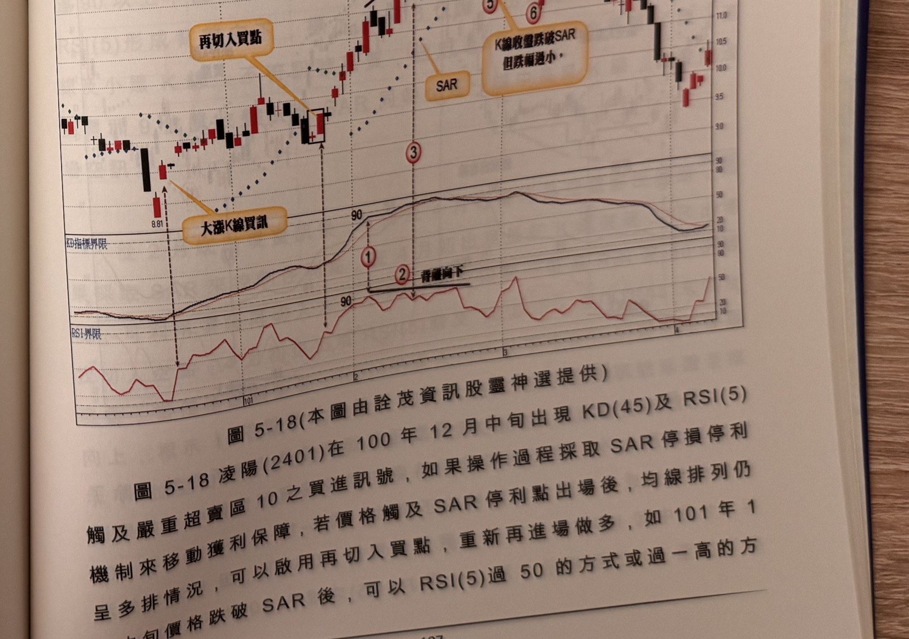

## p.196

**圖 5-17** (本圖由詮茂資訊股靈神選提供)

> 圖說（figure notes）：晶彩科(3535) K 線圖，左上角報價列標示「B3535晶彩科(7.9億) 1011217開10.45↑高10.65↓低10.20↓收10.30↓0.40(-3.74%)量308↓」。K 線圖疊加SAR點狀線，高點14.15處文字方塊「大漲K線」（標示④⑤）。標示①②（背離向上，底部緩升黑線標示）、③、⑥⑦（低點8.5附近，另一背離向上黑線標示）、⑧（文字方塊「中長紅K」指向）、⑨⑩。下方「KD指標界限」子圖，K(45)/D(45)於標示④附近觸及「90」峰值，⑥⑧附近觸及「10」。最下方「RSI界限」子圖，於④附近觸及「90」峰值，⑥⑧附近觸及「10」後打勾向上，兩處皆標示「背離向上」黑線。K 線右側於高點回落後回升整理，收在10.3附近。

行情觸頂或觸底過程，RSI(5) 指標同步見頂底的情形並不多見，通常 RSI(5) 第一次觸及至 90 以上，KD(45) 還未抵達 90，當 RSI(5) 折回再攻時，KD(45) 才會觸及 90，但 RSI 再攻卻不容易再穿越 90，形成背離現象居多，在圖 5-17 晶彩(3535) 在 101 年 7 月

## p.197

以後，發生兩次觸底皆出現 RSI 背離向上，其中標示 1 及 2 的訊號均為小紅 K 線，須啟用 SAR 來過濾，最後在標示 3 位置 K 線收盤突破 SAR，且為中長紅 K 線，可以買進操作，而在 9 月中旬 KD(45) 觸及 90 以上，但 RSI(5) 之前已觸及 90 一次但那時 KD 指標尚未抵達嚴重超買區，在標示 4 位置 RSI 與 KD 同在 90 以上，當 RSI(5) 彎頭向下，訊號 K 線卻帶長下影線，隔根在標示 5 位置出現長黑下殺，確認賣出放空訊號，而不必等到跌破 SAR 才確認訊號；10 月底出現觸頂結構 RSI 及 KD 同在 10 以下，標示 6 位置 RSI(5) 呈現打勾向上，訊號品質不佳，因此延遲至標示 7 位置 K 線收盤突破

**圖 5-18** (本圖由詮茂資訊股靈神選提供)

> 圖說（figure notes）：凌陽(2401) K 線圖，左上角報價列標示「B2401凌陽(59.7億) 1010410開10.10↑高10.55↑低10.05↑收10.35↑0.45(4.55%)量3692↑」。K 線圖疊加SAR點狀線，低點8.81處文字方塊「大漲K線買訊」，其後文字方塊「再切入買點」標示於一次回檔後再度突破處，高點13.25（標示④，文字方塊「確認放空訊號」），標示③（文字方塊「SAR」）、⑤⑥（文字方塊「K線收盤跌破SAR 但跌幅過小」）。下方「KD指標界限」子圖與「RSI界限」子圖，標示①②（文字方塊「背離向下」），兩指標於低檔90附近鈍化後回落。K 線右側於高點回落整理，收在10附近。

SAR 才確認，稍後行情反彈結束再下殺破停損，標示 8 位置 KD(45) 再次觸及嚴重超賣區 10，但本次 RSI(5) 卻未觸及 10 以下，形成價創新低，指標背離向上的狀況，由於在標示 6 位置 RSI 已曾下探 10 以下，因此標示 8 位置 RSI 上勾不再受下探 10 的限制，當根 K 線漲幅不大，須等到隔天標示 9 出中長紅 K 線，始確認買進訊號。如果標示 9 位置非為中長紅 K 線，則須等待標示 10 位置 K 線收盤突破 SAR，才視為買進訊號。
