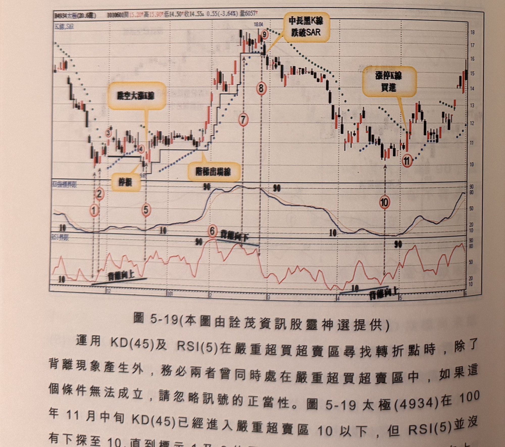

## p.198

式，再切入買進；標示 1~3 為典型觸頂模式，標示 1 位置 RSI 領先 KD(45) 觸及 90，而後折回再攻，此時 KD(45) 才正式觸及 90 以上，而價格與 RSI 指標卻呈現背離向下的現象，標示 3 位置 RSI 彎頭，訊號卻非大跌 K 線，因此啟用 SAR 輔助過濾，標示 4 為 K 線最低點跌破 SAR，但收盤卻未跌破，不符條件要求，標示 5 位置收盤跌破 SAR，但跌幅過小，仍不能躁進，標示 6 位置 K 線收盤跌破 SAR，且為中長黑 K 線，始確認放空訊號。

**圖 5-19** (本圖由詮茂資訊股靈神選提供)

> 圖說（figure notes）：太極(4934) K 線圖，左上角報價列標示「B4934太極(20.6億) 1010601開15.20↑高15.90↑低14.50↑收14.55↓0.55(-3.64%)量6057↑」。K 線圖疊加SAR點狀線及階梯線，標示①②（文字方塊「停損」）、③④（文字方塊「嚴空大漲K線」，低點9.85附近，文字方塊「階梯出場線」），標示⑦⑧⑨（高點18.04，文字方塊「中長黑K線跌破SAR」），標示⑥（文字方塊「背離向下」），標示⑩⑪（文字方塊「漲停K線買進」，低點附近）。下方「KD指標界限」子圖與「RSI界限」子圖，多處標示「背離向上」「背離向下」黑線，及「10」「90」參考值。K 線右側震盪回升，收在14~15區間。

運用 KD(45) 及 RSI(5) 在嚴重超買超賣區尋找轉折點時，除了背離現象產生外，務必兩者曾同時處在嚴重超買超賣區中，如果這個條件無法成立，請忽略訊號的正當性。圖 5-19 太極(4934) 在 100 年 11 月中旬 KD(45) 已經進入嚴重超賣區 10 以下，但 RSI(5) 並沒有下探至 10，直到標示 1 及 2 位置 RSI(5) 才進入 10 以下打勾向上，

## p.199

但都屬小漲 K 線，漲幅不到 3%，而大漲 K 線出現在標示 3 位置為實際進場買點，行情卻沒有展開底部大反轉，再次下跌，在標示 4 位置跌破標示 3 進場點的停損，之後創新低造成指標背離向上，標示 5 位置 RSI(5) 打勾向上，當日出現跳空大漲 K 線，符合訊號品質要求，進場後如啟動階梯出場線，持股將移到標示 9 位置才停利平倉。

而 101 年 2 月在標示 6 位置 RSI(5) 進入 90 嚴重超買區，但 KD(45) 卻沒有，兩者不具同時存在的事實，直到中旬 KD(45) 才抵達 90 以上，但 RSI(5) 卻無法再上 90，由於價格繼續創新高，因此 RSI(5) 形成背離向下，標示 7 及 8 位置雖出現彎頭，但為下跌紅 K 線及小黑 K 線，不符訊號品質，啟用 SAR 或尋找中長黑 K 線，直到標示 9 位置收盤跌破 SAR 同時也是一根中長黑 K 線，為實際進場空訊。

從 2 月底出現賣訊後，3 月及 4 月行情均為空頭勝出局面，如果採取 SAR 來控制停利點，在 4 月初出現長紅 K 線突破 SAR 出場後，可利用空頭再切入方式，以 K 線收盤破一低或 RSI 破 50 來尋找切入空點，4 月初也出現 RSI(5) 觸及 10 以下，但 KD(45) 未觸及，形成背離現象，當價格續創新低，KD(45) 進入 10 以下，RSI(5) 則形成背離向上，標示 10 位置打勾出現，卻非大漲 K 線，因此訊號延遲至標示 11 位置出現漲停收盤之 K 線，不須突破 SAR 來確認訊號。
