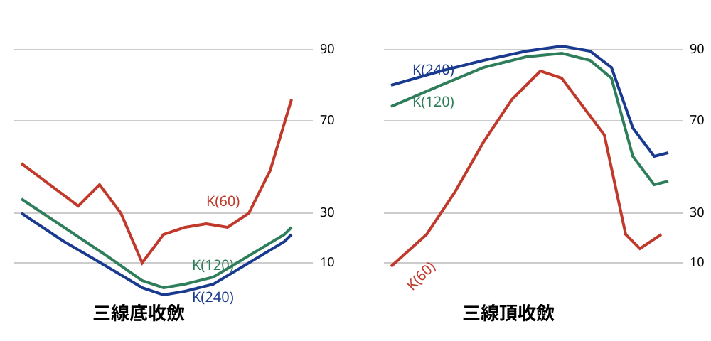

## p.200

### 三線頂底收歛

**圖 5-20** (示意圖，已重繪為 SVG，原圖見 股勝先選-fig-5-20.orig.jpg)

> 圖說（figure notes）：手繪示意圖（非真實 K 線截圖），縱軸標示 90、70、30、10 參考線，分兩組。左「三線底收歛」：紅線 K(60)、綠線 K(120)、藍線 K(240) 三條快速 D(K)值曲線皆下探至 10 附近後同步回升，谷底彼此貼近收斂。右「三線頂收歛」：三線皆上衝至 90 附近後同步下滑，其中 K(60) 峰值較低、先行回落，K(120) 與 K(240) 貼合同行於高點附近再回落，三線於峰頂彼此貼近收斂。

在快速 D 值(即一般 KD 指標的 K 值)收斂尋找頂底策略下，如果我們把兩者間的收斂現象，擴充至三線亦可得到相同的效果，而且只擷取三線一致朝嚴重超買或超賣區收斂來製造最具可能性的峰谷區間，而不用考慮 N 型結構，及內外側交叉狀況，使得判斷的流程更加簡化。

原先長 D 為 45 天期，而短 D 參數為 7 天期，透過長短 D 在超買超賣區同向打勾或彎頭，對於判斷轉折發生在那一天，有著較精準的效果，而本節使用三條快速 D 值(即 K 值)，參數為 60、120 及 240 天期，參數放大可顯示較長線的頂底點發生位置，雖然每一條線均有尋找頂底的功能，但取用三線一致抵達嚴重超買超賣區，強

## p.201

化聚焦頂底在某一極小時間範圍內。

以圖 5-20 來說明三線收斂策略的奧妙所在，假如我們用 K(240) 抵達超賣區 10 以下做為底部區間，它可能在 10 以下長達 30 天，代表行情正處空方勢力最強烈區間，買氣虛弱造成它始終在 240 天低點位置，換言之，這 30 天區間內，會有一天是行情的最低點位置，當加入第二條線 K(120) 判斷時，假如 K(120) 比 K(240) 晚 10 天進入超賣區 10 以下，而且比 K(240) 提早 5 天脫離 10，原先 30 天的尋底期，馬上縮小為 15 天，這 15 天區間內，將出現行情最低點位置。

如果再增加一條 K(60) 併入判斷，而 K(60) 若比 K(120) 晚 5 天離開 10，那麼三條線進入超賣區 10 以下，同時比 K(120) 提早 5 天，整個尋底的區間壓縮到只須在 5 天同時在超賣區的時間只剩 5 天，透過大漲 K 線或用 RSI(5) 內確認最低點，尋底的難度因此降低，透過大漲 K 線或用 RSI(5) 內確認最低點，尋底的難度因此降低，啟動 SAR 來尋找突破 K 線，均能確認可靠的底部切入點；同樣的判斷也可運用在尋找行情波段頂點。

找到一次底部買點，進場操作的風險設定在 7% 停損，但若正確發展成多頭漲勢，獲利將是所承受風險的數倍之多，對於某些績優股票在跌勢中，常用本益比的觀念去設算他的合理承接點，本益比 10 倍以下是通常認定的合理價格，但是跌勢發展到瘋狂追殺的階段，常常發生不理性屠殺，爛股被認為燙手山芋而被拋售是可以理解，但好股票遭受池魚之殃，同被連坐，雖為之叫屈，但市場的行為永遠是對的，不理性的砍殺，創造下一次獲利的切入時機，例如 EPS 高達 6 元的股票，被追殺到 30 元，公司年年賺錢，那這種
