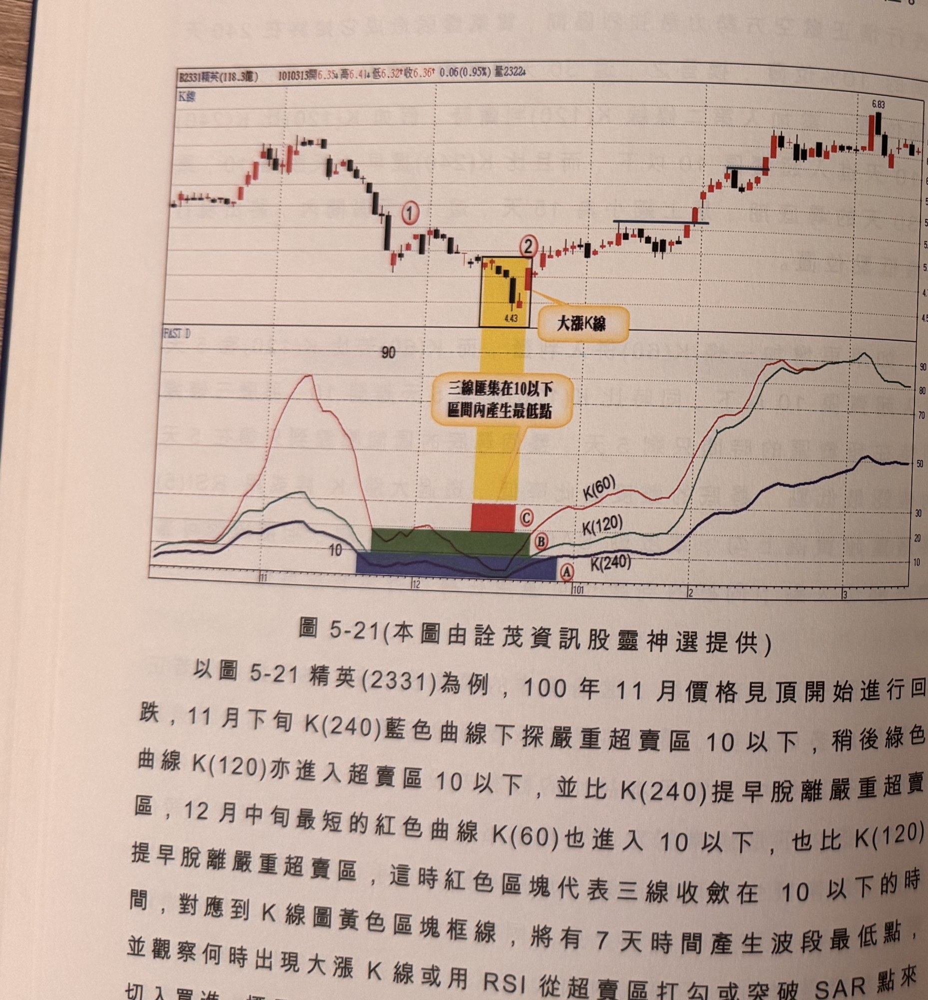
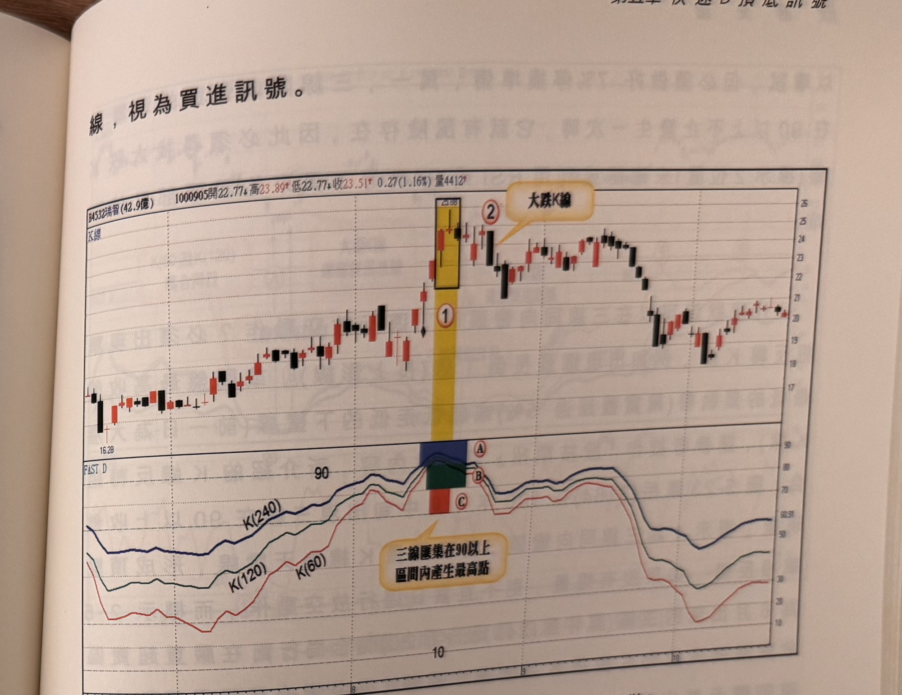

## p.202

股票，簡直是市場給識貨者的大禮，問題是它本益比只有 5 倍，一般人早在 9 倍或 8 倍就奮勇進場買來套，雖然事後來說是過早介入，但如果懂得利用這種三線收斂的方法，對於底部發生區間，更容易掌握而能選擇在最佳價位買進，不用再猜合理價位在哪裡。

**圖 5-21** (本圖由詮茂資訊股靈神選提供)

> 圖說（figure notes）：精英(2331) K 線圖，左上角報價列標示「B2331精英(118.3億) 1010313開6.35↑高6.41↓低6.32↑收6.36↑0.06(0.95%)量2322↓」。K 線圖低點4.43附近以黃色框線標示（標示①②，文字方塊「大漲K線」），K 線右側高點6.83後回落整理。下方「FAST D」子圖，三色曲線K(60)紅、K(120)綠、K(240)藍，於中段以藍/綠/紅三色矩形色塊由下而上疊放（標示A、B、C），文字方塊「三線匯集在10以下 區間內產生最低點」指向色塊。三線末端同步大幅回升至50~90區間。

以圖 5-21 精英(2331)為例，100 年 11 月價格見頂開始進行回跌，11 月下旬 K(240)藍色曲線下探嚴重超賣區 10 以下，稍後綠色曲線 K(120)亦進入超賣區 10 以下，並比 K(240)提早脫離嚴重超賣區，12 月中旬最短的紅色曲線 K(60)也進入 10 以下，也比 K(120)提早脫離嚴重超賣區，這時紅色區塊代表三線收斂在 10 以下的時間，對應到 K 線圖黃色區塊框線，將有 7 天時間產生波段最低點，並觀察何時出現大漲 K 線或用 RSI 從超賣區打勾或突破 SAR 點來

## p.203

切入買進，標示 2 位置係三線同時在 10 以下收斂，所出現的大漲 K 線，視為買進訊號。

到底三線齊聚超買超賣區會持續多久時間，在當下無法判斷的，從三線同在 10 以下或 90 以上開始，特別注意三線同向打勾或彎頭現象出現時，往往是最低或最高點產生時刻，而三線進入超買超賣區的先後順序不見得是由 K(240)先進入，接著 K(120)，最後才輪到 K(60)，某些情況是 K(60)率先進入超買超賣區，而後才輪到 K(120)或 K(240)再進入，重點在於三線同時位在嚴重超買超賣區，所代表的頂底最可能區域。

圖 5-22 瑞智(4532)在 100 年 9 月中旬，三線在黃色區塊(標示 1 位置)同時處在嚴重超買區 90 以上；時間只有 3 天，而三線同向下彎那天正好是最高點位置，呈現倒 T 線，假如想空在最高點，可

**圖 5-22** (本圖由詮茂資訊股靈神選提供)

> 圖說（figure notes）：瑞智(4532) K 線圖，左上角報價列標示「B4532瑞智(42.9億) 1000905開22.77↓高23.89↑低22.77↓收23.51↑0.27(1.16%)量4412↑」。K 線圖高點25.88附近以黃色框線標示（標示①②，文字方塊「大跌K線」）。下方「FAST D」子圖，三色曲線K(60)紅、K(120)綠、K(240)藍，於高點以藍/綠/紅三色矩形色塊由上而下疊放（標示A、B、C），文字方塊「三線匯集在90以上 區間內產生最高點」指向色塊。三線末端下滑至20~30區間後回升整理。K 線右側於19~21區間震盪。
