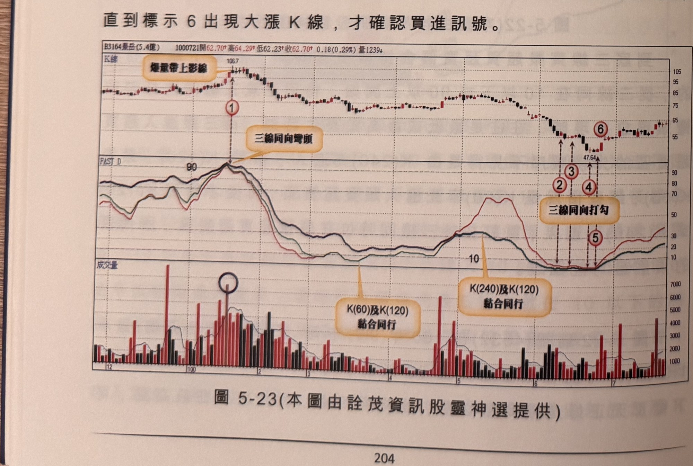
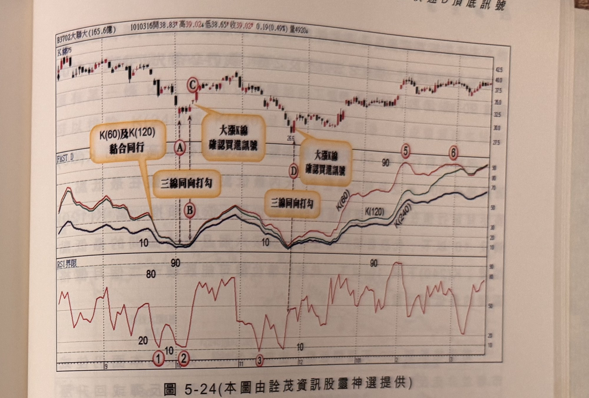

## p.204

以嘗試，但必須做好 7% 停損準備，萬一，三線同向彎頭的現象，在 90 以上不止發生一次時，它就有風險存在，因此必須尋找大跌 K 線(標示 2 位置)來確認或利用 RSI 或 SAR 等工具來佐證頭部已然形成。

什麼狀況可以在三線同向彎頭時，逕行放空動作？必須出現單根反轉 K 線，例如出現爆量長倒 T 線(長上影線)，或開盤最高收盤最低的黑執帶(黑實體超過 5%)或開低走低的下墜線(前一日為大漲 K 線)，請參考拙作『股技期招』第一章內容，所介紹的 K 線反轉組合。圖 5-23 景岳(3164)在 100 年 1 月中旬出現三線在 90 以上收斂現象，標示 1 為三線同向彎頭，當日爆量 K 線為天雷線，形成頂點單根反轉，如果沒有爆量，則不宜當日逕行放空動作，而標示 2~5 為 6 月出現的三線(其中 K(240) 及 K(120) 黏合同行)，在嚴重超賣區收斂並同向上勾，由於 K 線都屬小星線，未能具有單根反轉能力，直到標示 6 出現大漲 K 線，才確認買進訊號。

**圖 5-23** (本圖由詮茂資訊股靈神選提供)

> 圖說（figure notes）：景岳(3164) K 線圖，左上角報價列標示「B3164景岳(5.4億) 1000721開62.70↑高64.29↑低62.23↑收62.70↑0.18(0.29%)量1239↓」。K 線圖高點106.7，文字方塊「爆量帶上影線」指向標示①（三線同向彎頭）。低點47.64附近標示②③④⑤（文字方塊「三線同向打勾」），標示⑥（大漲K線）。下方「FAST D」子圖三色曲線於標示①處觸及90峰值後大幅下滑至10附近，標示②~⑤處觸及低點打勾。最下方「成交量」子圖，黑色圓圈標示標示①附近爆量紅柱，文字方塊「K(60)及K(120)黏合同行」「K(240)及K(120)黏合同行」分別指向對應區段。

## p.205

單一指標在跌勢中尋找波段低點時，往往因為參數天期過短，造成指標在超賣區連續觸及，卻不見較大反彈行情出現，例如圖 5-24 大聯大(3702)在 100 年 9 月下跌行情中，RSI(5) 在標示 1 及 2 位置兩度下探超賣區 20 以下，但只有標示 2 成功出現反彈行情，若加入三條 K 值配合觀察，則標示 1 位置三線尚未抵達嚴重超賣區 10 以下，自然不用進場嘗試，在 10 月初三線在 10 以下同向打勾，買進訊號須要再觀察確認，標示 C 位置出現跳空卻都為小星線，稍後反彈行情一直到 10 月底結束，再進行大漲，是為確認買點；11 月在標示 3 位置 RSI 下探至 10 以下，很容易誘使搶短帽客進場，但在沒有三線齊進嚴重超賣區前，可以忽略 RSI 訊號，下旬三線才同時在嚴重超賣區打勾，其時 RSI 也下探 10，兩種指標指向同一天轉折，K 線又屬大漲 K 線，確認為買進訊號，行情也展開更大幅度的上漲走勢。

**圖 5-24** (本圖由詮茂資訊股靈神選提供)

> 圖說（figure notes）：大聯大(3702) K 線圖，左上角報價列標示「B3702大聯大(165.6億) 1010316開38.83↑高39.02↓低38.65↑收39.02↑0.19(0.49%)量4920↓」。K 線圖疊加均線，標示A、B（文字方塊「K(60)及K(120)黏合同行」「三線同向打勾」），標示C（低點附近，文字方塊「大漲K線確認買進訊號」），低點26.6附近標示D（文字方塊「三線同向打勾」及「大漲K線確認買進訊號」）。下方「FAST D」子圖三色曲線K(60)紅、K(120)綠、K(240)藍，標示①②③觸及低點「10」後打勾向上，末端持續上升至90附近。最下方「RSI界限」子圖對應同期間多次觸及20以下及90以上。K 線右側持續上漲，末段於37.5~40區間震盪。
