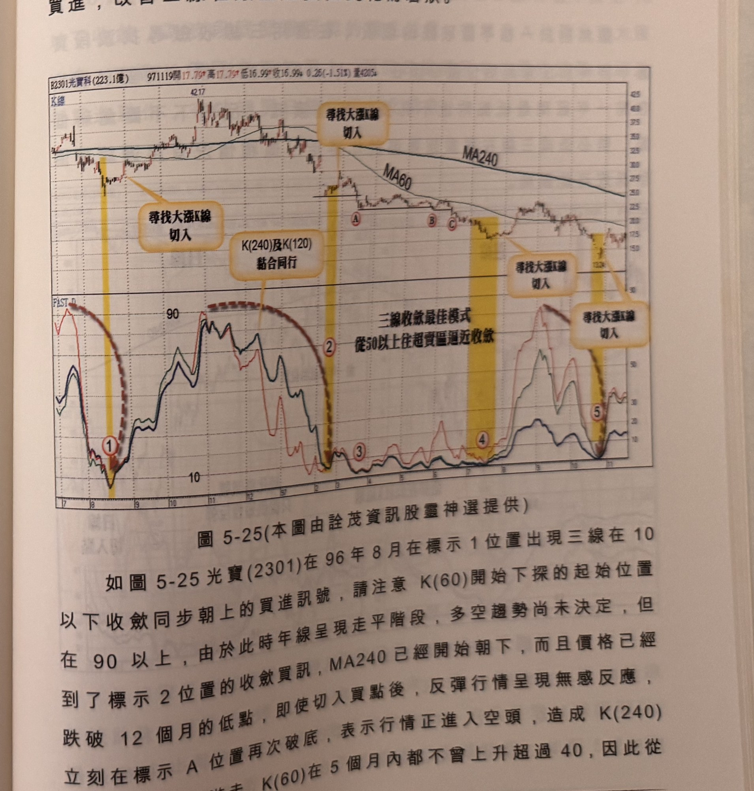

## p.206

三線在超買超賣區逼近收斂具有尋找頂底最可能區間，但並非萬靈丹，遇到鈍化一樣有它法力不及之處，我們必須先了解，K(60) 到達 90 或 10 的內涵是什麼？

例如目前行情在 60 天內的最高點，且收盤在最高點，K(60) 值將接近 90，反之目前行情在 60 天內最低點，且收盤在最低點，表示目前行情在三個月價格區間的新低位置，依此類推，當 K(120) 觸及 10 以下，代表目前行情位可能跌破六個月價格區間的最低點位置，K(240) 下探 10 以下，代表行情位置可能跌破十二個月價格區間的最低點位置。

當價格跌破 60 天區間低點，出現新低時，如果基本面仍佳或市場並非走反轉格局，應會吸引投資買盤進場，形成反彈或回升漲勢，例如在年線上揚或走平的格局裡，價格來到 3 個月最低，單看 K(60) 觸及 10 以下，就有機會出現反彈走勢或回升盤，形成一個買進訊號，而 K(120) 及 K(240) 同抵 10 以下，代表目前走勢到了多空關鍵位置，試想目前行情來到一年價格的最低點或新低位置，先前十二個月裡的最低點是否具有大支撐能吸引長線投資買盤進來，就是一大考驗，如果來到十二個月最低點具有大支撐，它將形成『交易訊號之直覺操作』下冊第三章內容中的平行撐買點，或者上冊第二章的內容中的創新低後，重新拉回區間內，形成跌破逆轉買訊。

如果行情在十二個月最低點附近得不到買盤進駐，K(240) 將呈現鈍化現象，這個階段即使產生買訊，將只是短暫反彈數日後，即再走跌底模式，形成大空頭走勢，一次操作一次險，我們當然不希望在空頭中，為了猜底而疲於短線進出，因此必須對於大空頭一路

## p.207

破低的走勢，作濾網結構，來排除指標鈍化，避開無效的三線收斂訊號，當年線(MA240) 彎頭向下行進時，三線收斂在超賣區前，必須有某一條 K 值從 40 以上開始向下進入超賣區，這個條件下，將可以排除 K(240) 或 K(120) 呈現低檔鈍化現象，造成頻頻產生短暫買進，改善三線在嚴重超賣區鈍化的窘狀。

**圖 5-25** (本圖由詮茂資訊股靈神選提供)

> 圖說（figure notes）：光寶科(2301) K 線圖，左上角報價列標示「B2301光寶科(223.1億) 971119開17.79↑高17.79↑低16.99↑收16.99↓0.25(-1.51%)量4205↓」。K 線圖高點42.17，五處文字方塊「尋找大漲K線切入」分別以黃色縱帶標示（對應下方FAST D子圖標示①②③④⑤），標示A、B、C（低點附近平台整理）。下方「FAST D」子圖，三色曲線於標示①處觸及10附近同步打勾向上（黑色虛線弧標示「三線收歛最佳模式 從50以上往超賣區逼近收歛」），標示②③④⑤處重複類似收歛型態。K 線右側末端於150附近整理。

如圖 5-25 光寶(2301)在 96 年 8 月在標示 1 位置出現三線在 10 以下收斂同步朝上的買進訊號，請注意 K(60) 開始下探的起始位置在 90 以上，由於此時年線呈現走平階段，多空趨勢尚未決定，但到了標示 2 位置的收斂買訊，MA240 已經開始朝下，而且價格已經跌破 12 個月的低點，即使切入買點後，反彈行情呈現無感反應，立刻在標示 A 位置再次破底，表示行情正進入空頭，造成 K(240) 在 5 個月內都不曾上升超過 40，因此從
