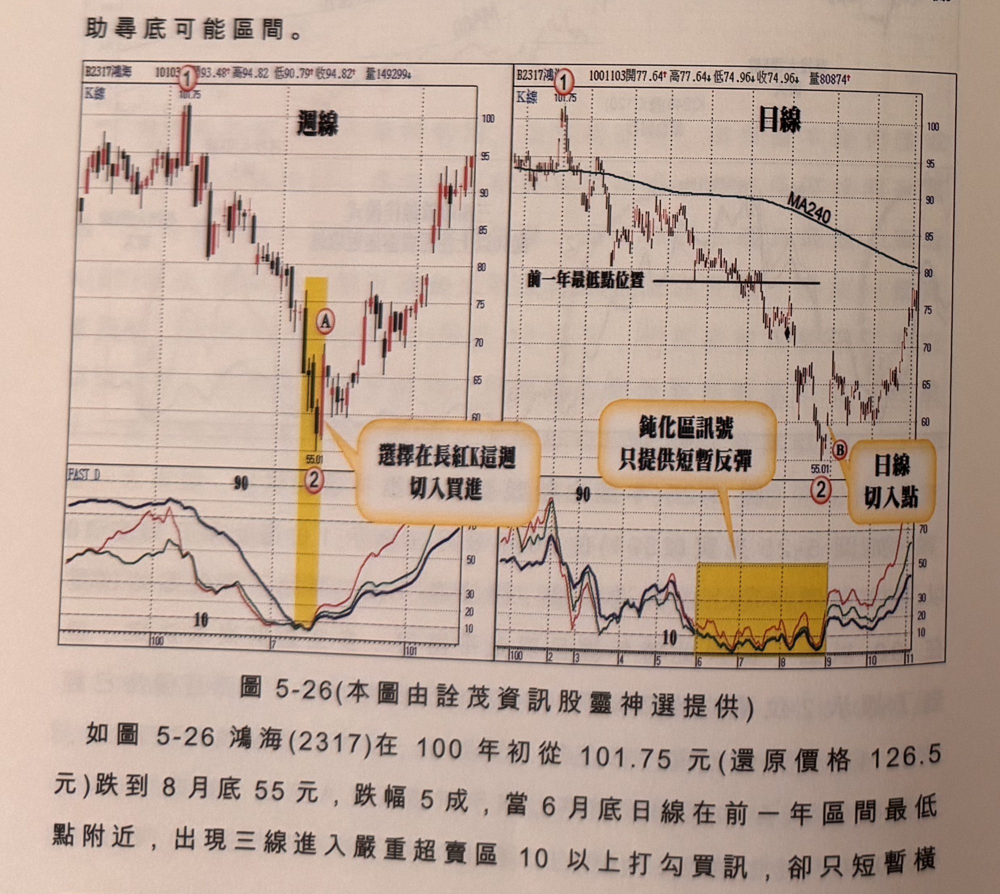
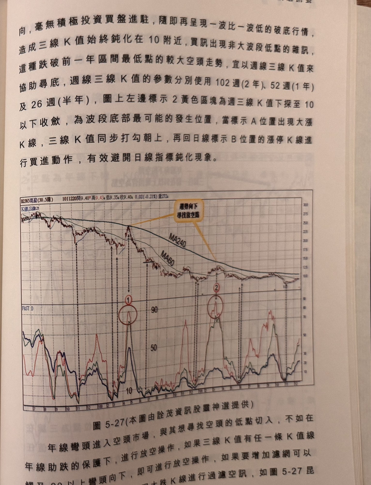

## p.208

標示 3 到標示 4 之間的三線收斂買訊，均未符合三線必須有一方位在 40 以上之濾網規定，直到標示 5 才出現 K(60) 及 K(120) 上揚超過 40 以上，再往下至嚴重超賣區與 K(240) 進行收斂，形成買進訊號。

顯然對於一檔不斷破底的個股，在運用三線收斂尋找波段買點，要特別注意起始位置必須在 40 以上的濾網結構，而對於個股在前一年區間最低點附近不見長線買盤簇擁，反向下不斷創新低點，勢必造成三線在嚴重超賣區鈍化游走，這種情況宜用週線來協助尋底可能區間。

**圖 5-26** (本圖由詮茂資訊股靈神選提供)

> 圖說（figure notes）：鴻海(2317) 左右並列週線與日線 K 線圖。左「週線」：報價列標示「B2317鴻海 101031開93.48↑高94.82↓低90.79↑收94.82↑量149299↓」，高點101.75（標示①），低點55.01附近以黃色縱帶標示（標示②A，文字方塊「選擇在長紅K這週切入買進」）。右「日線」：報價列標示「B2317鴻海 1001103開77.64↑高77.64↓低74.96↓收74.96↓量80874↑」，疊加MA240，文字方塊「前一年最低點位置」水平線標示，低點55.01附近以黃色縱帶標示（標示②B，文字方塊「鈍化區訊號 只提供短暫反彈」及「日線切入點」）。下方左右各自對應「FAST D」子圖，三色曲線於低點同步觸及10附近打勾向上。

如圖 5-26 鴻海(2317)在 100 年初從 101.75 元(還原價格 126.5 元)跌到 8 月底 55 元，跌幅 5 成，當 6 月底日線在前一年區間最低點附近，出現三線進入嚴重超賣區 10 以上打勾買訊，卻只短暫橫

## p.209

向，毫無積極投資買盤進駐，隨即再呈現一波比一波低的破底行情，造成三線 K 值始終鈍化在 10 附近，買訊出現非大波段低點的雜訊，這種跌破前一年區間最低點的較大空頭走勢，宜以週線三線 K 值來協助尋底，週線三線 K 值的參數分別使用 102 週(2 年)、52 週(1 年)及 26 週(半年)，圖上左邊標示 2 黃色區塊為週三線 K 值下探至 10 以下收斂，為波段底部最可能的發生位置，當標示 A 位置出現大漲 K 線，三線 K 值同步打勾朝上，再回日線標示 B 位置的漲停 K 線進行買進動作，有效避開日線指標鈍化現象。

**圖 5-27** (本圖由詮茂資訊股靈神選提供)

> 圖說（figure notes）：昆盈(2365) K 線圖，左上角報價列標示「B2365昆盈(30.5億) 1011220開9.40↑高9.43↓低9.35↑收9.40↓0.02(-0.21%)量272↓」。K 線圖疊加均線與SAR，高點附近文字方塊「趨勢向下 尋找放空點」，標示紅色圓圈①②於FAST D子圖對應高點（90以上彎頭向下）。三色曲線K(60)、K(120)、K(240)多次觸及90附近後回落。K 線右側持續下跌至10附近整理。

年線彎頭進入空頭市場，與其想尋找空頭的低點切入，不如在年線助跌的保護下，進行放空操作，如果三線 K 值有任一條 K 值線觸及 90 以上彎頭向下，即可進行放空操作，如果要增加濾網可以使用 K 線收盤破一低或出現大跌 K 線進行過濾空訊，如圖 5-27 昆
