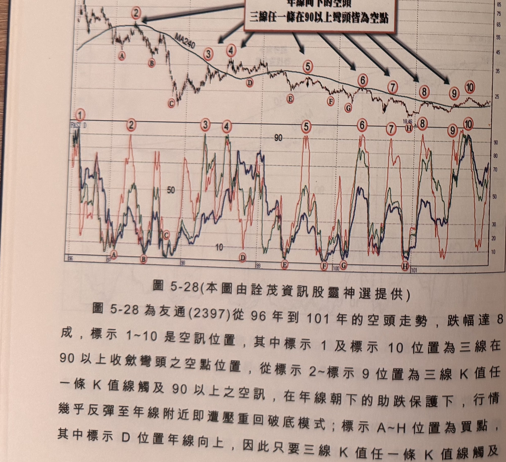
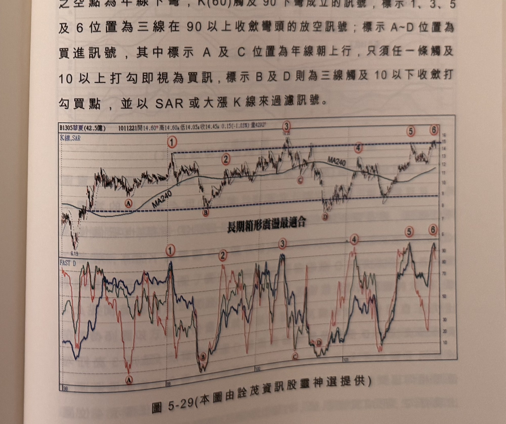

## p.210

盈(2365)在 99 年 9 月開始年線逐漸下彎，當 11 月出現三線 K 值觸及 10 以下的買訊，彈升至季線後，重新下跌並再次創新低，整個空頭走勢將不知伊底何處，一方面尋找三線 K 值收斂底部買點，另一方面在三線 K 值任一線觸及 90 以上彎頭，進行順勢放空，如標示 1 及標示 2 位置，均為 K(60) 觸及 90 彎頭的空點，而這種一再呈現破底走勢的個股，為免鈍化困擾判斷，宜採取週線三線 K 值線來協助尋底。

**圖 5-28** (本圖由詮茂資訊股靈神選提供)

> 圖說（figure notes）：友通(2397) K 線圖，疊加均線MA240，文字方塊「年線向下的空頭 三線任一條在90以上彎頭皆為空點」以多支黑色粗箭頭指向標示②③④⑤⑥⑦⑧⑨⑩（沿年線下降趨勢各次反彈高點），對應標示A~H為谷底買點。下方「FAST D」子圖，三色曲線K(60)紅、K(120)綠、K(240)藍，於標示①~⑩對應處多次觸及90附近後回落，於標示A~H對應處觸及10附近後打勾向上。K 線右側末端於18.46附近整理回升。

圖 5-28 為友通(2397)從 96 年到 101 年的空頭走勢，跌幅達 8 成，標示 1~10 是空訊位置，其中標示 1 及標示 10 位置為三線在 90 以上收斂彎頭之空點位置，從標示 2~標示 9 位置為三線 K 值任一條 K 值線觸及 90 以上之空訊，在年線朝下的助跌保護下，行情幾乎反彈至年線附近即遭壓重回破底模式；標示 A~H 位置為買點，其中標示 D 位置年線向上，因此只要三線 K 值任一條 K 值線觸及

## p.211

10 以下，視為買進訊號參考點。

當個股呈現長線箱形震盪，最適合用三線 K 值線收斂來尋找波段的高低點位置，配合 MA240 來做為長線趨勢方向，記住當年線朝上行時，買點只須三線 K 值線任一條觸及 10 以下打勾，再以過一高或大漲 K 線，或者以 SAR 過濾訊號，若年線朝下行時，空點只須三線 K 值線任一條觸及 90 以上彎頭，以破一低或大跌 K 線或跌破 SAR 做為濾網。圖 5-29 為華夏(1307)在 98 年至 101 年呈現長期箱形走勢，標示 1~6 位置均為放空訊號，其中標示 2 及 4 位置之空點為年線下彎，K(60) 觸及 90 下彎成立的訊號，標示 1、3、5 及 6 位置為三線在 90 以上收斂彎頭的放空訊號；標示 A~D 位置為買進訊號，其中標示 A 及 C 位置為年線朝上行，只須任一條觸及 10 以上打勾即視為買訊，標示 B 及 D 則為三線觸及 10 以下收斂打勾買點，並以 SAR 或大漲 K 線來過濾訊號。

**圖 5-29** (本圖由詮茂資訊股靈神選提供)

> 圖說（figure notes）：華夏(1307) K 線圖，左上角報價列標示「B1305華夏(42.5億) 1011221開14.60↑高14.60↓低14.05↑收14.45↓0.15(-1.03%)量4292↑」。K 線圖疊加SAR與MA240，兩條水平虛線標示長期箱形區間上下界，文字方塊「長期箱形震盪最適合」，標示①(低點6.19)②③④⑤⑥（沿箱形上下界的高低點），標示A、B、C、D（谷底買點）。下方「FAST D」子圖三色曲線對應標示①~⑥觸及90附近，A~D觸及10附近。K 線右側末端於14.45附近整理回升。
