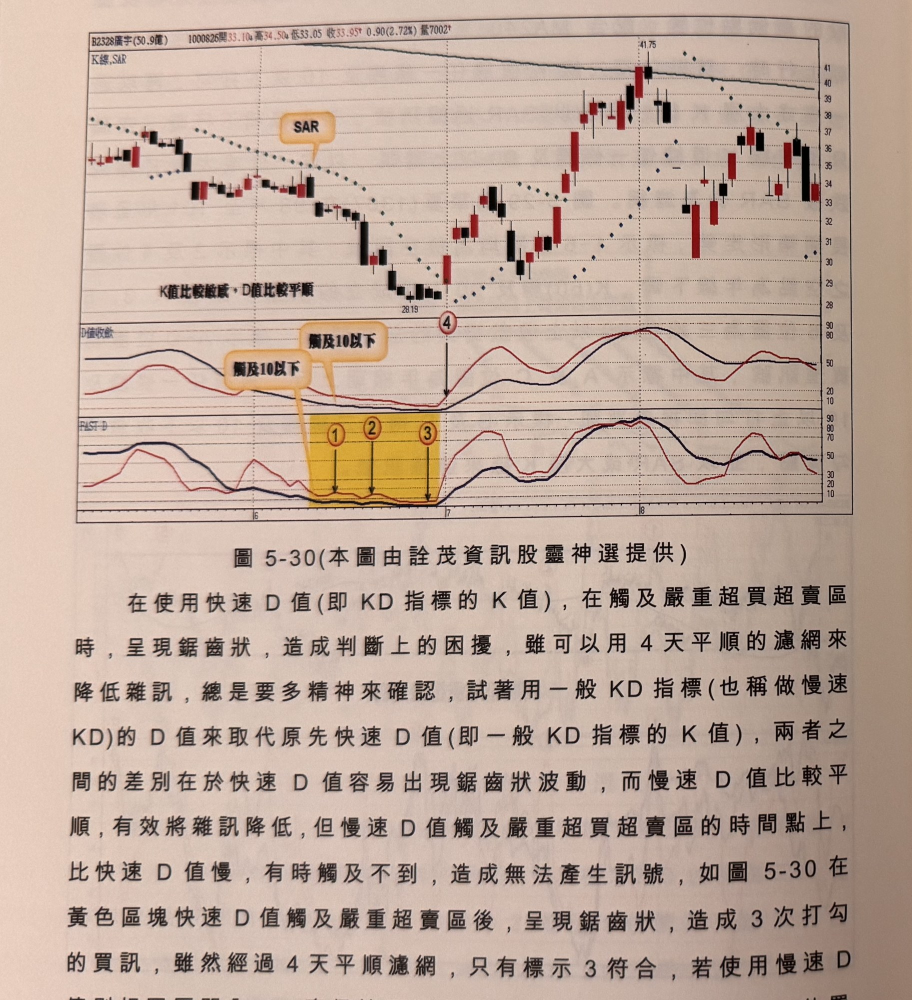
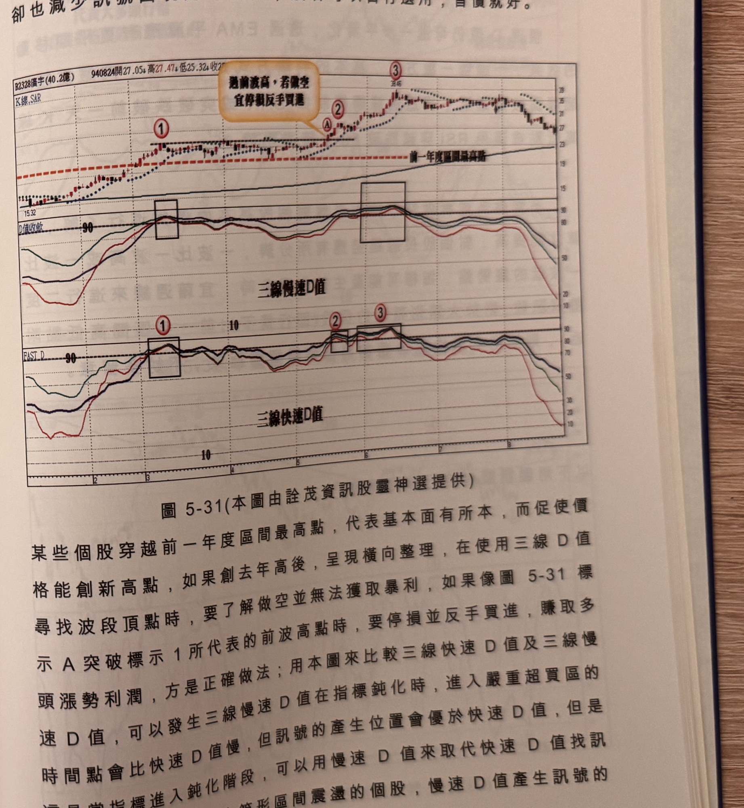

## p.212

### 改善鋸齒狀的D值

在使用快速 D 值(即 KD 指標的 K 值)，在觸及嚴重超買超賣區時，呈現鋸齒狀，造成判斷上的困擾，雖可以用 4 天平順的濾網來降低雜訊，總是要多精神來確認，試著用一般 KD 指標(也稱做慢速 KD)的 D 值來取代原先快速 D 值(即一般 KD 指標的 K 值)，兩者之間的差別在於快速 D 值容易出現鋸齒狀波動，而慢速 D 值比較平順，有效將雜訊降低，但慢速 D 值觸及嚴重超買超賣區的時間點上，比快速 D 值慢，有時觸及不到，造成無法產生訊號，如圖 5-30 在黃色區塊快速 D 值觸及嚴重超賣區後，呈現鋸齒狀，造成 3 次打勾的買訊，雖然經過 4 天平順濾網，只有標示 3 符合，若使用慢速 D 值則相同區間內，一直保持平順與長 D 逼近收斂，只在標示 4 位置出現打勾，形成買進訊號，的確比快速 D 值容易判斷，但慢速 D 值

**圖 5-30** (本圖由詮茂資訊股靈神選提供)

> 圖說（figure notes）：廣宇(2328) K 線圖，左上角報價列標示「B2328廣宇(50.9億) 1000826開33.10↑高34.50↑低33.05↑收33.95↑0.90(2.72%)量7002↑」。K 線圖疊加SAR，文字方塊「SAR」，低點28.19，文字方塊「K值比較敏感，D值比較平順」置底。中段「D值收斂」子圖，兩條線（快、慢D值）於黃色縱帶區間觸及「10以下」（文字方塊分別標示兩次「觸及10以下」），標示④打勾向上。下方「FAST D」子圖，於同一黃色縱帶區間標示①②③三次打勾。K 線右側上漲至高點41.75後回落整理，收在33附近。

## p.213

觸及 10 以下的時間點，顯然比快速 D 值慢，在某些狀況下，將無法順利產生訊號，俗語說得好，有一好就無二好，改善鋸齒狀發生，卻也減少訊號出現的可能性，讀者可以自行選用，習慣就好。

慢速 D 值仍可進一步平滑化，透過 EMA 平滑應有更平順移動的效果，不論哪一種方式，基本的判斷方式是不變的，向嚴重超買超賣區收斂逼近，再透過濾網機制如 SAR 或突破跌破前一天 K 線高低點或運用 RSI 穿越跌破 50 來篩選訊號。

不管做多或者做空，操作者應對個股基本面優劣進行了解，勝算才能提高，對個股長線趨勢應有所分辨，一波比一波高或一波比一波低的趨勢盤，指標可能產生鈍化現象時，宜藉週線來進行二度篩選訊號，對於大箱形整理的個股(即行情不出前一年區間高低點附近)，則能把本章快速 D 值的尋頂底發揮到極致，不妨多留意。

**圖 5-31** (本圖由詮茂資訊股靈神選提供)

> 圖說（figure notes）：廣宇(2328) K 線圖，左上角報價列標示「B2328廣宇(40.2億) 940824開27.05↑高27.47↓低25.32↑收25.??」。K 線圖疊加SAR，紅色虛線標示「前一年度區間最高點」，文字方塊「過前波高，若做空 宜停損反手買進」，標示①（前波高點）②③（A，突破前波高點）。中段「三線慢速D值」子圖，兩個黑框分別標示①②③對應處三線於90附近觸及糾結。下方「三線快速D值」子圖，同樣以黑框標示①②③對應處三線於90附近糾結。K 線右側末端高點39.46後大幅回落。

某些個股穿越前一年度區間最高點，代表基本面有所本，而促使價格能創新高點，如果創去年高後，呈現橫向整理，在使用三線 D 值尋找波段頂點時，要了解做空並無法獲取暴利，如果像圖 5-31 標示 A 突破標示 1 所代表的前波高點時，要停損並反手買進，賺取多頭漲勢利潤，方是正確做法；用本圖來比較三線快速 D 值及三線慢速 D 值，可以發生三線慢速 D 值在指標鈍化時，進入嚴重超買區的時間點會比快速 D 值慢，但訊號的產生位置會優於快速 D 值，但是這是當指標進入鈍化階段，可以用慢速 D 值來取代快速 D 值找訊號，這是當指標進入鈍化階段，屬於長期大箱形區間震盪的個股，慢速 D 值產生訊號的
