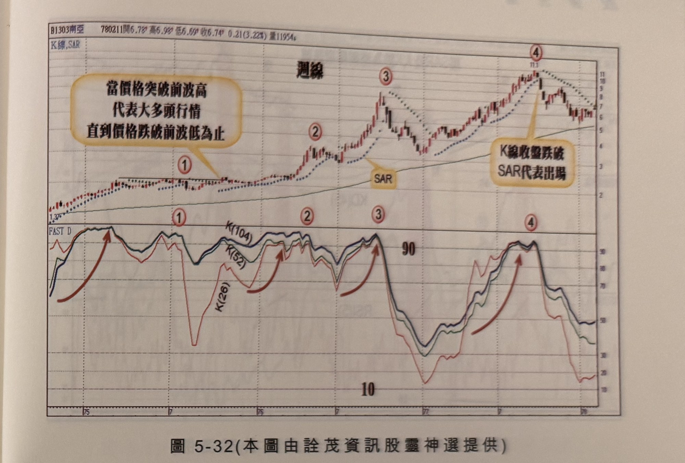
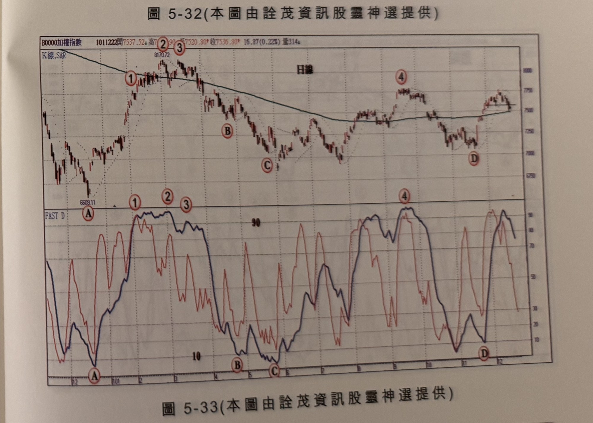

## p.214

即時性及敏感度就沒有快速 D 值有效，兩種尋頂底工具，各有所長之處，我們可以視情況加以調整。

慢速 D 值仍可進一步平滑化，透過 EMA 平滑應有更平順移動的效果，不論哪一種方式，基本的判斷方式是不變的，向嚴重超買超賣區收斂逼近，再透過濾網機制如 SAR 或突破跌破前一天 K 線高低點或運用 RSI 穿越跌破 50 來篩選訊號。

不管做多或者做空，操作者應對個股基本面優劣進行了解，勝算才能提高，對個股長線趨勢應有所分辨，一波比一波高或一波比一波低的趨勢盤，指標可能產生鈍化現象時，宜藉週線來進行二度篩選訊號，對於大箱形整理的個股(即行情不出前一年區間高低點附近)，則能把本章快速 D 值的尋頂底發揮到極致，不妨多留意。

以下附圖請讀者自行參閱練習。

## p.215

**圖 5-32** (本圖由詮茂資訊股靈神選提供)

> 圖說（figure notes）：南亞(1303) K 線圖，左上角報價列標示「B1303南亞 780211開6.78↑高6.98↑低6.69↑收6.74↑0.21(3.22%)量11954↓」，標題「週線」。K 線圖疊加SAR，文字方塊「當價格突破前波高 代表大多頭行情 直到價格跌破前波低為止」以線段指向標示①；文字方塊「K線收盤跌破SAR代表出場」指向標示④（高點11.1附近）。標示②③沿上升趨勢。下方「FAST D」子圖，三色曲線K(26)、K(52)、K(104)，多支紅色弧形箭頭指向①②③④對應處的高點打勾。K 線右側末端回落整理，收在7附近。

**圖 5-33** (本圖由詮茂資訊股靈神選提供)

> 圖說（figure notes）：加權指數 K 線圖，左上角報價列標示「B0000加權指數 1011222開7537.52↓高8170.72↓低7520.80↑收7536.80↑16.87(0.22%)量314↓」，標題「日線」。K 線圖疊加均線，低點6609.11（標示A），高點8170.72（標示②③），標示①B（回檔）、C（低點）、④D（高點後回落）。下方「FAST D」子圖，兩色曲線於標示①②③處觸及90附近，於A、B、C、D處觸及10附近。K 線右側末端於7500附近整理。
