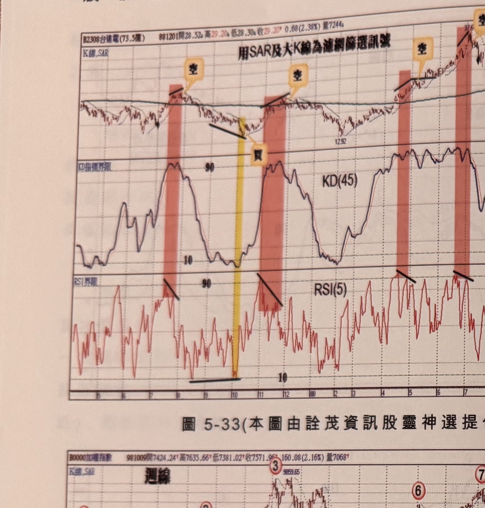
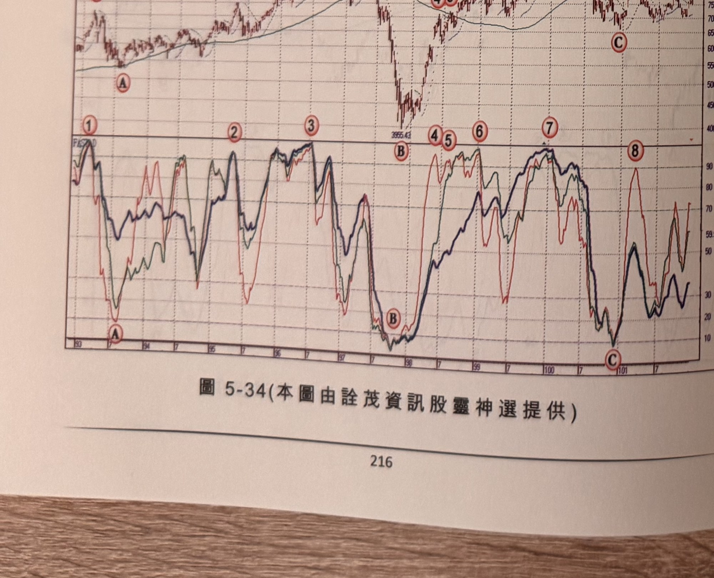
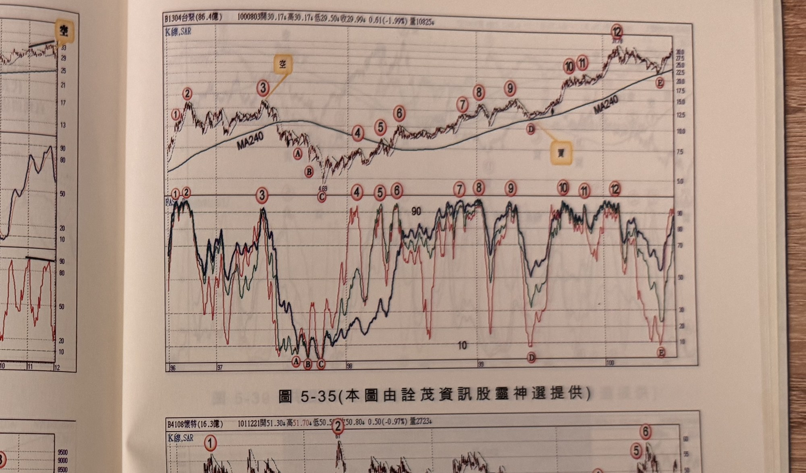
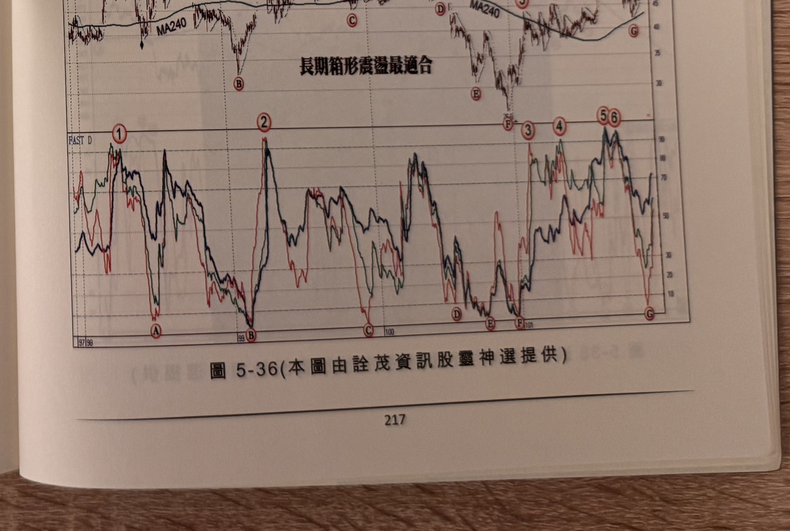

## p.216

**圖 5-33** (本圖由詮茂資訊股靈神選提供；注意：此圖與 p.215 圖 5-33 編號重複，疑為原書排版錯誤，此處以檔名 p216-1 區分)

> 圖說（figure notes）：台達電(2308) K 線圖，左上角報價列標示「B2308台達電(73.5億) 881201開28.52↑高29.20↑低28.30↑收29.20↑0.68(2.38%)量7244↓」。標題「用SAR及大K線為濾網篩選訊號」。K 線圖疊加SAR，四段紅色縱帶各標示「空」（黑色斜線標示前波高），其一以黃色縱帶標示「買」（谷底反轉處）。下方「KD指標界限」子圖，KD(45)於各紅色縱帶對應處觸及90附近。最下方「RSI界限」子圖，RSI(5)同步於對應處觸及90附近（黑色斜線標示）。K 線右側持續上漲，末端高點37.6附近。

**圖 5-34** (本圖由詮茂資訊股靈神選提供)

> 圖說（figure notes）：加權指數 K 線圖，標題「週線」，低點3955.43（標示B）。下方「FAST D」子圖，三色曲線於標示①②③④⑤⑥⑦⑧觸及90附近，於A、B、C觸及10附近。

## p.217

**圖 5-35** (本圖由詮茂資訊股靈神選提供)

> 圖說（figure notes）：台聚(1304) K 線圖，左上角報價列標示「B1304台聚(86.4億) 1000803開30.17↑高30.17↓低29.50↑收29.99↓0.61(-1.99%)量10825↓」。K 線圖疊加MA240，標示①②③（文字方塊「空」指向③高點）、④⑤⑥A、B、C（低點4.69附近）、⑦⑧⑨、⑩⑪⑫D（文字方塊「買」指向D）、E。下方「FAST D」子圖對應同步標示①~⑫及A~E。K 線右側末端高點30.79附近。

**圖 5-36** (本圖由詮茂資訊股靈神選提供)

> 圖說（figure notes）：懷特(4108) K 線圖，左上角報價列標示「B4108懷特(16.3億) 1011221開51.30↓高51.70↓低50.50↑收50.80↓0.50(-0.97%)量2723↑」。K 線圖疊加MA240，文字方塊「長期箱形震盪最適合」，標示①B（低點附近）、②C、D、E、③④、F、⑤⑥G。下方「FAST D」子圖對應同步標示①~⑥及A~G。K 線右側末端於50附近整理。
