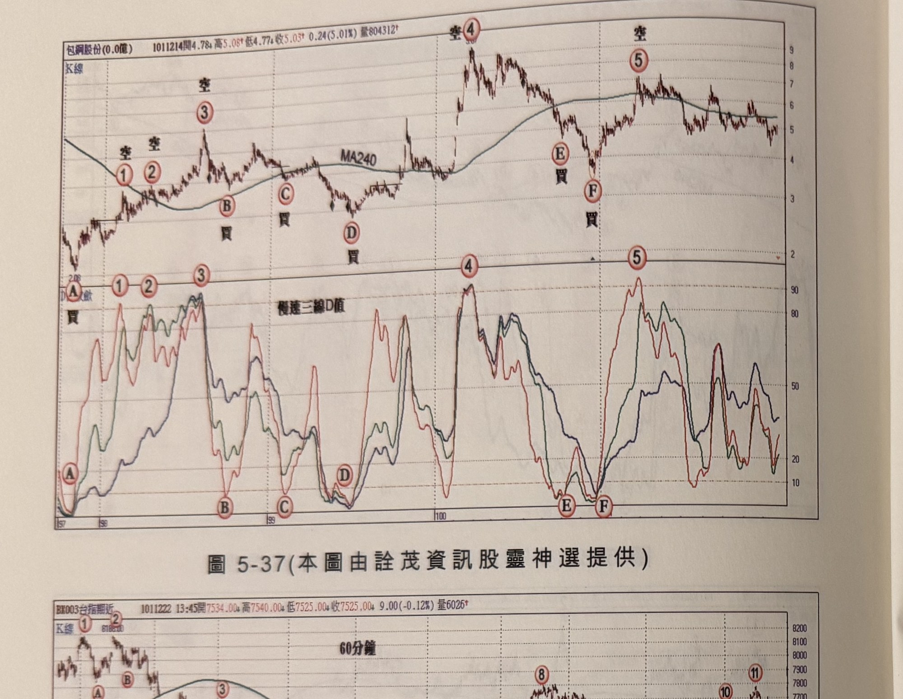
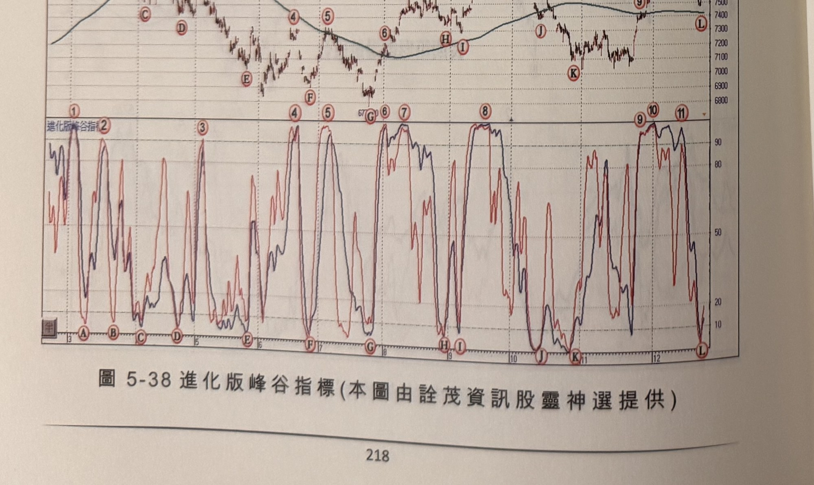
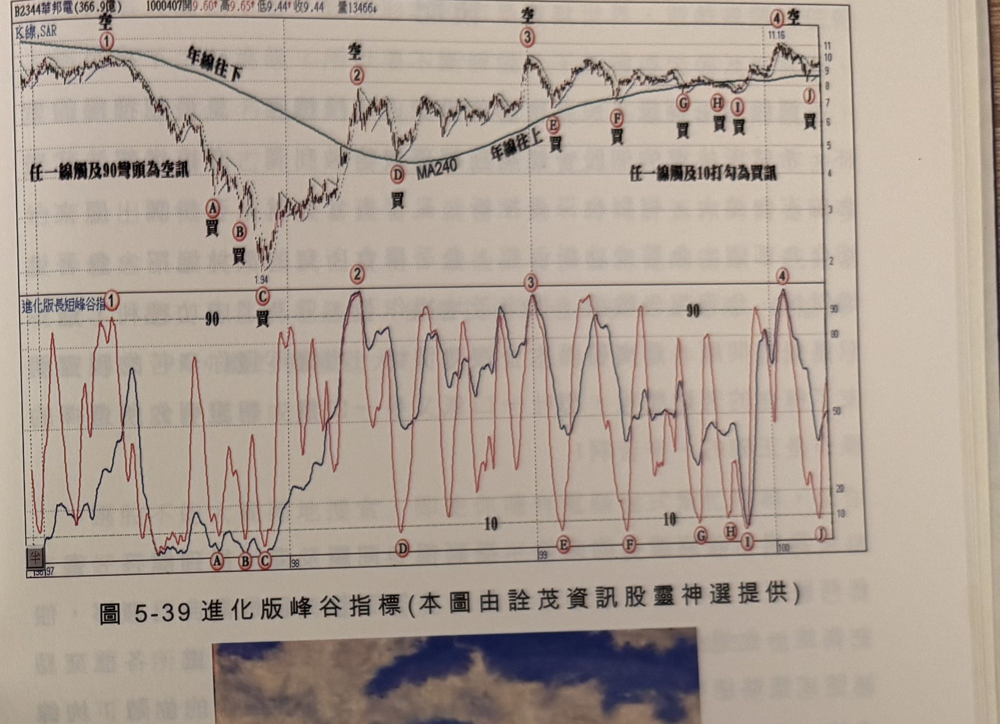

## p.218

**圖 5-37** (本圖由詮茂資訊股靈神選提供)

> 圖說（figure notes）：包鋼股份 K 線圖，左上角報價列標示「包鋼股份(0.0億) 1011214開4.78↑高5.08↑低4.77↑收5.03↑0.24(5.01%)量804312↑」。K 線圖疊加MA240，標示「空①②」（低點附近）、「空③」（高點）、「買B」「買C」「買D」（低檔區）、「空④」（高點9.0附近）、「買E」「買F」（回檔低點）、「空⑤」（次高點）。下方「慢速三線D值」子圖，三色曲線於A~F及①~⑤對應處分別觸及10附近（買）或90附近（空）。K 線右側末端於5附近整理。

**圖 5-38 進化版峰谷指標** (本圖由詮茂資訊股靈神選提供)

> 圖說（figure notes）：台指期近 K 線圖，左上角報價列標示「BX003台指期近 1011222 13:45開7534.00↑高7540.00↓低7525.00↑收7525.00↓9.00(-0.12%)量6026↑」，標題「60分鐘」。K 線圖疊加均線，標示①②③④⑤⑥⑦⑧⑨⑩⑪對應各波段高低點（A~L 於下方子圖對應）。下方「進化版峰谷指標」子圖，雙色曲線多次觸及10（A、B、C、D、E、F、G、H、I、J、K、L）及90（①~⑪）附近。K 線右側末端於7400附近整理。

## p.219

**圖 5-39 進化版峰谷指標** (本圖由詮茂資訊股靈神選提供)

> 圖說（figure notes）：華邦電(2344) K 線圖，左上角報價列標示「B2344華邦電(366.9億) 1000407開9.60↑高9.65↑低9.44↑收9.44 量13466↓」。K 線圖疊加MA240，文字方塊「任一線觸及90彎頭為空訊」「任一線觸及10打勾為買訊」「年線往下」「年線往上」。標示「空①」（高點）、「買A」「買B」「買C」（低點1.94附近）、「空②」「空③」（高點）、「買D」（MA240谷底）、「買E」「買F」「買G」「買H」「買I」（沿年線上升的各次糾結買訊）、「空④」（次高點11.16）、「買J」。下方「進化版長短峰谷指」子圖，雙色曲線於A~J處觸及10附近、①~④處觸及90附近。K 線右側末端於9~10區間整理。

[下方為插圖「玉山(王沛文油畫作品，16歲)」——油畫描繪玉山主峰，深色山體、藍紫色天空與白雲，前景為開滿粉紅花朵的高山灌叢；插圖左側頁面另有一欄極淡的灰色印刷字跡，經比對為背面透印痕跡，非本頁內容，不予轉錄。]
