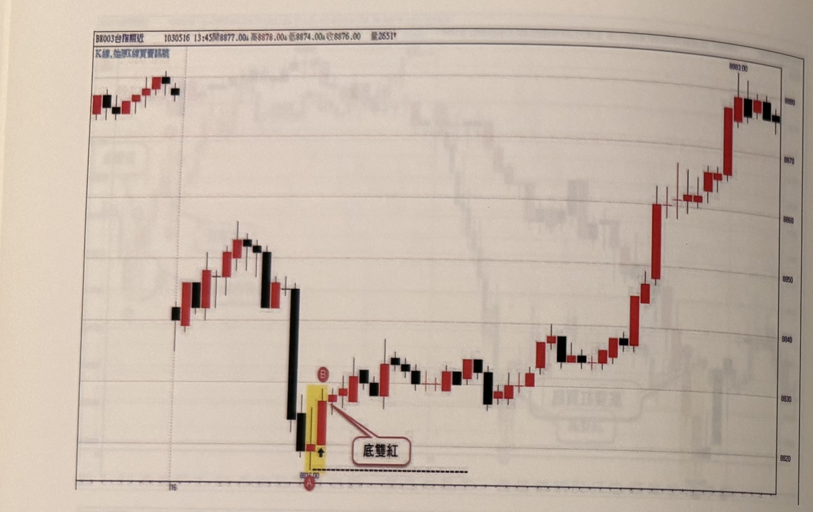
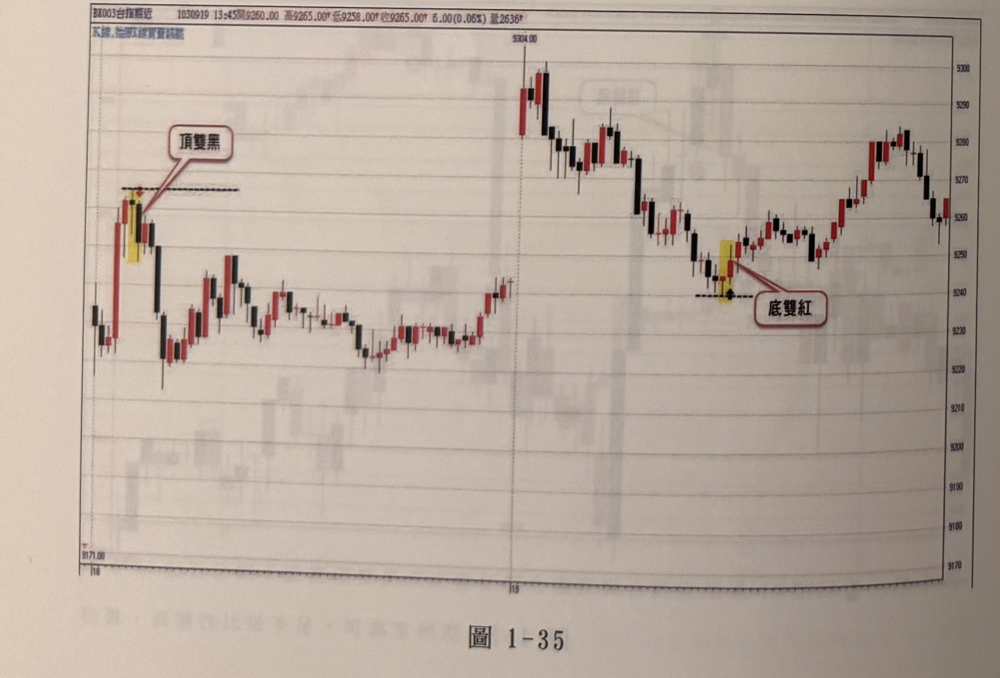
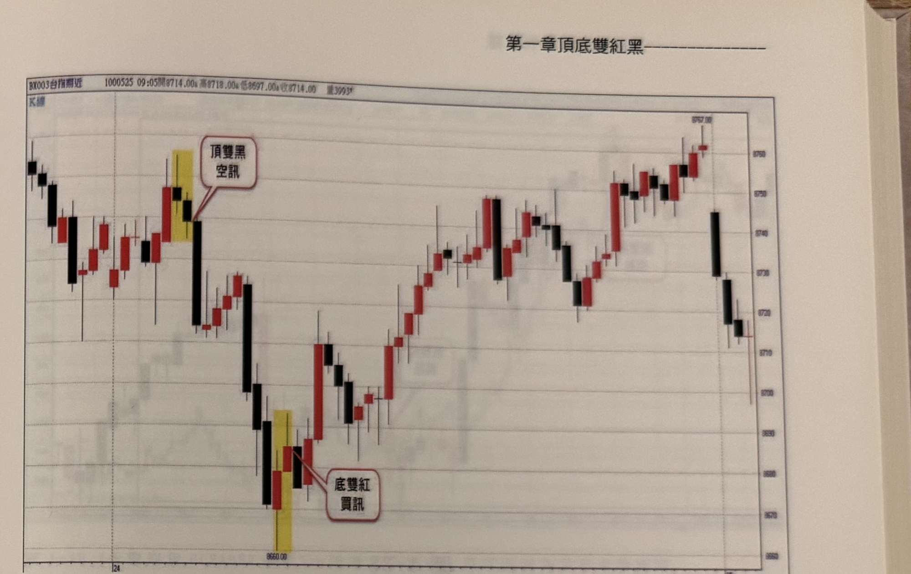
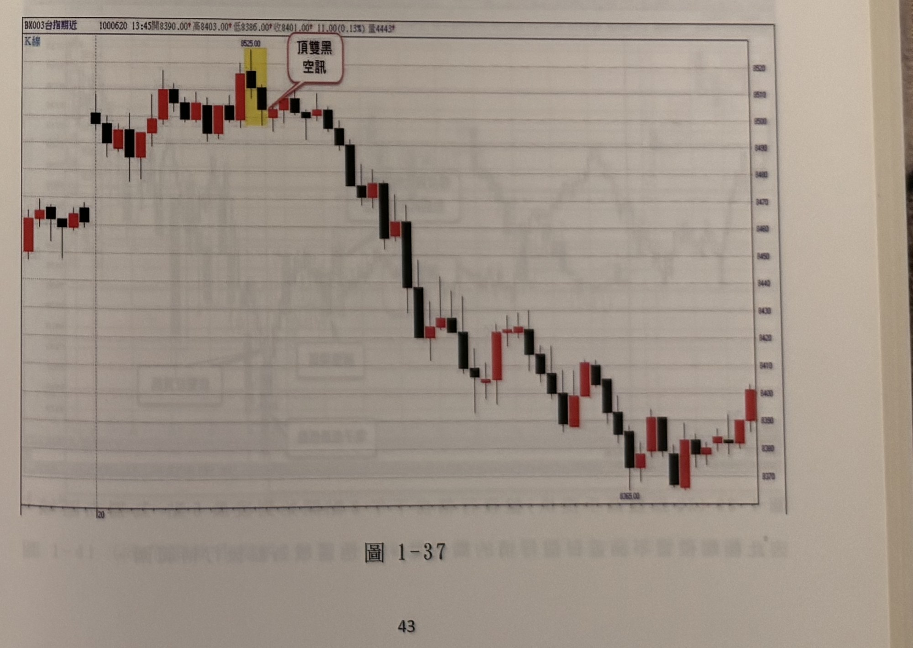

## p.42

**圖 1-34**

> 圖說（figure notes）: 台指期分時K線走勢圖（頁首標示「BK003台指期近 1030516 13:45開8877.00，高8878.00，低8874.00，收8876.00 量2651」，左上另有小字「K線,始漲反線買賣訊號」）。走勢左段先小幅盤堅後拉回，出現一根長黑K棒重挫下殺，隨後緊接兩根以黃色網底標示的K棒（黑K下方紅圈字母「A」標示低點，其上紅K棒上方紅圈字母「B」標示），紅框白底圓角矩形標註框「底雙紅」以線指向該處，代表A、B兩根K棒構成底雙紅買訊。訊號出現後行情呈區間震盪緩步走高，最終於圖右段一根長紅K棒帶動下急拉走高，收在全圖最高點「8883.00」附近，隨後小幅回落收黑作收。

**圖 1-35**

> 圖說（figure notes）: 台指期分時K線走勢圖（頁首標示「BK003台指期近 1030919 13:45開9260.00，高9265.00，低9258.00，收9265.00 6.00(0.06%) 量2636」，左上小字「K線,始漲反線買賣訊號」）。走勢左段快速上攻至高點附近，出現一根以黃色網底標示的黑K棒（上方紅框白底圓角矩形標註框「頂雙黑」，以線指向緊鄰其左側略高的紅K棒頂部一帶的水平虛線），構成頂雙黑空訊；隨後行情反轉重挫下殺一大段，於圖中段低點附近止跌、呈W形雙底盤整後再度上攻，攻抵另一波高點「9304.00」，再次拉回至一組以黃色網底標示的K棒（下方紅框白底圓角矩形標註框「底雙紅」以線指向，旁註水平虛線與箭頭）構成底雙紅買訊，其後行情持續走高，於圖右段呈區間震盪盤堅作收。

## p.43

**圖 1-36**

> 圖說（figure notes）: 台指期分時K線走勢圖（頁首標示「BX003台指期近 1000525 09:05開8714.00，高8718.00，低8697.00，收8714.00 量3993」，左上小字「K線」）。走勢左段小幅震盪下探後反彈，攻抵一組以黃色網底標示的K棒（紅框白底圓角矩形標註框「頂雙黑 空訊」以線指向），構成頂雙黑空訊；訊號出現後行情連續重挫下殺一大段，於圖中段低點附近出現另一組以黃色網底標示的K棒（紅框白底圓角矩形標註框「底雙紅 買訊」以線指向），構成底雙紅買訊；此後行情持續反彈走高，中段一度呈區間盤整，末段再度上攻，於圖右段收在高點「8757.00」附近後小幅拉回收黑作收。

**圖 1-37**

> 圖說（figure notes）: 台指期分時K線走勢圖（頁首標示「BX003台指期近 1000620 13:45開8390.00，高8403.00，低8386.00，收8401.00 11.00(0.13%) 量4443」，左上小字「K線」）。走勢左段盤堅走高，攻抵一組以黃色網底標示的K棒（上方標示價位「8525.00」，紅框白底圓角矩形標註框「頂雙黑 空訊」以線指向），構成頂雙黑空訊；訊號出現後行情連續重挫下殺，一路破底下探，中途略有反彈但整體持續破底，直到圖右段低點「8365.00」附近止跌，最終一根長紅K棒帶動反彈至「8401」附近作收。
