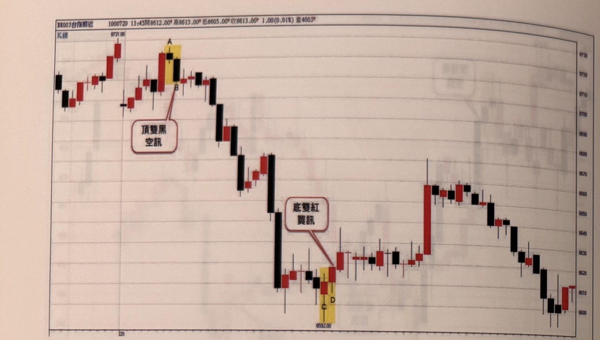
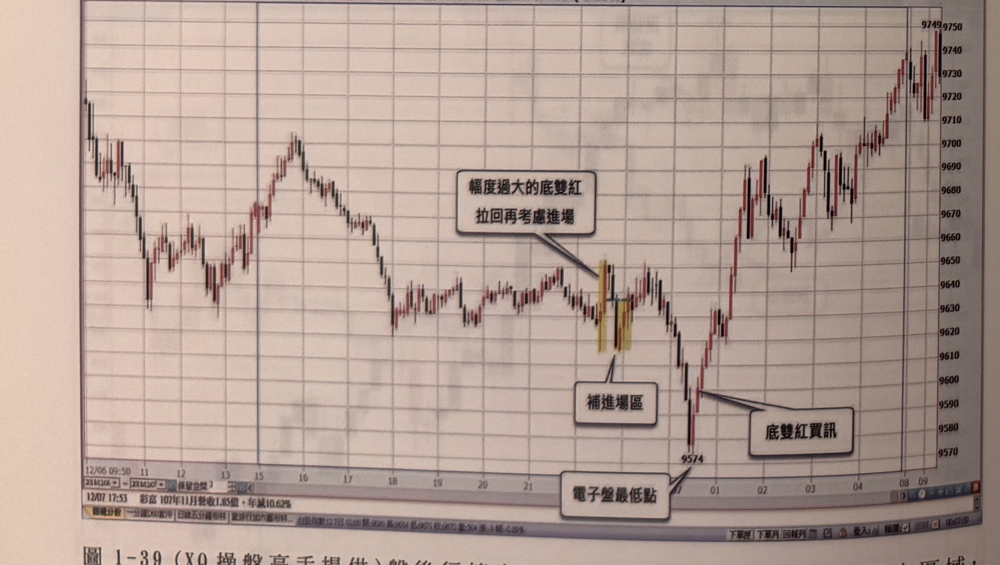
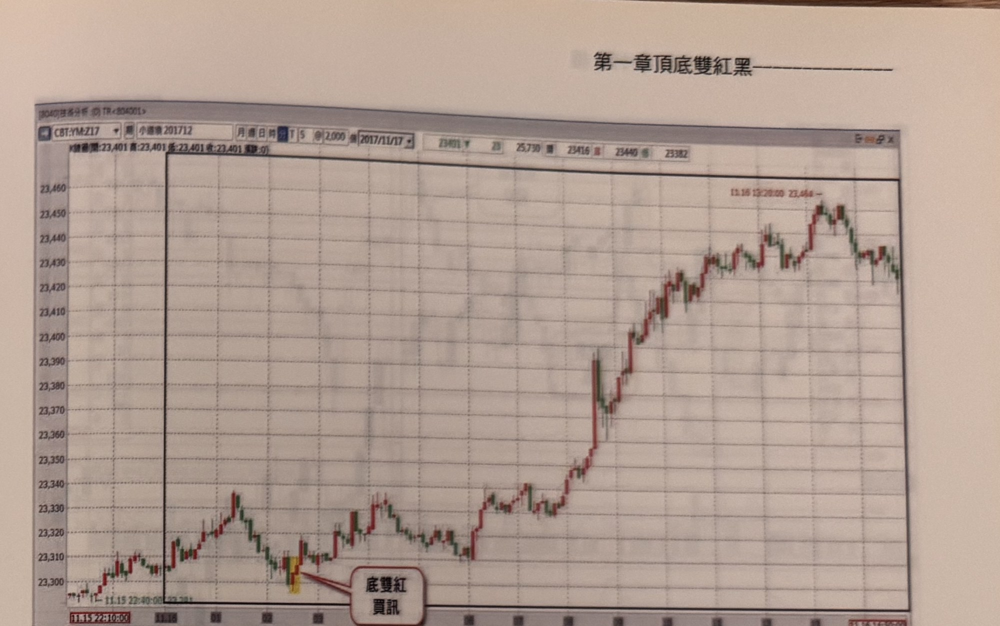
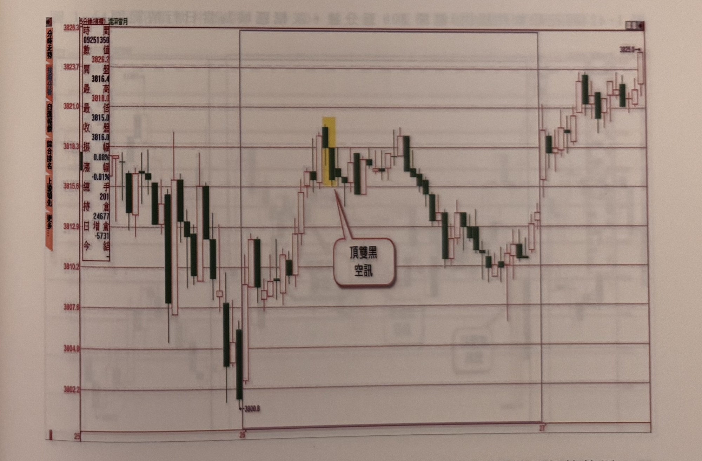

## p.44

**圖 1-38**

> 圖說（figure notes）: 台指期分時K線走勢圖（頁首標示「BK003台指期近 1000729 13:45開8612.00，高8613.00，低8605.00，收8613.00 1.00(0.01%) 量4003」，左上小字「K線」）。走勢左段盤堅上攻，攻抵一組以黃色網底標示的K棒（上方紅圈字母「A」標示，下方紅圈字母「B」標示），紅框白底圓角矩形標註框「頂雙黑 空訊」以線指向B，構成頂雙黑空訊；訊號後行情連續重挫下殺一大段，於圖中段低點附近出現另一組以黃色網底標示的K棒（上方紅圈字母「C」，下方紅圈字母「D」，價位標示「8532.00」），紅框白底圓角矩形標註框「底雙紅 買訊」以線指向，構成底雙紅買訊；其後行情呈區間盤整緩步走高，圖右段一根長紅K棒帶動急拉後續呈區間震盪，收在8610附近。

**圖 1-39** (XQ操盤高手提供)盤後行情自下午3點開始到凌晨5點，為獨立區域，因此極端位置不涵蓋日盤行情的高低點，藍色區域為盤後行情範圍。

> 圖說（figure notes）: XQ操盤高手軟體截圖的日K線走勢圖（左下時間軸標示12/06 09:50起至12/07 17:53，並有「彩富 107年11月營收1.85億，年減10.62%」跑馬燈文字），右側為價格座標軸（約9570至9750）。走勢先從左段高點震盪下探，中段反彈至波段高點後再度下跌，途中出現一組以黃色網底標示、標籤「幅度過大的底雙紅 拉回再考慮進場」的K棒（以線指向），其下方另有標籤「補進場區」（以線指向同一組K棒下緣）；行情持續下探至圖中低點「9574」（下方標籤「電子盤最低點」），此低點右側緊鄰一根長紅K棒與標籤「底雙紅買訊」（以線指向9574附近的K棒組合）。訊號後行情強勁反彈走高，一路震盪盤堅上攻，最終於圖右段收在全圖最高點「9749」附近。

## p.45

**圖 1-40** (永豐期貨 GLEADER 提供)小道瓊五分鐘圖，黑框區域為當日走勢範圍

> 圖說（figure notes）: 永豐期貨GLEADER軟體截圖，小型道瓊期貨（CBT:YM:Z17，2017/11/17，5分鐘K線）走勢圖，左側為價格座標軸（約23,300至23,460）。圖中以黑色矩形框圈出當日走勢範圍。走勢左段於低點區間震盪整理，其中一根以黃色網底標示的K棒下方以標籤「底雙紅買訊」指出買進訊號；訊號後行情出現一根跳空長紅K棒急拉，隨後持續震盪盤堅上攻，中途小幅拉回後再度上攻，最終於圖右上方標示「11.16 12:20:00 23,464→」處達到全圖最高點附近，收在23,420上下。

**圖 1-41** (同花順軟件提供)滬深300五分鐘，灰框區域為當日行情範圍

> 圖說（figure notes）: 同花順軟體截圖，滬深300期貨5分鐘K線走勢圖，左側資訊欄顯示「數值 開/最高/最低/收/振幅0.08%/幅-0.01%/手201/倉24677/增倉-5731/今」等即時報價資訊，右側以灰框標示當日行情範圍（自左段起，跨兩個交易日）。走勢左段震盪下探至低點「3800.8」，其後反彈走高，攻抵一組以黃色網底標示的K棒（紅框白底圓角矩形標註框「頂雙黑 空訊」以線指向），構成頂雙黑空訊；訊號後行情反轉重挫下殺一段，於圖中段呈區間震盪整理後再度走低，末段行情止跌反彈走高，最終於圖右上段收在「3825.0」附近的高點作收。
