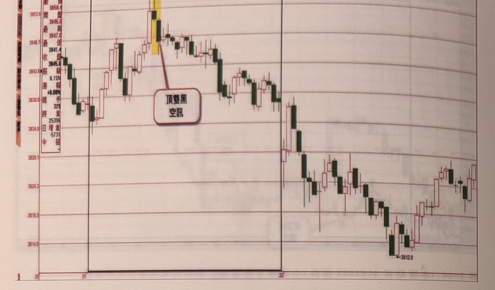
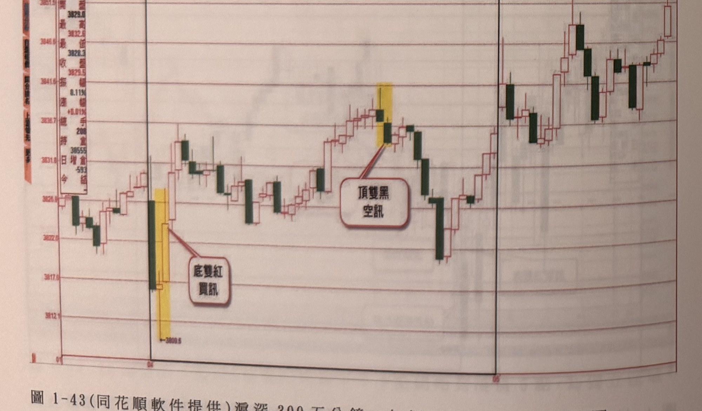
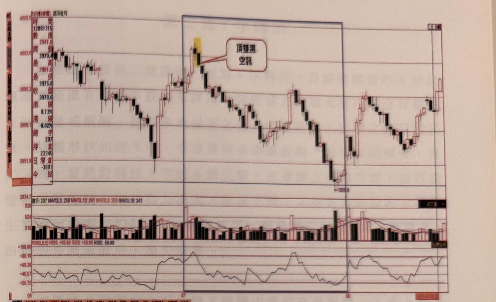
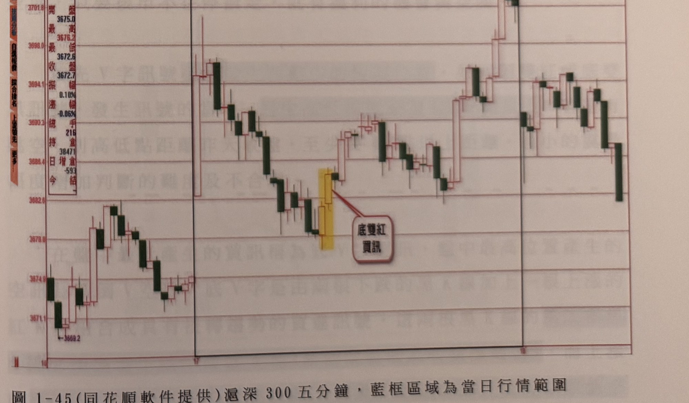

## p.46

**圖 1-42** (同花順軟件提供)滬深300五分鐘，灰框區域為當日行情範圍

> 圖說（figure notes）: 同花順軟體截圖（深色主題，紅漲綠跌），滬深300期貨5分鐘K線走勢圖，左側資訊欄顯示開/最高/最低/收/振幅/幅/手/倉/增倉等即時報價資訊，圖中以灰／黑色矩形框標示兩個交易日的當日行情範圍。走勢左段震盪走高，攻抵一組以黃色網底標示的K棒（紅框白底圓角矩形標註框「頂雙黑 空訊」以線指向），構成頂雙黑空訊；訊號後行情反轉重挫下殺一段，中途止跌小幅反彈後再度破底下探，最終於圖右段收在全圖最低點「3812.0」附近。

**圖 1-43** (同花順軟件提供)滬深300五分鐘，灰框區域為當日行情範圍

> 圖說（figure notes）: 同花順軟體截圖（深色主題），滬深300期貨5分鐘K線走勢圖，左側同樣顯示即時報價資訊欄，圖中以黑色矩形框標示當日行情範圍。走勢左段震盪下探至低點，出現一組以黃色網底標示的K棒（下方標示價位「3809.5」，紅框白底圓角矩形標註框「底雙紅 買訊」以線指向），構成底雙紅買訊；訊號後行情反彈走高，一路盤堅上攻，攻抵另一組以黃色網底標示的K棒（紅框白底圓角矩形標註框「頂雙黑 空訊」以線指向），構成頂雙黑空訊；此後行情重挫下殺一段，觸底後再度反彈走高，最終於圖右段呈區間盤堅震盪作收。

## p.47

**圖 1-44** (同花順軟件提供)滬深300五分鐘，藍框區域為當日行情範圍

> 圖說（figure notes）: 同花順軟體截圖，滬深300期貨5分鐘K線走勢圖（含下方成交量柱狀圖與自訂界限RSI指標副圖，RSI5,5,5參數，RSI5值標示+58.89／-58.89），左側資訊欄顯示即時報價，圖中以藍色矩形框標示當日行情範圍（框內橫跨圖表中段一大段走勢）。走勢左段小幅震盪走低後反彈，攻抵一組以黃色網底標示的K棒（紅框白底圓角矩形標註框「頂雙黑 空訊」以線指向），構成頂雙黑空訊；訊號後行情持續重挫下殺一大段，於藍框右緣附近觸及低點「3939.0」，其後止跌反彈，行情呈W形震盪走高，最終於圖右段收在相對高點附近；下方RSI指標亦同步呈現先高檔鈍化、隨價格下跌轉弱、後續反彈回升的走勢。

**圖 1-45** (同花順軟件提供)滬深300五分鐘，藍框區域為當日行情範圍

> 圖說（figure notes）: 同花順軟體截圖，滬深300期貨5分鐘K線走勢圖，左側資訊欄顯示即時報價資訊，圖中以藍色矩形框標示當日行情範圍。走勢左段震盪下探至低點「3669.2」，其後反彈走高又再度拉回，於圖中段出現一組以黃色網底標示的K棒（紅框白底圓角矩形標註框「底雙紅 買訊」以線指向），構成底雙紅買訊；訊號後行情持續盤堅上攻，一路震盪走高，末段觸及波段高點後於藍框右緣附近由高檔重挫下殺一根長黑K棒，收在相對低點作收。
