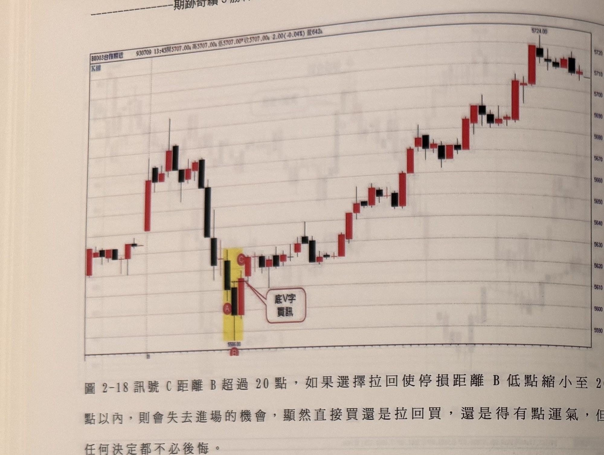
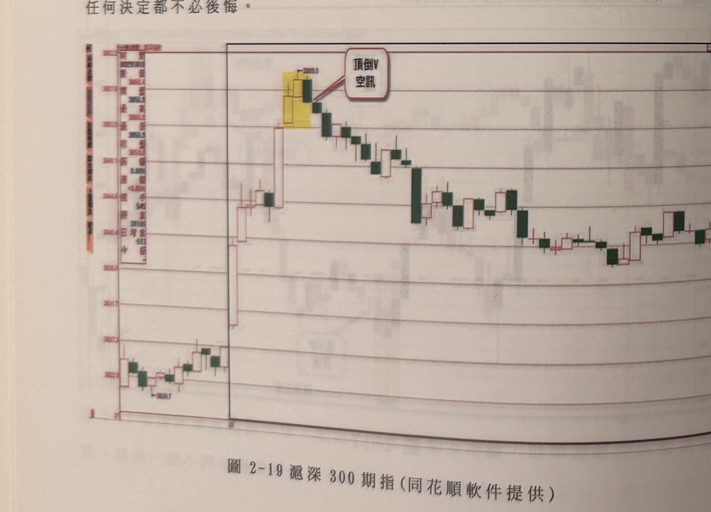
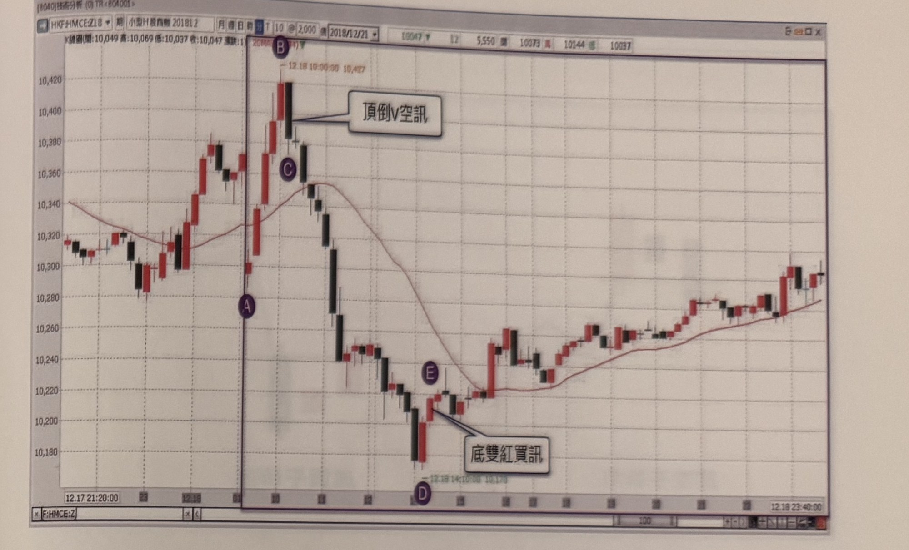
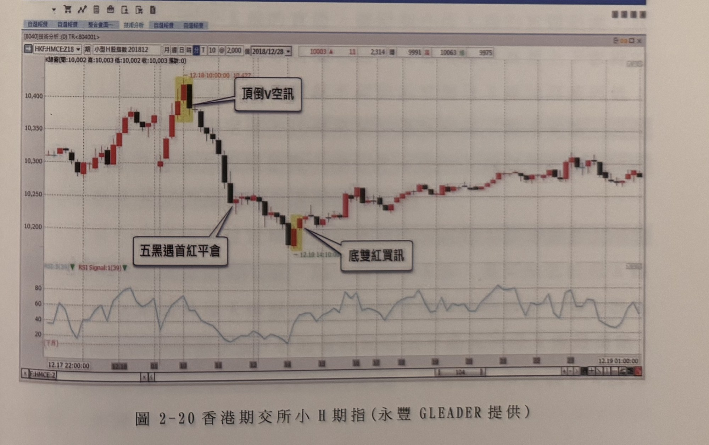

## p.64

**圖 2-18** 訊號C距離B超過20點，如果選擇拉回使停損距離B低點縮小至20點以內，則會失去進場的機會，顯然直接買還是拉回買，還是得有點運氣，但任何決定都不必後悔。

> 圖說（figure notes）: 台指期分時K線走勢圖（頁首標示「BX003台指期近 930709 13:45開5707.00，高5707.00，低5707.00，收5707.00 2.00(-0.04%) 量642」，左上小字「K線」）。走勢左段震盪走高後拉回下探，出現一組以黃色網底標示的K棒（下方紅圈字母「B」標示低點「5566.00」，其上紅圈字母「A」標示，另有紅圈字母「C」標示於稍上方一根紅K棒頂端），紅框白底圓角矩形標註框「底V字買訊」以線指向A、C一帶，構成底V字買訊；訊號後行情持續反彈走高，一路震盪盤堅上攻，最終於圖右段收在全圖最高點「5724.00」附近。

**圖 2-19** 滬深300期指(同花順軟件提供)

> 圖說（figure notes）: 同花順軟體截圖，滬深300期貨走勢圖，左側資訊欄顯示開/最高/最低/收/振幅/幅/手/持倉/增倉等即時報價資訊。走勢左段小幅盤堅走高，其後一根跳空長紅K棒急拉至高點，攻抵一組以黃色網底標示的K棒（上方標示價位「3860.0」），紅框白底圓角矩形標註框「頂倒V 空訊」以線指向，構成頂倒V空訊；訊號後行情連續重挫下殺一大段，中途略有反彈但持續破底，最終於圖右段呈區間震盪整理，低點標示「3826.7」。

## p.65

**圖 2-20** 香港期交所小H期指(永豐GLEADER提供)

> 圖說（figure notes）: 永豐期貨GLEADER軟體截圖，香港期交所小型H股指數期貨（HKF:HMCE:Z18，2018/12/21，10分鐘K線，含20日均線）走勢圖，左上顯示K線圈選開10,049／高10,069／低10,037／收10,047。圖中以紅圈字母A（走勢起點）、B（最高點，標示「12.18 10:00:00 10,427」）、C（均線附近）、D（最低點，標示「12.19 14:10:00 10,170」）、E標示關鍵轉折點。走勢自A處起漲，急拉至B頂點後，紅框白底圓角矩形標註框「頂倒V空訊」以線指向B下方的黑K棒，構成頂倒V空訊；隨後行情連續重挫下殺，跌破均線一路探底至D點，止跌後在E點出現紅框白底圓角矩形標註框「底雙紅買訊」（以線指向D、E一帶的K棒組合），構成底雙紅買訊；此後行情反彈走高，一路盤堅上攻，突破均線壓力，最終於圖右段呈區間盤堅震盪，收在10,300上下。

**圖 2-20** 香港期交所小H期指(永豐GLEADER提供)

> 圖說（figure notes）: 永豐期貨GLEADER軟體截圖，香港期交所小型H股指數期貨（HKF:HMCE:Z18，2018/12/28，分鐘K線，下方附RSI Signal:1(39)副圖指標）走勢圖。走勢左段震盪走高，攻抵一組以黃色網底標示的K棒（標示「12.18 10:00:00 10,427」），紅框白底圓角矩形標註框「頂倒V空訊」以線指向，構成頂倒V空訊；訊號後行情連續重挫下殺一大段，中途另以線指向一處轉折標註框「五黑遇首紅平倉」，說明連續五根黑K線後遇首根紅K線應平倉；行情持續探底至一組以黃色網底標示的K棒（標示「12.19 14:10:00」），紅框白底圓角矩形標註框「底雙紅買訊」以線指向，構成底雙紅買訊；此後行情反彈走高，一路盤堅上攻，最終於圖右段呈區間盤堅震盪，下方RSI指標同步由低檔回升至中性偏多區間。
