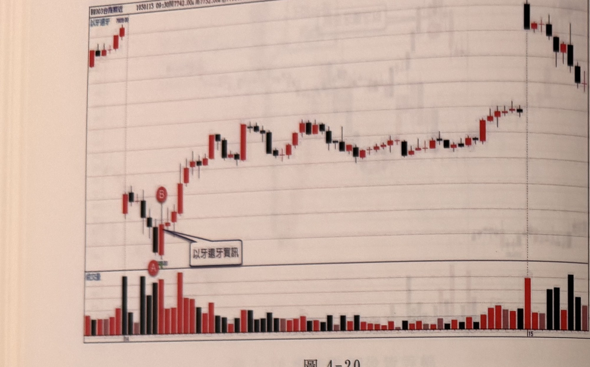
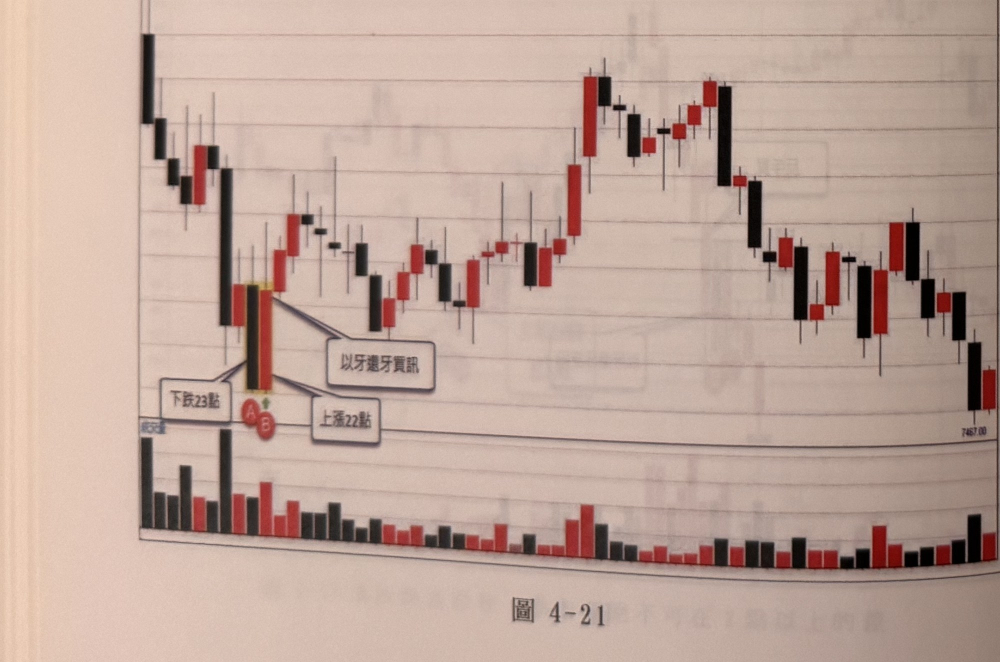

## p.98

**圖 4-20**

> 圖說（figure notes）: 台指期分時K線走勢圖（頁首標示「BK003台指期近 1050115 09:30開7742.00，高7752.00，低7736.00 量3833」，左上小字「以牙還牙」，標示價位「7809.00」；下方附成交量柱狀圖副圖）。走勢左段震盪走高後拉回下探，於圖中段低點出現一組K棒（下方紅圈字母「A」，上方紅圈字母「B」），紅框白底圓角矩形標註框「以牙還牙買訊」以線指向A、B一帶，構成以牙還牙買訊；訊號後行情強力反彈走高，一路盤堅上攻，中途歷經多次區間震盪整理，末段一根長黑K棒重挫後再度反彈，最終於圖右段呈區間震盪盤堅作收；下方成交量副圖顯示訊號出現時有明顯放量。

**圖 4-21**

> 圖說（figure notes）: 台指期分時K線走勢圖（頁首標示「BK003台指期近 1000905 13:40開7470.00，高7479.00，低7460.00，收7478.00 8.00(0.11%) 量1915」，下方附成交量柱狀圖副圖）。走勢左段一根長黑K棒重挫下殺，隨後於低點出現一組以黃色網底標示的K棒（下方紅圈字母「A」標示「下跌23點」，紅圈字母「B」標示「上漲22點」），紅框白底圓角矩形標註框「以牙還牙買訊」以線指向，構成以牙還牙買訊；訊號後行情反彈走高，一路盤堅上攻，中途歷經多次區間震盪，末段觸及波段高點後重挫下殺一大段，最終於圖右段收在「7467.00」附近的相對低點作收。

## p.99

[空白頁：章末空白頁，本頁沒有印刷內容（已核對照片）。照片上的淡字是背面鏡像透印，或隔頁的p.101 第五章首頁透過紙張看到的，不轉錄。]
