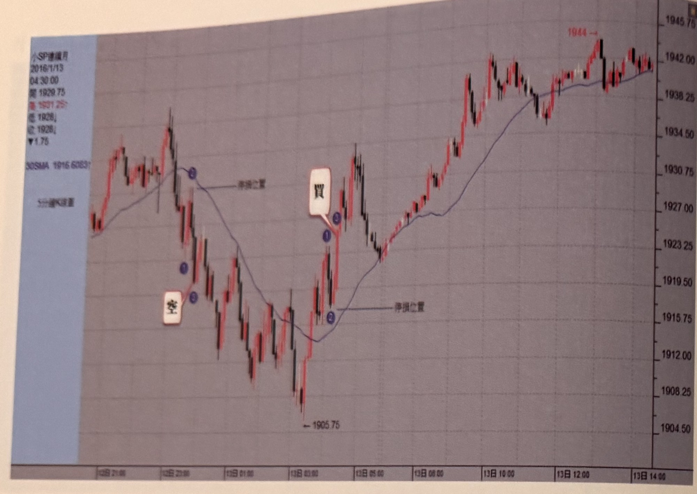
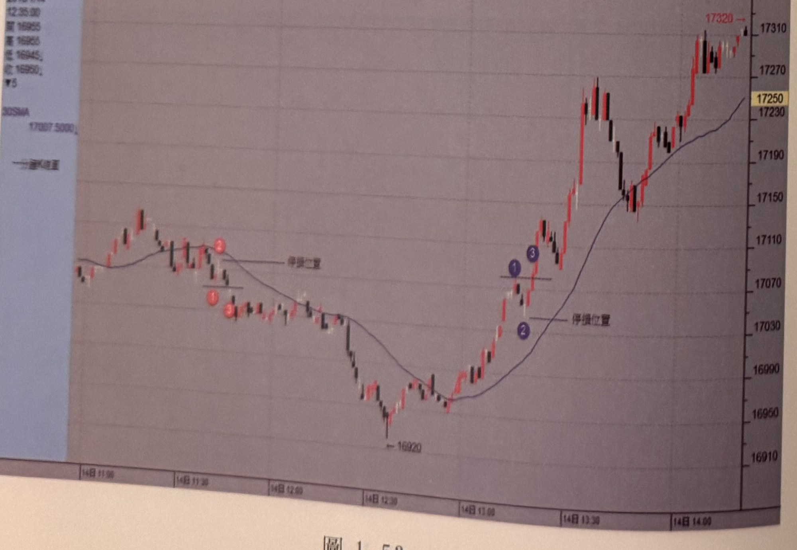
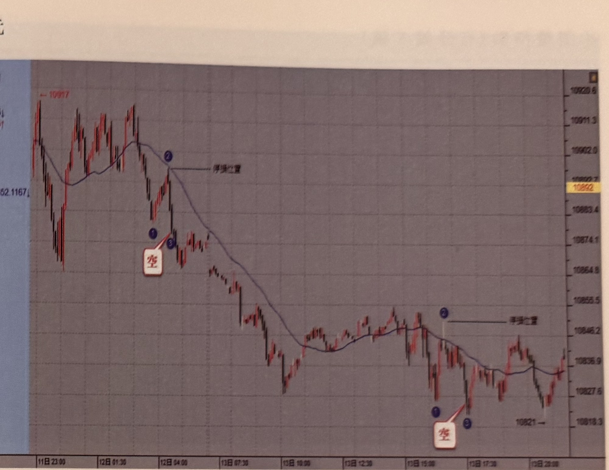
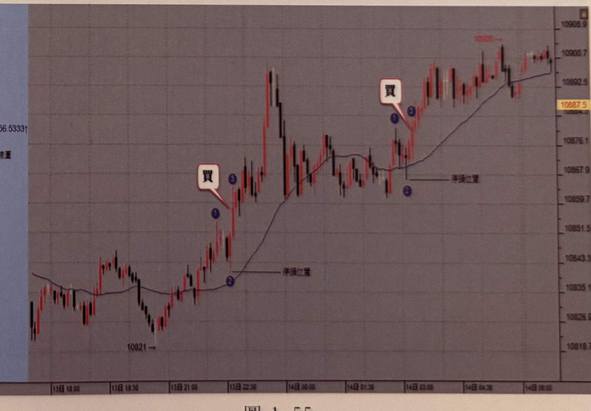

## p.54

**圖 1-52**

> 圖說（figure notes）: 小型SP期貨連續月5分鐘K線走勢圖（左側資訊欄顯示2016/1/13 04:30:00，開1929.75，高1931.25，低1928，收1928，跌1.75，30SMA 1916.6083，含30日均線），右側為價格座標軸（約1904.50至1945.75）。走勢左段震盪走高後跌破均線，於均線下方標示紅圈數字「1」「2」處出現「空」進場標籤（以線指向），隨後行情持續下跌至低點「1905.75」；其後行情反彈突破均線，於均線上方標示藍圈數字「1」「2」「3」處出現「買」進場標籤（以線指向），並以線標示「停損位置」（分別對應空單停損於均線上方、多單停損於均線下方）；訊號後行情強力反彈走高，一路盤堅上攻，中途歷經小幅震盪整理，最終於圖右段收在最高點「1944」附近。

**圖 1-53**

> 圖說（figure notes）: 走勢圖（資訊欄顯示2016/1/14 12:35:00，開16955，高16955，低16945，收16950，跌5，30SMA 17097.5000，1分鐘K線走勢圖），右側為價格座標軸（約16910至17320）。走勢左段於均線附近震盪走高後跌破均線，標示紅圈數字「1」「2」「3」（伴隨「停損位置」線標）於均線上方；行情持續下探至低點「16920」，其後強力反彈突破均線，標示藍圈數字「1」「2」「3」（伴隨「停損位置」線標）於均線下方轉上方處；訊號後行情持續盤堅上攻，一路震盪走高，中途一度小幅拉回，最終於圖右段收在最高點「17320」附近。

## p.55

歐元

**圖 1-54**

> 圖說（figure notes）: 歐元連續月5分鐘K線走勢圖（左側資訊欄顯示2016/1/13 09:55:00，開10640.5，高10641.5，低10839，收10840，跌1，30SMA 10852.1167，含30日均線；圖左上方另標示前波高點「10917」），右側為價格座標軸（約10818.3至10920.6）。走勢左段震盪走高後反轉重挫下殺，跌破均線，於均線下方標示藍圈數字「1」「3」處出現「空」進場標籤（以線指向），並以線標示「停損位置」於均線上緣；訊號後行情持續破底下殺一大段，中途一度反彈整理，末段再度出現藍圈數字「1」「3」與「空」標籤（以線指向低點附近K棒），下方標示價位「10821→」，並再度以線標示「停損位置」；行情於圖右段呈區間震盪整理，收在10820上下。

**圖 1-55**

> 圖說（figure notes）: 歐元連續月5分鐘K線走勢圖（左側資訊欄顯示2016/1/13 23:45:00，開10893，高10998，低10887，收10893，跌0.5，30SMA 10856.5333，含30日均線；圖左下方標示前低點「10821→」），右側為價格座標軸（約10818.7至10908.9）。走勢左段自低點「10821」起漲，跌破均線後於均線下方標示藍圈數字「1」「3」，並出現「買」進場標籤（以線指向），以線標示「停損位置」於均線下緣；訊號後行情強力上攻，一路震盪盤堅走高，突破均線後於均線上方再度出現藍圈數字「1」「3」與「買」標籤（以線指向），並再度以線標示「停損位置」；此後行情持續盤堅上攻，中途歷經小幅拉回整理，最終於圖右段呈區間盤堅震盪，收在10900附近，圖右上方另標示高點「10938」。
