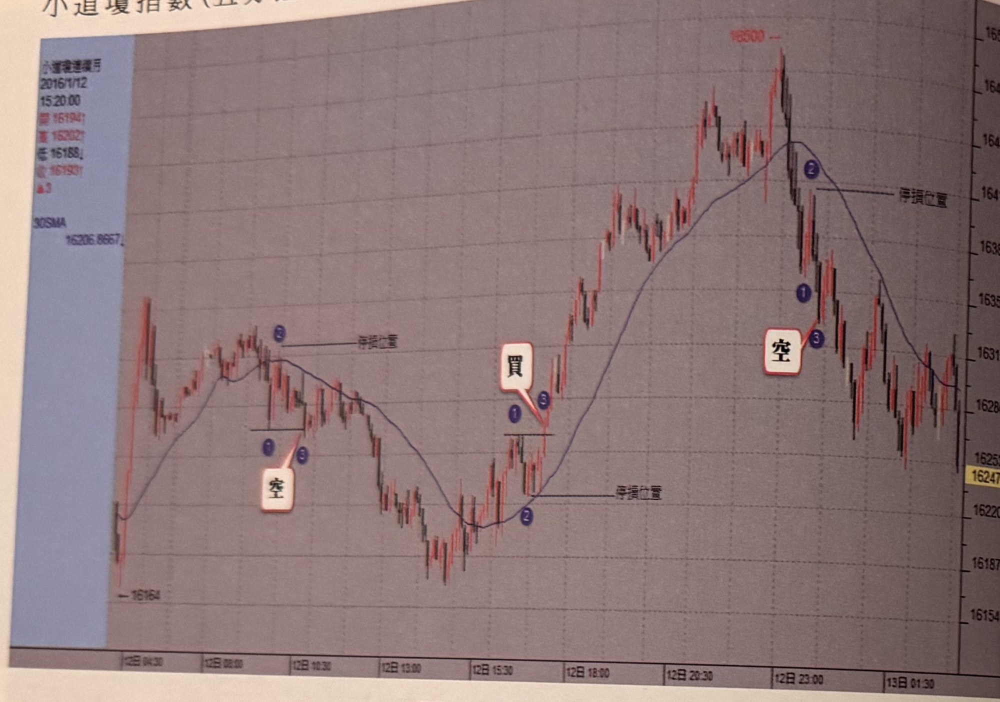
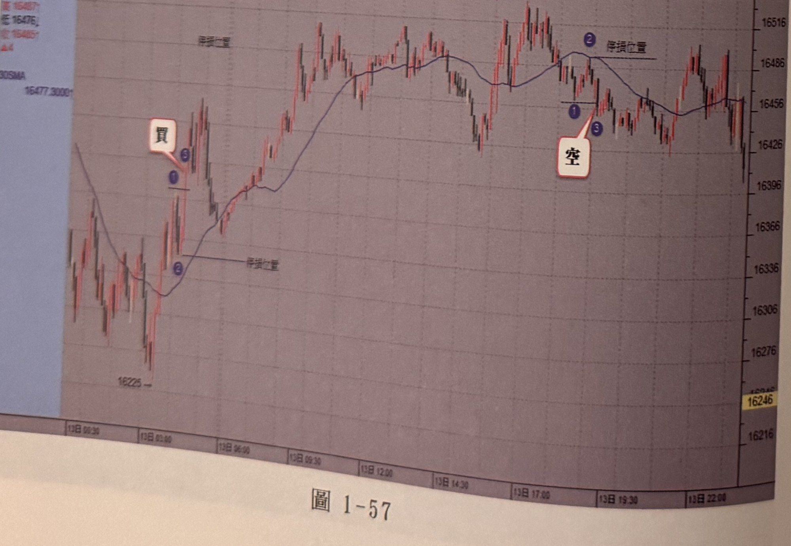
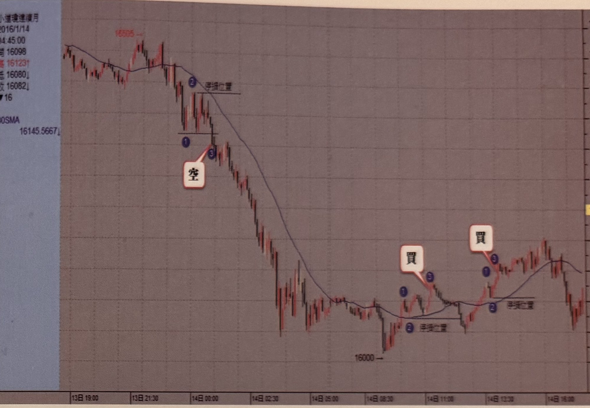
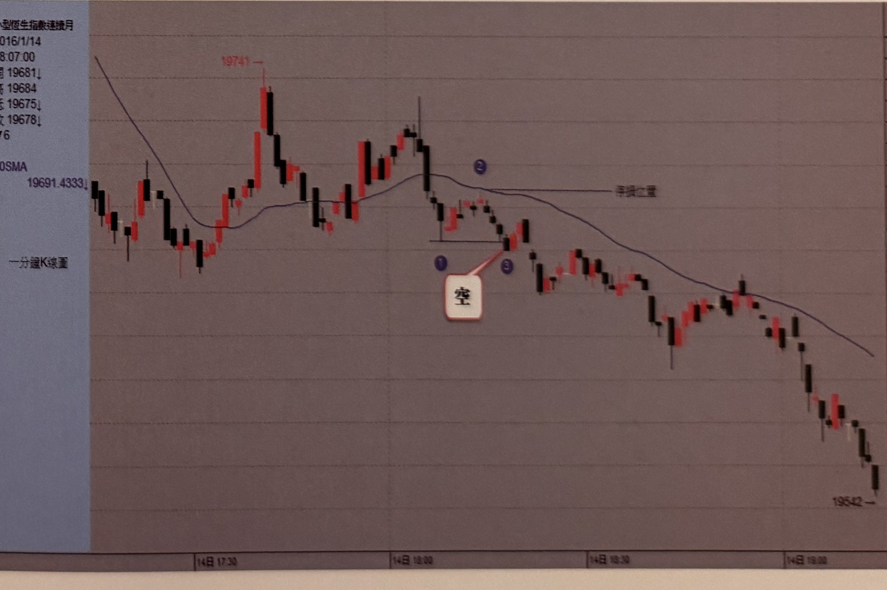

## p.56

小道瓊指數(五分鐘K線)

**圖 1-56**

> 圖說（figure notes）: 小道瓊指數連續月5分鐘K線走勢圖（左側資訊欄顯示2016/1/12 15:20:00，開16194，高16202，低16188，收16193，漲3，30SMA 16206.8667），右側為價格座標軸（約16154至約16510）。走勢左段自高點「16164」附近震盪走低，於均線附近標示藍圈數字「1」「2」處出現「空」進場標籤（以線指向），並以線標示「停損位置」；行情持續下探至低點後反彈突破均線，於均線附近標示藍圈數字「1」「2」「3」處出現「買」進場標籤，隨後行情強力上攻至高點「16500」附近，跌破均線後於均線上方標示藍圈數字「1」「3」處再度出現「空」進場標籤（以線指向），並以線標示「停損位置」；訊號後行情反轉重挫下殺一段，最終於圖右段呈區間震盪整理，收在16250上下。

**圖 1-57**

> 圖說（figure notes）: 走勢圖（資訊欄顯示16487／16476／16485，漲4，30SMA 16477.30991），右側為價格座標軸（約16216至16546）。走勢左段自低點「16225」起漲，突破均線於均線下方標示藍圈數字「1」「3」出現「買」進場標籤（以線指向），並以線標示「停損位置」；訊號後行情強力上攻，一路盤堅走高，中途歷經多次區間震盪整理，攻抵高點「16533」附近後跌破均線，於均線上方標示藍圈數字「1」「3」處出現「空」進場標籤（以線指向），並以線標示「停損位置」；此後行情呈區間震盪整理，收在16450上下。

## p.57

**圖 1-58**

> 圖說（figure notes）: 小道瓊連續月走勢圖（左側資訊欄顯示2016/1/14 04:45:00，開16098，高16123，低16080，收16082，跌16，30SMA 16145.5667），右側為價格座標軸。走勢左段自高點「16505」附近跌破均線，於均線下方標示藍圈數字「1」「2」「3」處出現「空」進場標籤（以線指向），並以線標示「停損位置」；訊號後行情連續重挫下殺一大段，最低點標示「16000」，其後止跌反彈突破均線，於均線附近標示藍圈數字「1」「2」「3」處先後出現兩組「買」進場標籤（以線指向），並以線標示「停損位置」；此後行情持續盤堅上攻，中途歷經多次區間震盪整理，最終於圖右段呈區間盤堅震盪。

小恒生期指(一分鐘K線圖)

**圖 1-59**

> 圖說（figure notes）: 小型恒生指數連續月1分鐘K線走勢圖（左側資訊欄顯示2016/1/14 18:07:00，開19681，高19684，低19675，收19678，跌6，30SMA 19691.4333；圖左上方標示前波高點「19741→」），右側為價格座標軸。走勢左段自高點附近震盪走低，跌破均線後於均線下方標示藍圈數字「1」「2」「3」處出現「空」進場標籤（以線指向），並以線標示「停損位置」於均線上緣；訊號後行情持續重挫下殺一大段，中途歷經多次小幅反彈整理，最終於圖右段跌破多個價位，收在「19542→」附近的全圖低點作收。
