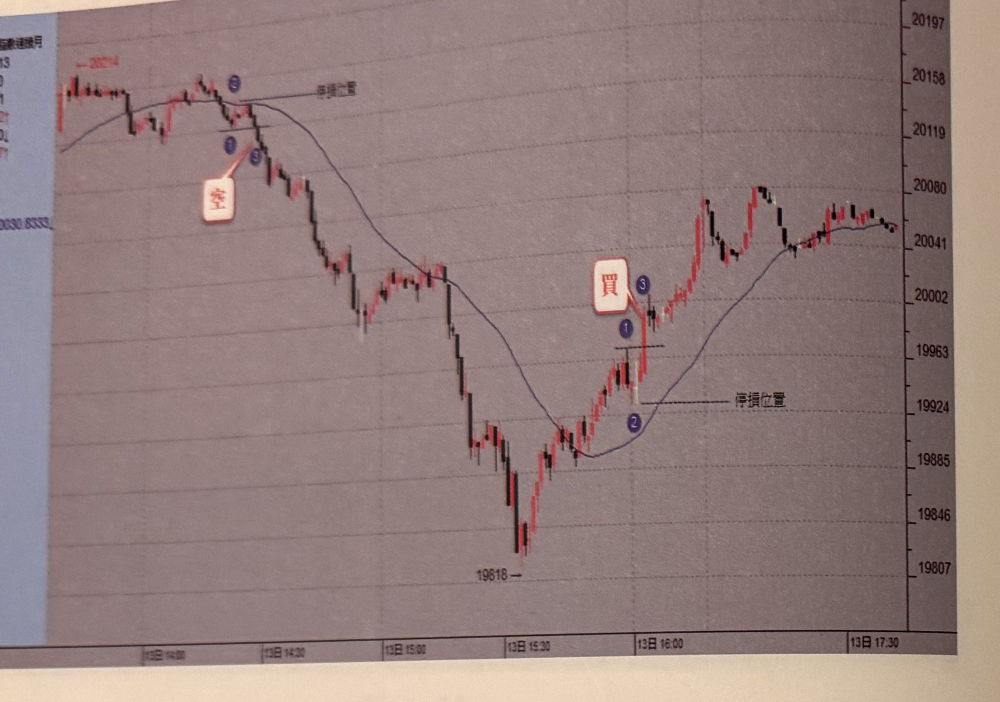
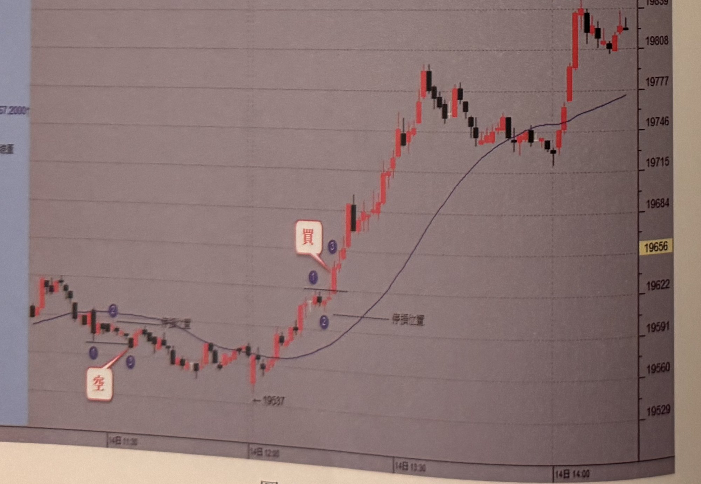
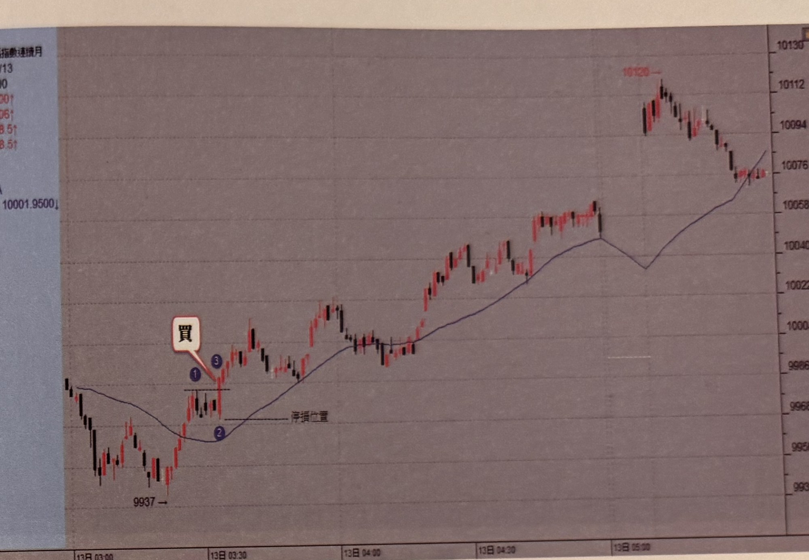
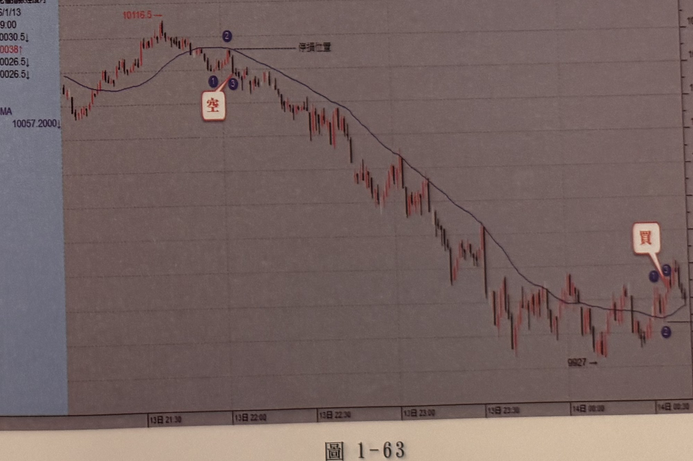

## p.58

**圖 1-60**

> 圖說（figure notes）: 小型恒生指數連續月走勢圖（2016/1/13 15:14:00，開20031，高20042，低20030，收20037，漲5，30SMA 20030.8333；圖左上方標示前波高點「20214→」），右側為價格座標軸（約19807至20236）。走勢左段自高點附近跌破均線，於均線下緣標示藍圈數字「1」「3」出現「空」進場標籤（以線指向），並以線標示「停損位置」；訊號後行情連續重挫下殺一大段，最低點「19618」，其後止跌反彈突破均線，於均線附近標示藍圈數字「1」「2」「3」出現「買」進場標籤，並以線標示「停損位置」；此後行情持續盤堅上攻，中途歷經多次區間震盪整理，最終於圖右段呈區間盤堅震盪，收在20041上下。

**圖 1-61**

> 圖說（figure notes）: 小型恒生指數連續月1分鐘K線走勢圖（2015/1/14 13:10:00，開19562，高19567，低19585，收19569，跌2，30SMA 19567.2000；圖右上方標示高點「19847→」），右側為價格座標軸（約19529至19839）。走勢左段於均線附近震盪走低，跌破均線後於均線下緣標示藍圈數字「1」「2」「3」出現「空」進場標籤（以線指向），並以線標示「停損位置」；行情持續下探至低點「19637」，其後強力反彈突破均線，於均線附近標示藍圈數字「1」「2」「3」出現「買」進場標籤，並以線標示「停損位置」；訊號後行情持續盤堅上攻，一路震盪走高，最終於圖右段收在最高點「19847」附近。

## p.59

法蘭克福指數(一分鐘K線)

**圖 1-62**

> 圖說（figure notes）: 法蘭克福指數連續月1分鐘K線走勢圖（2016/1/13 04:12:00，開10000，高10005，低9998.5，收9998.5，漲0.5，30SMA 10001.9500；圖右上方標示高點「10120→」），右側為價格座標軸（約9932至10130）。走勢左段自低點「9937」起漲，突破均線於均線附近標示藍圈數字「1」「3」出現「買」進場標籤（以線指向），並以線標示「停損位置」；訊號後行情持續盤堅上攻，一路震盪走高，中途歷經小幅拉回整理，攻抵高點「10120」附近後回落，最終於圖右段收在10076上下。

**圖 1-63**

> 圖說（figure notes）: 法蘭克福指數連續月走勢圖（2016/1/13 22:49:00，開10030.5，高10038，低10026.5，收10026.5，跌5，30SMA 10057.2000；圖左上方標示高點「10116.5→」），右側為價格座標軸。走勢左段於高點附近跌破均線，於均線附近標示藍圈數字「1」「2」「3」出現「空」進場標籤（以線指向），並以線標示「停損位置」；訊號後行情連續重挫下殺一大段，最低點「9927」，其後止跌反彈突破均線，於均線附近標示藍圈數字「1」「2」「3」出現「買」進場標籤，並以線標示「停損位置」；此後行情呈區間震盪整理。
