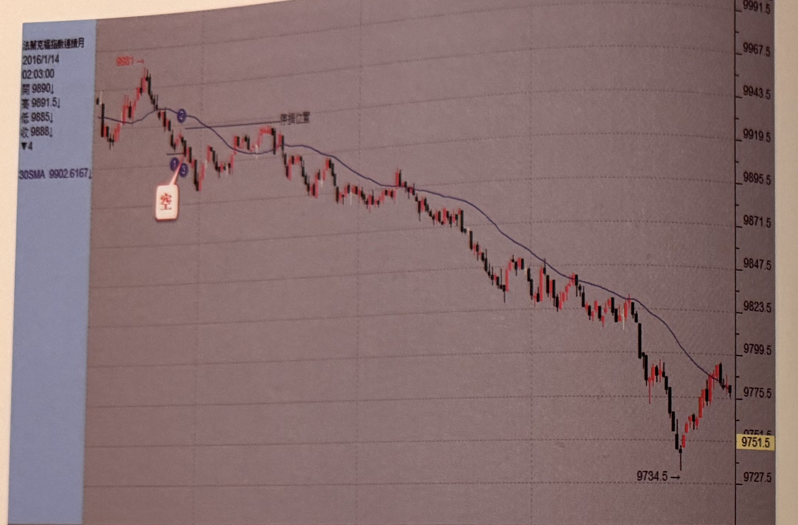
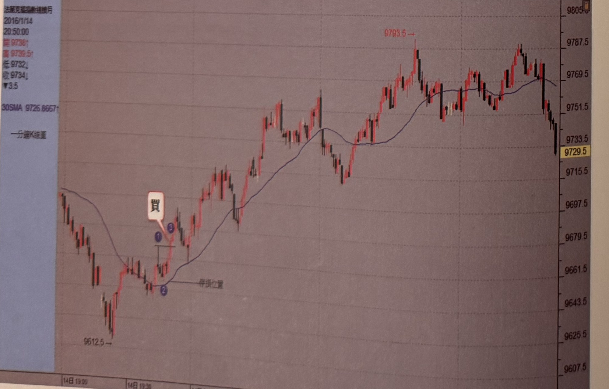
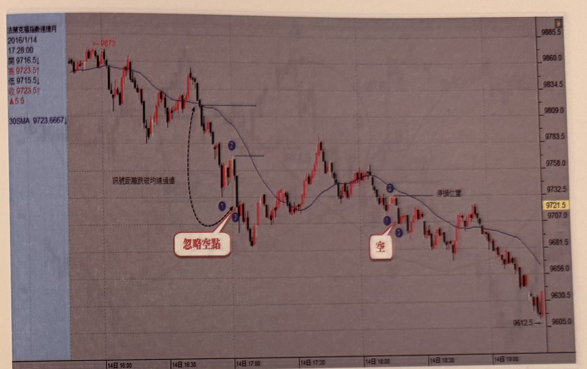
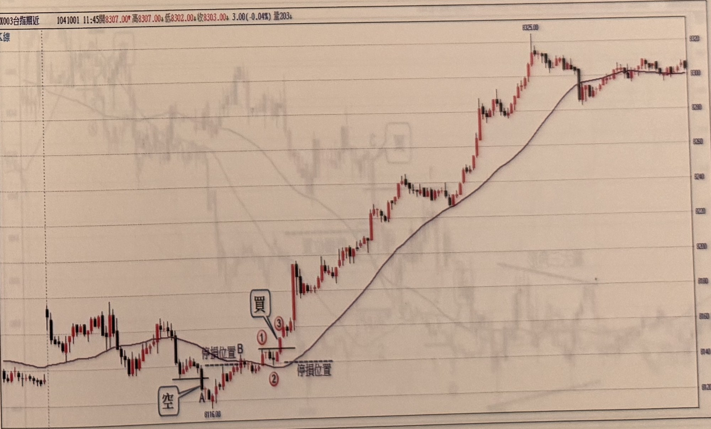

## p.60

**圖 1-64**

> 圖說（figure notes）: 法蘭克福指數連續月走勢圖（2016/1/14 02:03:00，開9890，高9891.5，低9885，收9888，跌4，30SMA 9902.6167；圖左上方標示高點「9981→」），右側為價格座標軸（約9727.5至9991.5）。走勢左段自高點附近跌破均線，於均線下緣標示藍圈數字「1」「3」出現「空」進場標籤（以線指向），並以線標示「停損位置」；訊號後行情持續重挫下殺一大段，一路盤跌破多個價位，中途歷經多次小幅反彈整理，最終於低點「9734.5」附近觸底後小幅反彈，收在9751.5上下。

**圖 1-65**

> 圖說（figure notes）: 法蘭克福指數連續月1分鐘K線走勢圖（2016/1/14 20:50:00，開9736，高9739.5，低9732，收9734，跌3.5，30SMA 9726.8667；圖右上方標示高點「9793.5→」），右側為價格座標軸（約9607.5至9805.5）。走勢左段自低點「9612.5」起漲，突破均線於均線附近標示藍圈數字「1」「3」出現「買」進場標籤（以線指向），並以線標示「停損位置」；訊號後行情持續盤堅上攻，一路震盪走高，攻抵高點「9793.5」附近後拉回整理，最終於圖右段一根長黑K棒重挫，收在9729.5上下。

## p.61

**圖 1-66**

> 圖說（figure notes）: 法蘭克福指數連續月走勢圖（2016/1/14 17:28:00，開9716.5，高9723.5，低9715.5，收9723.5，漲5.5，30SMA 9723.6667；圖左上方標示高點「9873→」），右側為價格座標軸（約9605.0至9885.5）。走勢左段自高點附近跌破均線，於均線下方標示藍圈數字「1」「2」「3」，並以虛線弧線與文字框「訊號距離跌破均線過遠」搭配「忽略空點」標籤，說明此處雖跌破均線但訊號點距離均線過遠，應**忽略此空點不進場**；行情持續下探後於圖中段小幅反彈整理，再度跌破均線，於均線下方標示藍圈數字「1」「2」「3」出現「空」進場標籤（以線指向），並以線標示「停損位置」；訊號後行情持續重挫下殺一大段，最終於圖右段收在低點「9612.5」附近。

以下為台指期一分鐘穿越均線買賣策略圖，請讀者自行參閱。

**圖 1-67**

> 圖說（figure notes）: 台指期近月1分鐘K線走勢圖（白底淺色主題，頁首標示「X003台指期近 1041001 11:45開8307.00，高8307.00，低8302.00，收8303.00 3.00(-0.04%) 量203」，左上小字「K線」），右側為價格座標軸（約8320至8380上緣）。走勢左段震盪走低，於低點「8116.00」附近以「空」標籤搭配紅圈字母「A」「B」標示（以線指向），並以線標示「停損位置」；行情反彈後於均線附近標示紅圈數字「1」「2」「3」出現「買」進場標籤（以線指向），再以線標示另一「停損位置」；訊號後行情強力上攻，一根跳空長紅K棒急拉後持續盤堅走高，一路突破均線壓力，中途歷經多次區間震盪整理，最終攻抵高點「8325.00」後小幅拉回，於圖右段呈區間盤堅震盪作收。
