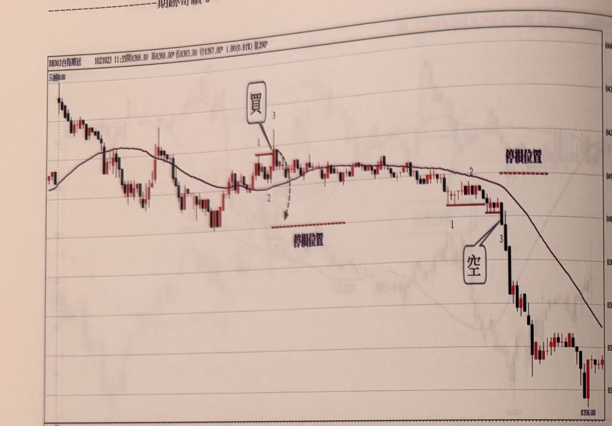
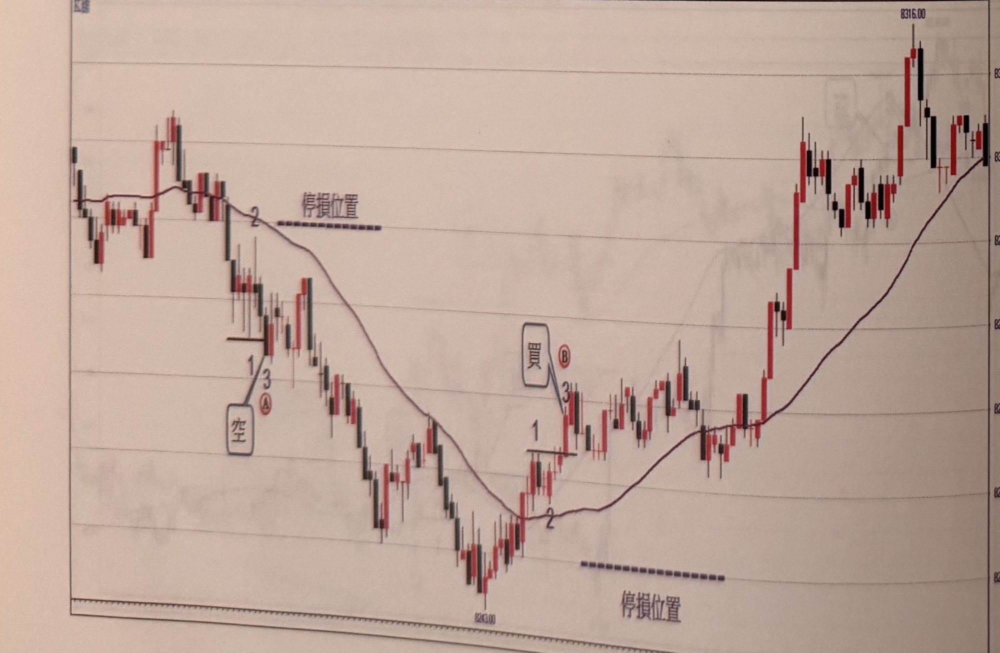

## p.64

**圖 1-72**

> 圖說（figure notes）: 台指期近月走勢圖（白底淺色主題，頁首標示「DX003台指期近 1021023 11:35開8366.00，高8368.00，低8365.00，收8367.00 1.00(0.01%) 量290」，左上小字「K線」），右側為價格座標軸（約8356.00至8440附近）。走勢左段震盪走高後於均線附近盤整，於均線上方標示數字「1」「3」出現「買」進場標籤（以線指向，並有虛線弧線與箭頭指示行情由此轉折向下），下方以紅色虛線標示「停損位置」；行情持續於均線附近區間盤整一大段，其後跌破均線，於均線附近標示數字「1」「2」「3」出現「空」進場標籤（以線指向），上方以紅色虛線標示另一「停損位置」；訊號後行情連續重挫下殺一大段，最終於圖右段收在低點「8356.00」附近。

**圖 1-73**

> 圖說（figure notes）: 台指期近月走勢圖（白底淺色主題），右側為價格座標軸。走勢左段於高點附近跌破均線，於均線附近標示數字「2」處以紅色虛線標示「停損位置」，其下方標示數字「1」「3」與紅圈字母「A」出現「空」進場標籤（以線指向）；訊號後行情連續重挫下殺一大段，最低點標示「8243.00」，下方以紅色虛線標示另一「停損位置」；其後行情止跌反彈突破均線，於均線附近標示數字「1」「2」「3」與紅圈字母「B」出現「買」進場標籤（以線指向）；此後行情強力上攻，一路盤堅走高，中途歷經多次區間震盪整理，最終攻抵高點「8316.00」附近後小幅拉回，於圖右段呈區間盤堅震盪作收。

## p.65

[空白頁：章末空白頁，本頁沒有印刷內容（已核對照片）。照片上的淡字是背面鏡像透印，或隔頁的p.67 第二章首頁透過紙張看到的，不轉錄。]
