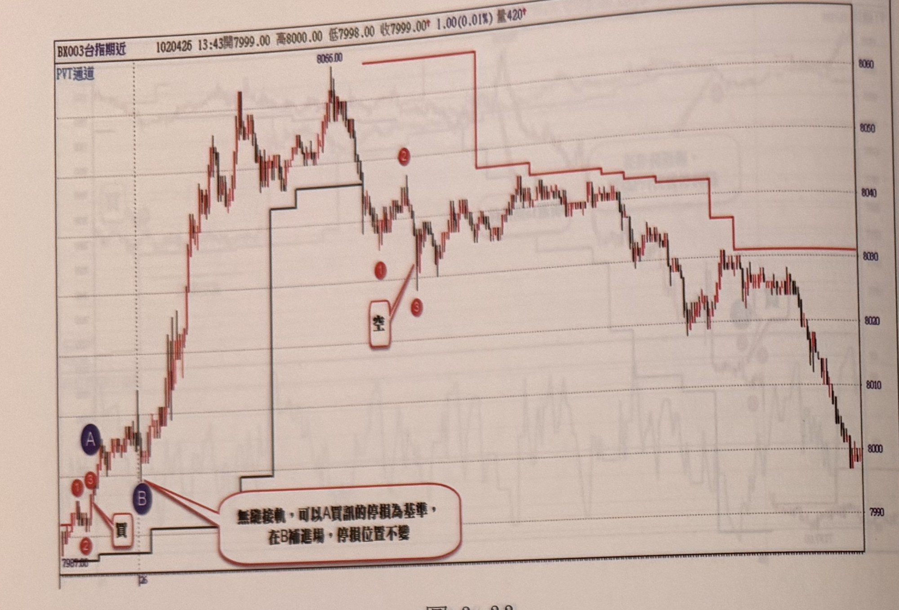
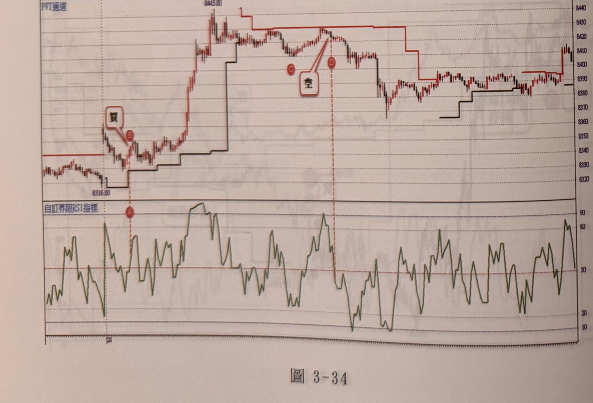

## p.124

**圖 3-33**

> 圖說（figure notes）: 台指期近月走勢圖（白底淺色主題，頁首標示「BX003台指期近 1020426 13:43開7999.00，高8000.00，低7998.00，收7999.00 1.00(0.01%) 量420」，左上小字「PVT通道」，圖中另繪有紅色與黑色的階梯狀PVT通道線），右側為價格座標軸（約7990至8060）。走勢左段自低點起漲，於低點附近標示紅圈數字「1」「2」「3」與紅圈字母「A」「B」出現「買」進場標籤，並有文字框「無論拉軟，可以A買訊的停損為基準，在B補進場，停損位置不變」（以線指向A、B），說明**即使行情拉回走軟，仍以A買訊當時的停損為基準，在B處補進場時停損位置維持不變**；訊號後行情強力上攻至高點「8066.00」，其後跌破PVT通道，於通道下方標示紅圈數字「1」「2」「3」出現「空」進場標籤（以線指向）；此後行情呈區間震盪走低，一路緩步下跌，PVT通道隨行情下移，最終於圖右段跌破多個價位，收在8000上下。

**圖 3-34**

> 圖說（figure notes）: 台指期近月走勢圖（白底淺色主題，頁首標示「BX003台指期近 1000321 12:25開8409.00，高8410.00，低8403.00，收8403.00 6.00(-0.07%) 量254」，左上小字「PVT通道」，下方附「自訂界限RSI指標」副圖），右側為價格座標軸（約8316.00至8445附近）。走勢左段於低點「8316.00」附近標示紅圈字母「A」（對應下方RSI指標同一時間點），突破PVT通道後標示紅圈字母「B」出現「買」進場標籤（以線指向）；訊號後行情強力上攻至高點「8445.00」，其後於高檔區間震盪整理，標示紅圈字母「C」「D」出現「空」進場標籤（以線指向，D點以虛線對應下方RSI指標同一時間點），跌破PVT通道；此後行情反轉下殺一段，PVT通道隨之下移，中途歷經多次區間震盪整理，最終於圖右段呈區間盤堅震盪，收在8410上下；下方自訂界限RSI指標同步呈現隨價格漲跌而高低擺動，多次觸及90以上高檔與20以下低檔區域。

## p.125

[空白頁：章末空白頁，本頁沒有印刷內容（已核對照片）。照片上的淡字是背面鏡像透印，或隔頁的p.127 第四章首頁透過紙張看到的，不轉錄。]
