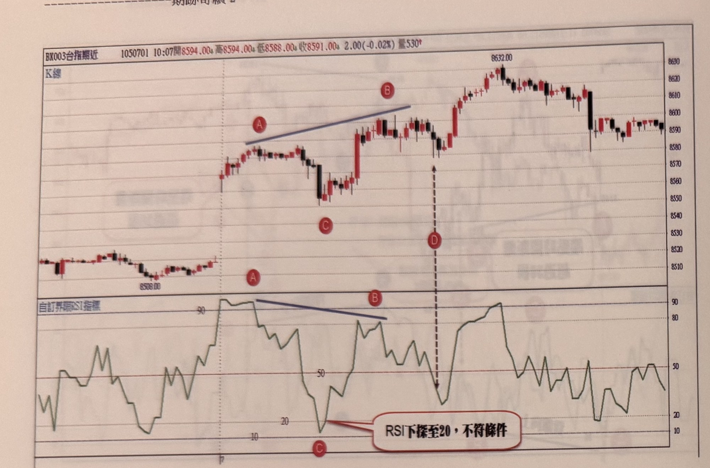
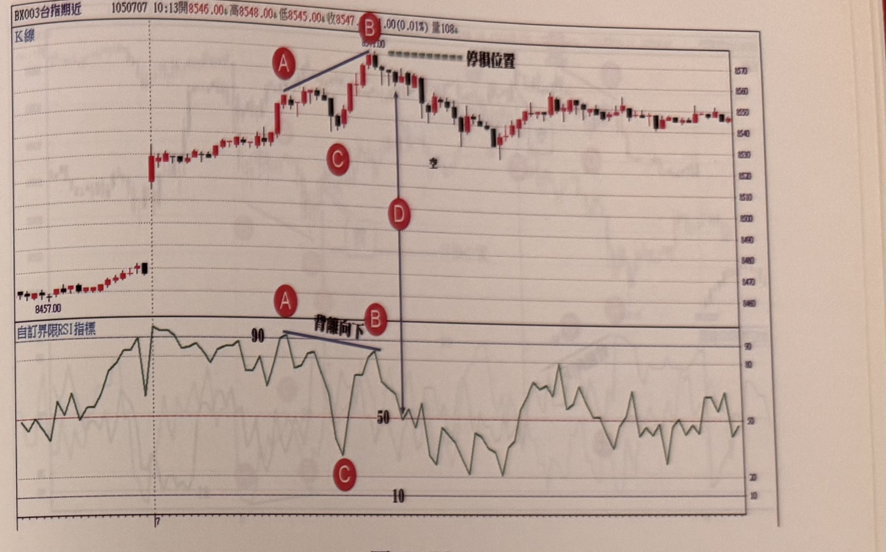
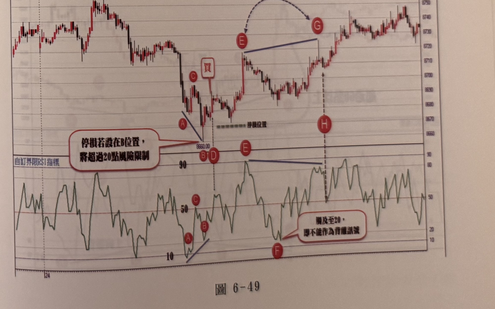

## p.228

**圖 6-47**

> 圖說（figure notes）: 台指期近月走勢圖（頁首標示「BX003台指期近 1050701 10:07開8594.00，高8594.00，低8588.00，收8591.00 2.00(-0.02%) 量530」），上方K線主圖，下方為「自訂界限RSI指標」副圖，右側為價格座標軸（約8500至8630）。走勢左段於低點「8508.00」附近盤整，其後跳空上攻，於K線圖標示紅圈字母「A」（低點附近）與「B」（高點附近，兩點以藍色斜線相連，斜線向上），對應下方RSI副圖同一時間點也標示紅圈字母「A」「B」（兩點以藍色斜線相連，斜線向下，RSI在90附近鈍化後走弱，與K線價格創新高但RSI未創新高形成背離）；K線圖另標示紅圈字母「C」（A、B之間拉回低點）與「D」（虛線箭頭由B下方向下指向RSI副圖同一時間點的低點，RSI下探至20附近），對應RSI副圖同一時間點標示紅圈字母「C」，並有文字框「RSI下探至20，不符條件」（以線指向RSI谷底，說明此背離因RSI跌破20底限而不成立）；K線行情其後續攻至最高點「8632.00」，再拉回於8590附近呈區間盤整震盪作收。

　　在圖6-47的線形中，跳高開盤使得RSI立刻竄升至嚴重超買90以上，並且維持鈍化至A位置後，才開始拉回，之後行情雖再創盤中新高B，但RSI卻沒有同步創新高，止於90下方，AB之間形成背離現象，距離根數都符合條件，但自A峰點拉回至C谷點，RSI卻下跌破20，超過RSI拉回的底限，**不能低於20的限制**；一個RSI的震盪循環代表自超賣區（超買區）運動到另一端超買區（超賣區），意謂行情過熱拉回到冷卻，不再背負背離看回不回的反轉暗示，因此當AB段產生背離外觀時，卻不能在D位置RSI破50時，認為空訊出現而進場操作。

以下附圖請讀者自行參閱練習

## p.229

**圖 6-48**

> 圖說（figure notes）: 台指期近月走勢圖（頁首標示「BX003台指期近 1050707 10:13開8546.00，高8548.00，低8545.00，收8547.00 1.00(0.01%) 量108」），上方K線主圖，下方為「自訂界限RSI指標」副圖，右側為價格座標軸（約8450至8580）。走勢左段自低點「8457.00」起漲，於K線圖標示紅圈字母「A」（低點附近）與「B」（高點「8577.00」附近，兩點以藍色斜線相連，斜線向上），並以虛線標示「停損位置」於B高點延伸向右；對應下方RSI副圖同一時間點標示紅圈字母「A」「B」（兩點以藍色斜線相連並註記「背離向下」，RSI於90附近鈍化後未再創新高）；K線圖另標示紅圈字母「C」（AB間拉回點，旁註「空」）與「D」（長箭頭由B下方垂直向下指向RSI副圖同一時間點約50處），對應RSI副圖同一時間點標示紅圈字母「C」（RSI谷底附近）；K線行情其後於8540~8570區間反覆震盪整理作收。

**圖 6-49**

> 圖說（figure notes）: 台指期近月走勢圖（頁首標示「BX003台指期近 1000524 12:03開8735.00，高8735.00，低8733.00，收8733.00 2.00(-0.02%) 量103」），上方K線主圖，下方為「自訂界限RSI指標」副圖，右側為價格座標軸（約8650至8760）。走勢左段自高點「8755.00」重挫下殺，於K線圖標示紅圈字母「A」（拉回段）、「B」「D」（低點「8660.00」附近，重疊標示）、「C」（B上方一根K棒，旁註「買」進場標籤），並有文字框「停損若設在B位置，將超過20點風險限制」（以線指向B、D一帶），以虛線標示「停損位置」；對應下方RSI副圖同一時間點標示紅圈字母「A」「B」（兩點以藍色斜線相連，RSI於10附近觸底）；其後行情反彈走高，K線圖標示紅圈字母「E」（起漲點）與「G」（高點，兩點以藍色弧形虛線箭頭相連，旁註「峰點距離超過30則亦是不符條件」），另標示紅圈字母「H」（長虛線箭頭由G下方垂直向下指向RSI副圖同一時間點），對應RSI副圖同一時間點標示紅圈字母「E」（兩點以藍色斜線相連，RSI於80附近鈍化後走弱）與「F」（低點，並有文字框「觸及至20，即不能作為背離訊號」以線指向），說明**RSI一旦觸及20，即不能作為背離訊號成立的依據**；K線行情其後持續盤堅上攻，一路震盪走高，最終於圖右段收在8730上下高檔區間。
