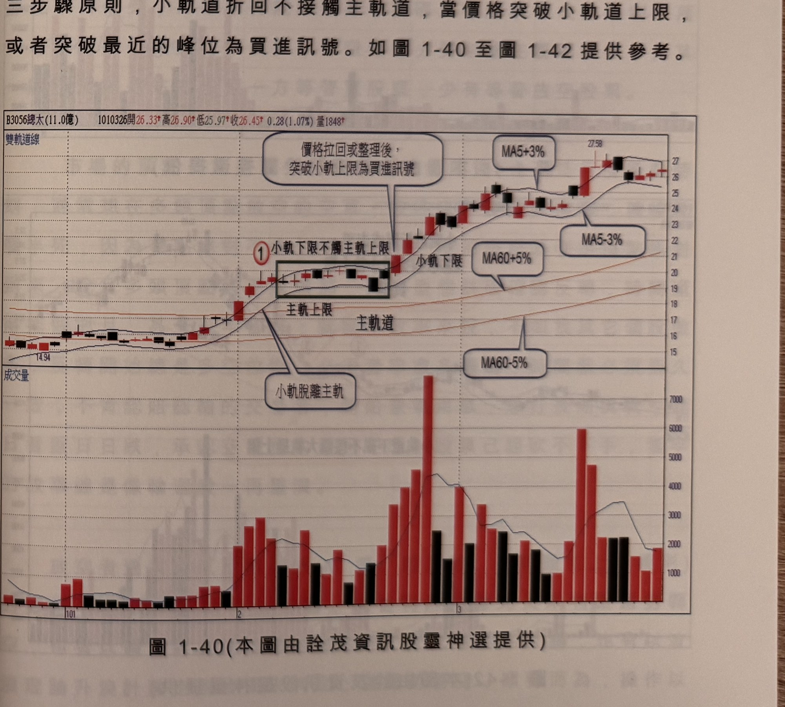

## p.44

[承上頁] 權 K 線當時價格來到 100 元之上，買進是否有偏高風險呢？100 年 3 月 11 日在日本大
地震及超級海嘯襲擊下，和泰汽車雖有零件斷料影響，但前半年卻交出亮麗的獲利，稅後 EPS 達
6.52 元(公布時間為 8 月才知)，Q1 的稅後 EPS 即高達 4.22 元(4/29 公布)，當 7/11 公布 6 月營收
數字後，Q2 營收為 126 億，受到斷料的衝擊，較之 Q1 營收 270 億，衰退一半以上，EPS 稅應有
1.5 元水準(比照 97 年 Q2 營收 133 億，稅 EPS 為 1.68 元)，因此，估計前半年稅後 EPS 至少在
5 元以上，

（下表為和泰車重大財務訊息時間軸，數字標號對應圖 1-39 K 線圖上標示位置，資料來源：華南
永昌證券理財寶典資料庫）

| 標號 | 日期 | 訊息內容 |
| --- | --- | --- |
| 8 | 100/11/14 | 和泰車 100 年前三季合併損益表，每股盈餘 9.97 元 |
| — | 100/11/10 | 年營收上看 900 億？和泰車：媒體推估 |
| — | 100/11/09 | 和泰車 100 年 10 月營收 99.20 億、年增 38.50% |
| — | 100/11/01 | 和泰車成立薪酬委員會 |
| 7 | 100/10/31 | Q4 每股估賺 3.22 元？和泰車：媒體推估 |
| — | 100/08/29 | 和泰車 100 年上半年合併損益表，每股盈餘 6.52 元 |
| 6 | 100/08/29 | 和泰車 100 年上半年損益表，每股盈餘 6.52 元 |
| — | 100/08/10 | 和泰車 100 年 7 月營收 82.69 億、年增 33.49% |
| 5 | 100/04/29 | 和泰車 100 年第一季損益表，每股盈餘 4.22 元 |
| — | 100/04/29 | 和泰車 99 年全年合併損益表，每股盈餘 8.89 元 |
| 4 | 100/04/29 | 和泰車 99 年全年損益表，每股盈餘 8.89 元 |
| — | 100/04/28 | 和泰車股利：現金 6 元 |
| — | 100/04/22 | 和泰車：國瑞汽車 4/25-6/3 調整生產計劃，產能減少 50% |
| — | 100/04/15 | 信大等 30 檔股票 4/15 起暫停融券賣出五個營業日 |
| — | 100/04/12 | 東鋼等 5 檔股票 4/15 起暫停融券賣出五個營業日 |
| 3 | 100/04/11 | 和泰車 100 年 3 月營收 82.40 億、年增 11.93% |
| — | 100/04/11 | 和泰車違反證交法，處負責人罰鍰 24 萬元 |
| — | 100/04/01 | 和泰車：日本地震致 3 月進貨減少 2300 台 |
| — | 100/03/28 | 和泰車訂 6/24 召開 100 年股東常會 |
| — | 100/03/28 | 和泰車：和通汽車投資公司投資北京 LEXUS 210 萬美元 |
| — | 100/03/17 | 和泰車：日本豐田海外工廠新車生產線所需零組件 3/21 恢復生產 |
| — | 100/03/14 | 和泰車：日本豐田 3/14-16 停工檢查 |
| 2 | 100/03/10 | 和泰車 100 年 2 月營收 56.62 億、年減 10.28% |
| 1 | 100/02/10 | 和泰車 100 年 1 月營收 131.73 億、年增 64% |

(資料來源：華南永昌證券理財寶典資料庫)

## p.45

三步驟原則，小軌道折回不接觸主軌道，當價格突破小軌道上限，或者突破最近的峰位為買進
訊號。如圖 1-40 至圖 1-42 提供參考。

**圖 1-40**（本圖由詮茂資訊股靈神選提供）

> 圖說：總太(B3056總太(11.0億))日線圖，時間戳 1010326，開 26.33、高 26.90、低 25.97、收
> 26.45，0.28(1.07%)，量 1848，含 K 線／雙軌道線主圖與成交量副圖。主圖以文字框①標示「小軌
> 下限不觸主軌上限」；另以文字說明標示「主軌上限」「主軌道」「小軌下限」「小軌脫離主軌」
> 分別對應圖上各軌道線；並以箭頭搭配文字框標示「價格拉回或整理後突破小軌上限為買進訊號」
> 指向對應的突破 K 線；圖右側另標示均線族群「MA5+3%」「MA5-3%」「MA60+5%」「MA60-5%」。
