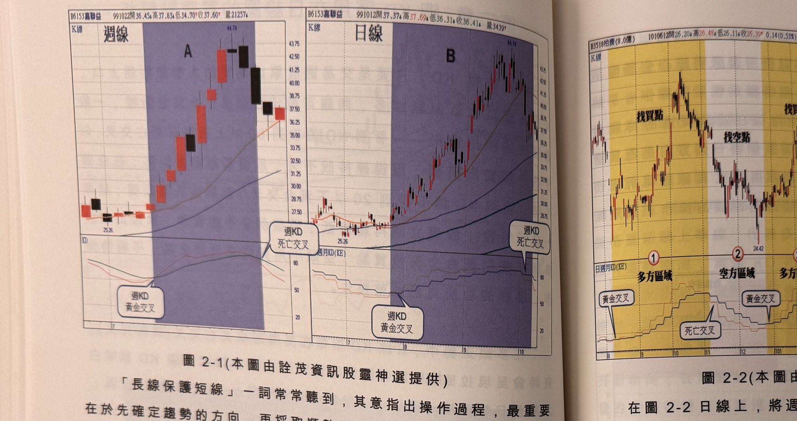
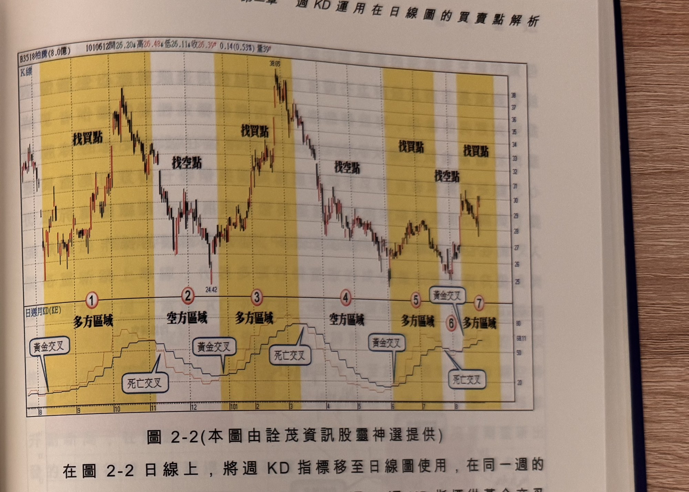

## p.72

「長線保護短線」一詞常常聽到，其意指出操作過程，最重要在於先確定趨勢的方向，再採取順勢
作為，並運用各種技術工具去尋找與趨勢同向的進場訊號，必然增加操作的勝算。在價格回檔過程，
採取低接策略的前提必須趨勢看漲；而價格反彈建空單，必須趨勢走空；所有作為均須配合趨勢
方向而定。

在圖 2-1 為嘉聯益(6153)週線圖及日線圖並列比較，在左邊顯示週線 KD 黃金交叉到死亡交叉之間
的上漲格局(如 A 區域)，只見 K 線不斷以陽線推升，只有一週呈現黑 K 線拉回，但是同一期間對照
右邊日線圖(如 B 區域)，整個上升過程並非日日朝上，中間有幾次短暫回檔，若要賺這種波段行情，
只須透過價格回檔去尋找切入買點，當我們將週 KD 指標投置在日線圖上，要斷定波段行情是否延續，
只要週 K 值大於 D 值維持著，波段行情就持續演出，尋找合適的切入點，便可以獲取波段利潤。

**圖 2-1**（本圖由詮茂資訊股靈神選提供）

> 圖說：嘉聯益(6153)週線圖（左）與日線圖（右）並列比較。左側週線圖以文字框標示週 KD 黃金
> 交叉到死亡交叉之間的上漲格局為「A 區域」（陽線不斷推升，僅一週呈黑 K 線拉回）；右側日線圖
> 對應同一期間標示為「B 區域」，顯示上升過程並非日日朝上，中間有數次短暫回檔。兩圖以連線
> 對照同一時間範圍。

## p.73

在圖 2-2 日線上，將週 KD 指標移至日線圖使用，在同一週的 KD 值，在日線上將維持 5 個交易日
(一週)；週 KD 指標從黃金交叉(簡稱金叉)開始，到出現死亡交叉(簡稱死叉)為止，兩者之間稱為
多方區域，如標示 1、3、5及7區域，多方區域以找買點為主；而從死叉到金叉之間，稱為空方區域，
如標示 2、4及6區域，操作上以做空為主；從圖上看出在多方區域的回檔，除非幅度很大且時間拖得
很久，才可能促使週 KD 下彎，否則行情仍將持續向上發展，如此可避掉在多方區域內因日 KD 死叉
造成出脫補不回的憾事發生；而在週 KD 死叉後的空方區域，不會因日線 KD 出現金叉而過早搶買，
造成一日行情的多頭陷阱。

純以週 K 線配合週 KD 指標切入點的選擇上，不如日線 KD 指標精確，例如當週前三天急漲，用
週線角度來找買點，可能這一週任何一天是一樣的，假使後二天出現快速折回，雖週 K 線仍收紅 K，

**圖 2-2**（本圖由詮茂資訊股靈神選提供）

> 圖說：日線 K 線圖，以標號區分週 KD 黃金交叉至死亡交叉之間的多方區域與空方區域，標示
> 1、3、5、7 為多方區域（黃金交叉至死亡交叉之間，以找買點為主），標示 2、4、6 為空方區域
> （死叉到金叉之間，操作上以做空為主）；圖上以豎直分隔線劃分各區域邊界，便於對照週 KD
> 交叉時點與日線價格走勢。
