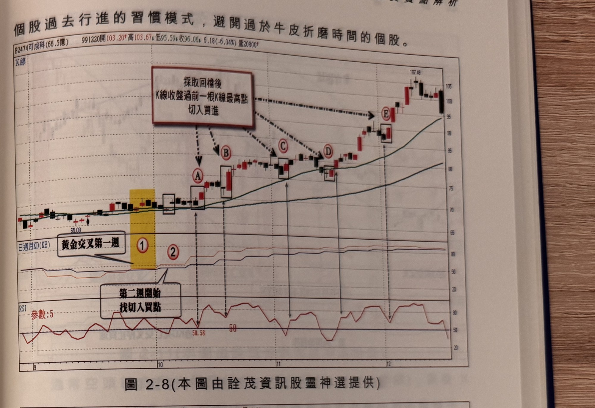
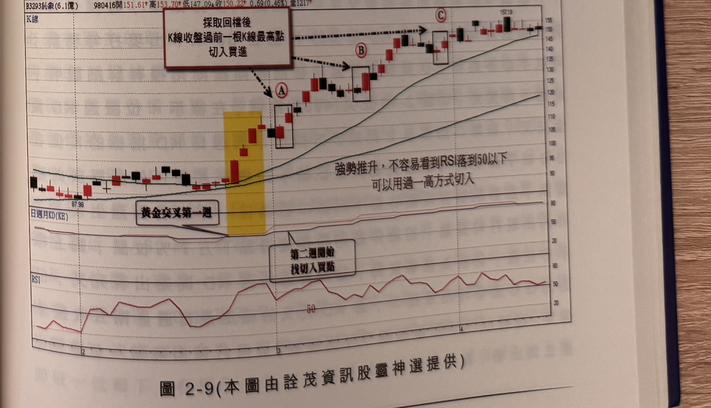

## p.82

[承上頁] 勢，季線與月線呈現空排，週 KD 亦呈現空頭向下情形，在 6 月中旬標示 1 位置，週 KD
開始出現金叉，代表行情轉變的機會來臨，此時均線仍呈空排，但已有週 KD 暗示翻多的可能，當
標示 2 區域，價格越過季線連拉 3 根大漲 K 線，幾乎可以證實行情進入多頭區域，因此可以利用 RSI
穿越 50 來觀察買進時機，在 A、B 及 C 三處都出現 RSI 穿越 50 的買訊參考位置，其中 A 與 B
位置都有二次同位階的買訊出現，只要取最早出現進場即可，當標示 C 之後出現週 KD 死叉現象，
代表行情進入偏空可能，在本例中，週 KD 呈現在超買區 80 以上鈍化游走，此時若持股則依據有沒有
跌破 5 日均線或以 5 日均量線縮減來判斷出場。

一般採取過一高的方式，最好自見高折回 3 天以上，當回檔過程，RSI 指標無法跌破 50 以下，就
產生過一高現象，則可先採取過一高切入買進，這種情形發生在強勢股居多；很猛的推升走法，
不斷地拉出大漲 K 線，回檔又偏好小黑 K 線壓盤，落到 50 以下，三、四天回檔的跌幅甚至不到 5%，
又重新展開攻勢，遇到這種強勢股，可以用過一高的方式來切入，比用 RSI 過 50 切入法有效掌握
較佳的買點。如圖 2-8 可成(2474)在強勢推升過程，標示 A、B 及 E 位置，就無法用 RSI 過 50 方式
獲得切入機會，又如圖 2-9 鈺象(3293)在週 KD 金叉那週，即推升勇猛，強勢之姿不可言喻，回檔
過程都是採取小黑線壓盤，時間又短暫，更難看見 RSI 跌破 50 的機會，一定得利用標示 A~C 位置
產生過一高時，掌握切入買進的機會。

但是一些推升採取進一退二方式，甚至大漲一根 K 線後，即又陷入數天到十天以上整理的個股，
採取過一高切入法似乎容易陷入泥淖而耗費等待突破時機，因此，在挑選介入標的股時，宜先觀察

## p.83

第二章　週 KD 運用在日線圖的買賣點解析

個股過去行進的習慣模式，避開過於牛皮折磨時間的個股。

**圖 2-8**（本圖由詮茂資訊股靈神選提供）

> 圖說：可成(B2474可成科(66.5億))日線圖，時間戳 991220，開 103.20、高 103.67、低 95.59、
> 收 96.06，6.18(-6.04%)，量 20800，含 K 線／均線主圖與日週月 KD(KE)、RSI 副圖。主圖上以
> 紅框文字說明「採取回檔後 K 線收盤過前一根 K 線最高點切入買進」，並以箭頭指向標示 A、B、
> C、D、E 五個切入點（各以方框標示對應 K 線）；副圖以文字框「黃金交叉第一週」（標示①，黃色
> 網底）搭配「第二週開始找切入買點」（標示②）說明操作時序。低點 65.08 起漲，末端高點
> 107.48。

**圖 2-9**（本圖由詮茂資訊股靈神選提供）

> 圖說：鈺象(B3293鈺象(6.1億))日線圖，時間戳 980416，開 151.61、高 153.70、低 147.09、收
> 150.22，0.69(0.46%)，量 1217，含 K 線／均線主圖與日週月 KD(KE)、RSI 副圖。主圖上以紅框
> 文字說明「採取回檔後 K 線收盤過前一根 K 線最高點切入買進」，並以箭頭指向標示 A、B、C 三個
> 切入點（各以方框標示對應 K 線）；主圖並以文字註記「強勢推升，不容易看到 RSI 落到 50 以下，
> 可以用過一高方式切入」；副圖以文字框「黃金交叉第一週」（黃色網底）搭配「第二週開始找切入
> 買點」說明操作時序。低點 87.98 起漲，末端高點 157.18。
