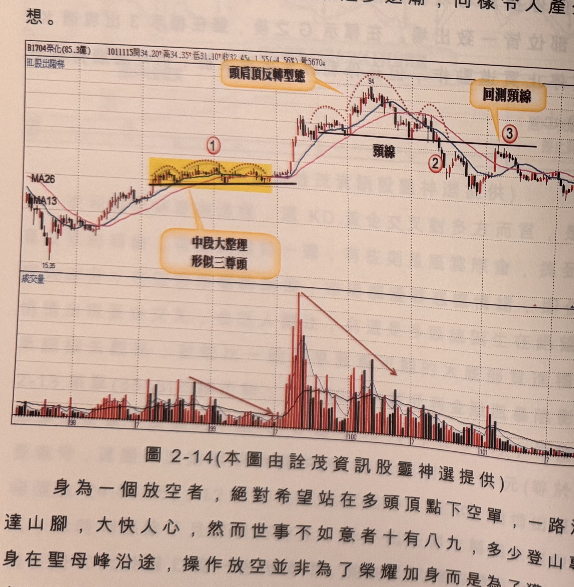

## p.90

多頭市場的頭部認定，主要是發生價量失衡，成交量遞減退潮，形成價格只能在區間上下擺盪，即使
行情再創新高點，整個量群仍然無法與價齊揚；再者，中長期均線逐漸走平收斂，反轉型態中 M 型
結構或頭肩頂結構或多尊頭或楔形結構，逐步形成；但均線尚未形成死亡交叉前或型態頸線還未有效
跌破前，推斷行情反轉進入空頭格局似嫌過早，因為多頭市場行進過程的中段大整理，與頭部的結構
並不存在重大的差異性，如圖 2-14 榮化(1704)在標示 1 區所呈現的多尊頭，成交量也呈現逐步退潮，
同樣令人產生頭部聯想。

**圖 2-14**（本圖由詮茂資訊股靈神選提供）

> 圖說：榮化(1704)日線圖，含 K 線／均線主圖（頂部標示「頭肩頂反轉型態」）與變盤指標、成交量
> 副圖。主圖以文字框「空訊」（四處）分別搭配箭頭指向標示 A、B、C、D 四個高點附近的轉折
> K 線，其中標示 A、B 兩處以紅色網底標示對應區間，構成多尊頭（頭肩頂）型態的各個頭部；圖
> 說明成交量隨型態發展逐步退潮遞減。

## p.91

第二章　週 KD 運用在日線圖的買賣點解析

放空者需要的只是方向，及有勝算機會的切入點，操作方法不要複雜難懂，設定好自身的風險值，
就可見機行事；不見得在多頭頂點放空才叫厲害，當均線正式轉空後，籌碼鬆動的壓力，將是放空者
無形的助力，因此在均線仍處多排，週 KD 產生的死亡交叉，旨在提醒操作者停止操作，不是翻空
操作，要想在多頭走勢中，進行放空動作，必須有更多的濾網來支持你做空的立場，例如指標發生
背離向下，或者在死亡交叉後，週 K 小於週 D 的狀況下，價格向上創新高，也算背離現象，可據此
做為放空的跡證，但放空後價格沒有跌破 MA60 或跌破 MA60 後發生遲滯橫向盤整，都要特別小心
留意多頭未死。
